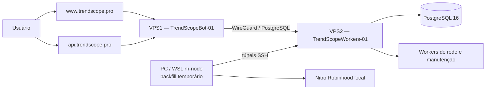

# TrendScope — Referência Técnica Atual

> Estado revisado em `2026-08-22`.
>
> Esta referência descreve o que foi confirmado no código, no banco e na
> infraestrutura durante a migração para os servidores Netcup. Planos futuros
> aparecem separados do que já está em produção.

## 1. Objetivo e regra de confiança

Este documento é o mapa técnico do TrendScope. Ele deve responder:

- onde cada parte do produto roda;
- qual processo é responsável por cada trabalho;
- quais dados são persistidos;
- como Solana e Robinhood entram no sistema;
- quais integrações externas estão envolvidas;
- o que já existe e o que ainda é roadmap;
- como validar, implantar e recuperar o serviço.

Quando houver conflito, use esta ordem de confiança:

1. código e schema da branch implantada;
2. configuração efetiva dos serviços e do `.env` do host;
3. estado observado no PostgreSQL e nos endpoints de health;
4. este documento;
5. planos históricos.

Nunca coloque neste arquivo:

- senhas;
- chaves privadas;
- API keys;
- bearer tokens;
- JWT secrets;
- conteúdo de arquivos WireGuard privados.

## 2. Estado resumido

O TrendScope é uma aplicação web multichain em evolução, com:

- frontend Vite + TypeScript;
- API Express;
- Socket.io para atualizações em tempo real;
- PostgreSQL como armazenamento central;
- workers separados por responsabilidade;
- Solana como chain original;
- Robinhood Chain em rollout/backfill;
- autenticação local, social e por carteira;
- acesso token-gated;
- billing implementado no código, mas não necessário para o lançamento
  token-gated atual;
- integração Telegram registrada em checkpoints locais, ainda não tratada como produção;
- wallet tracking multichain planejado, ainda não implementado como produto.

Baseline observado na migração:

- branch implantada nas duas VPS: `Robinhood-Implementation`;
- commit implantado: `350c45d`;
- a base local auditada antes das fatias wallet LIVE era `954ae548`, com o
  enrichment preparado para leituras de supply/quote no head, mas esse commit
  não deve ser
  presumido nas VPS sem conferir `git rev-parse --short HEAD`;
- o histórico local possui checkpoints posteriores, além de mudanças ainda não commitadas;
- os checkpoints locais, incluindo Telegram, não devem ser presumidos nas VPS até
  push, deploy e schema check correspondentes.

## 3. Topologia de produção atual



### 3.1 VPS1 — produto público

Hostname operacional:

```text
TrendScopeBot-01
```

Responsabilidades:

- servir o frontend estático;
- expor a API pública;
- manter o Socket.io;
- terminar TLS no Nginx;
- consumir o PostgreSQL pela rede privada WireGuard;
- não executar background workers.

Caminhos atuais:

```text
/opt/trendscope/app                 repositório
/var/www/trendscope                 build estático do frontend
/etc/nginx/sites-available/trendscope
/etc/nginx/sites-available/api.trendscope.pro
/etc/systemd/system/trendscope-web.service
```

Serviço web:

```text
trendscope-web.service
```

Respostas HTTP compressíveis acima de 1 KiB usam negociação gzip/Brotli pelo Express. O contrato
JSON não muda; clientes sem `Accept-Encoding` compatível recebem o corpo sem compressão.

Contrato do runtime:

```env
NODE_ENV=production
PORT=3000
RUN_SOCKET_HUB=true
RUN_BACKGROUND_JOBS=false
DB_HOST=10.77.0.2
DB_PORT=5432
DB_NAME=volume_alert
```

`BACKGROUND_WORKER_GROUPS` não deve existir no `.env` da VPS1.

### 3.2 VPS2 — dados e processamento

Hostname operacional:

```text
TrendScopeWorkers-01
```

Responsabilidades:

- hospedar PostgreSQL 16;
- executar workers permanentes;
- executar partes pesadas do backfill Robinhood;
- receber conexões da VPS1 apenas pela rede privada;
- concentrar armazenamento de buckets, catálogos e dados de wallet tracking
  quando essa feature for implantada.

Características confirmadas:

- disco de aproximadamente 2 TB;
- PostgreSQL local na própria VPS2;
- database principal `volume_alert`;
- aplicação conectando com o usuário PostgreSQL `volumebot`;
- acesso entre VPS1 e VPS2 via WireGuard;
- PostgreSQL não deve ser publicado diretamente na internet.

Contrato geral de processos worker:

```env
NODE_ENV=production
RUN_SOCKET_HUB=false
RUN_BACKGROUND_JOBS=true
DB_HOST=127.0.0.1
DB_PORT=5432
DB_NAME=volume_alert
```

Cada unidade deve escolher apenas o grupo que realmente executa.

### 3.3 PC/WSL — papel temporário no backfill Robinhood

O ambiente `rh-node` no WSL mantém o Nitro Robinhood e foi usado para acelerar o
backfill.

Estado observado durante a migração:

- Nitro exposto localmente na porta `8547`;
- chain id retornado: `0x1237`;
- RPC reverso entregue à VPS2 em `127.0.0.1:18545`;
- acesso ao PostgreSQL da VPS2 feito por túnel;
- dois processos/shards de enrichment foram usados no WSL;
- discovery/shadow e enrichment foram distribuídos no PC;
- finalização/agregação pesada foi executada na VPS2.

Essa divisão é temporária. Antes de reiniciar o backfill, sempre confira as
unidades efetivas; não presuma que o `.env` sozinho representa o processo:

```bash
systemctl show <unidade> -p Environment -p ExecStart -p ActiveState
```

## 4. DNS, HTTPS e tráfego público

Registros públicos atuais:

```text
trendscope.pro      A      VPS1
www.trendscope.pro  A      VPS1
api.trendscope.pro  A      VPS1
```

A Vercel não está mais no caminho do frontend.

Nginx possui dois papéis:

- `trendscope.pro` e `www.trendscope.pro` servem `/var/www/trendscope`;
- `api.trendscope.pro` faz proxy para `127.0.0.1:3000`;
- `/socket.io/` suporta upgrade WebSocket;
- o fallback do frontend usa `index.html`, necessário para rotas SPA.

TLS:

- certificados emitidos pelo Let's Encrypt;
- Certbot integrado ao Nginx;
- `certbot.timer` habilitado e ativo;
- HTTP redirecionado para HTTPS.

Checagens:

```bash
curl -I https://www.trendscope.pro
curl -i https://api.trendscope.pro/api/health
curl -s https://api.trendscope.pro/nginx-health
systemctl is-active certbot.timer
```

`/nginx-health` prova apenas que o Nginx está vivo. `/api/health` prova que o
Node também está respondendo.

## 5. Repositório e componentes

### 5.1 Frontend

Diretório:

```text
frontend/
```

Tecnologias:

- Vite;
- TypeScript;
- Lightweight Charts;
- Socket.io Client;
- Solana Wallet Standard.

Arquivos centrais:

- `frontend/src/main.ts`;
- `frontend/src/state/app-controller.ts`;
- `frontend/src/state/app-state.ts`;
- `frontend/src/ui/app-shell.ts`;
- `frontend/src/ui/sections/`;
- `frontend/src/services/api/`;
- `frontend/src/services/socket/`.

Em produção, `frontend/src/services/api/base.ts` usa:

```text
https://api.trendscope.pro
```

como API padrão, salvo override permitido pelo próprio código.

### 5.2 Backend

Diretório:

```text
src/
```

Responsabilidades:

- API HTTP;
- cookies e sessões;
- OAuth;
- token gate;
- billing;
- catálogo;
- dashboard;
- alertas;
- Socket.io;
- composição e inicialização dos workers.

`src/server.js` é um arquivo de composição. Lógica nova de domínio deve ser
extraída para `src/services/` ou `src/models/`, não acumulada no servidor.

### 5.3 Banco e schema

Principais áreas:

- `src/models/`: acesso e contratos de persistência;
- `src/utils/db-init*.js`: criação/migração incremental;
- `src/utils/runtime-schema.js`: contrato do schema esperado;
- `src/utils/check-runtime-schema.js`: verificação operacional.

Validação obrigatória:

```bash
npm run db:schema-check
```

## 6. Runtime roles e workers

Controles principais:

```env
RUN_SOCKET_HUB=
RUN_BACKGROUND_JOBS=
BACKGROUND_WORKER_GROUPS=
```

Papéis derivados:

| Papel | Socket/API | Background jobs |
|---|---:|---:|
| `web` | sim | não |
| `background` | não | sim |
| `combined` | sim | sim |
| `idle` | não | não |

Produção deve usar processos separados. `combined` é forma de desenvolvimento
ou rollback emergencial, não topologia normal.

Grupos existentes:

| Grupo | Responsabilidades principais |
|---|---|
| `core` | catálogo, descoberta DEX, risco/enrichment e review sync |
| `market` | Meteora, bid zone, GMGN discovery e claim signals |
| `solana-maintenance` | catalog cleanup Solana; compartilhado e incluído por `all` |
| `robinhood-maintenance` | Robinhood retention; isolado, destrutivo e sempre opt-in |
| `maintenance` | alias temporário de rollback com cleanup Solana, retention Robinhood e mock-trading take-profit |
| `robinhood` | ingestão live monolítica: captura + valuation + projeção + staging + agregação + alertas |
| `robinhood-head` | captura isolada do head: só grava evidência durável na fila e avança o cursor de captura |
| `robinhood-processing` | consumidor isolado: reclama capturas por lease, decodifica a evidência congelada sem RPC, calcula preço/FDV/liquidez, persiste observações/buckets e poda a fila; no mesmo processo, um 2º runner drena `stream='discovery'` para o `robinhood_pool_registry` |
| `robinhood-derived` | consumidor isolado: drena a outbox de emit ao vivo e replica o fan-out `market:bucket` (socket/relay) sem o monólito; hospeda o catalog projection worker (metadata de token) |
| `robinhood-wallet` | consumidor isolado: re-lê observações aceitas e atribui `tx.from` via `eth_getBlockByNumber` (full-tx) por bloco, com cursor `live` próprio; alimenta `robinhood_wallet_swaps` |
| `robinhood-wallet-classification` | mantém as projeções e classificações de wallets; sob flags/leases separadas, também captura transfers ERC-20 e pode persistir `unified_transfer_v1` atomicamente após o handoff explícito |
| `robinhood-backfill` | discovery, scan, enrichment, finalizer e aggregation do replay |

O catalog cleanup do grupo `solana-maintenance` atua somente sobre identidades
`(chain, address)` de `chain = 'solana'`. Quarantine, soft archive e os conjuntos
de proteção não podem selecionar nem atualizar linhas Robinhood com endereço
semelhante. No startup, quarantine e limpeza de artefatos executam em sequência
antes do agendamento de archive; tokens já em `cleanup_quarantine` só voltam a ser
gravados quando `next_evaluation_at` vence. Uma fila única serializa também os
ciclos posteriores de quarantine, artefatos e archive. Durante a transição, o
alias explícito `maintenance` preserva o comportamento misto anterior, mas o
config rejeita combiná-lo com `all` ou com qualquer outro grupo.

`robinhood-maintenance`, `robinhood`, `robinhood-head`, `robinhood-processing`,
`robinhood-derived`, `robinhood-wallet`, `robinhood-wallet-classification` e
`robinhood-backfill` são grupos
isolados. O config rejeita combinar um grupo isolado com grupos compartilhados
ou entre si. `all` inclui `solana-maintenance`, nunca `robinhood-maintenance`.

As units de manutenção usam nomes simétricos:
`trendscope-worker@solana-maintenance.service` na porta `3003` e
`trendscope-worker@robinhood-maintenance.service` na porta `3011`. A unit
Robinhood deve subir inicialmente com `ROBINHOOD_RETENTION_ENABLED=false`.

O grupo `robinhood-head` roda um processo separado (systemd
`trendscope-worker@robinhood-head.service`) que instancia o runner de ingestão com o
adapter de captura (`robinhood_head_captures` + cursor próprio) e o pipeline em
`captureMode`. Ele **não** inicia catalog/alert/aggregate/staging: falha em qualquer
derivado não pode travar o cursor de captura — que é a fronteira que o incidente de
`2026-08-02` violou. É a implementação do isolamento descrito no plano urgente e no
contrato de evidência. Sobe apenas por deploy de uma unit própria com
`BACKGROUND_WORKER_GROUPS=robinhood-head`, `ROBINHOOD_INGESTION_ENABLED=true` e um
`ROBINHOOD_START_BLOCK` fresco; roda em shadow ao lado do `robinhood` com cursor
independente, sem substituir o monólito (a remoção do monólito é etapa posterior do
plano). A unit existe na VPS2 e, no diagnóstico de `2026-08-05`, mantinha discovery e
market no head com lag zero. Lease: `robinhood-head-capture-worker`.

O grupo `robinhood-processing` roda um processo separado (systemd
`trendscope-worker@robinhood-processing.service`, lease `robinhood-processing-worker`,
`start:worker:robinhood-processing` na porta 3007). O worker reclama capturas por lease
(`FOR UPDATE SKIP LOCKED`, ordem on-chain), re-decodifica o log congelado contra um contexto
de pool sintetizado da evidência e lê metadata/quote/saldos da própria evidência — **nenhum
`eth_call` histórico**. Persiste logs, deltas V4, observações e buckets numa transação
(`commitHeadProcessingBatch`) que **não** commita cursor nem emite socket/alert (derivados são
etapa posterior); erro isola a claim (retry com backoff ou dead-letter `blocked`) sem tocar o
cursor de captura. Poda a fila 1 dia após o terminal (`retention_eligible_at`). Watermark de
processamento independente do cursor de captura. A unit foi implantada em shadow, mas
ficou pausada em `2026-08-05` até a correção online do índice de claim market: o plano
vigente lia milhões de entradas do índice de reorg para reclamar lotes de 200. A Stage 107
adiciona `idx_robinhood_head_captures_market_claim` com `CREATE INDEX CONCURRENTLY`, na
ordem `(block_number, transaction_index, log_index, next_attempt_at)` e predicate parcial
`pending + market`; o índice antigo permanece para discovery. O processing só deve ser
retomado depois que `pg_index` confirmar `indisvalid/indisready` e `EXPLAIN (ANALYZE,
BUFFERS)` provar que a claim usa esse índice sem sort/scan massivo.

No mesmo processo do `robinhood-processing`, o `robinhood-discovery-processing-runner`
consome `stream='discovery'`. O cutover do isolamento do head tinha deixado o stream de
discovery **sem consumidor**: o head só enfileira o evento (`commitDiscoveryRange` do
adapter = `appendCaptures`), e o `upsertPool` vivia apenas no `commitDiscoveryRange` do
monólito, agora desligado — então pools lançados após o cutover paravam de entrar no
`robinhood_pool_registry` e sumiam do board (o market faz `INNER JOIN` no registry ativo).
O runner reclama por lease, decodifica o `event` congelado (sem RPC) e chama
`commitDiscoveryProcessingBatch`, que espelha os writes de pool/noxa do monólito **sem**
avançar `robinhood_ingestion_cursors` nem o cursor de captura e **sem** publicar backfill.
Reprocessar é idempotente (`insertProcessedLog` dedup + `upsertPool ON CONFLICT`), então o
drain do backlog acumulado registra só os lançamentos pós-cutover. Lease owner distinto
(`…:discovery`); o reclaim fica com o runner de market, cujo `reclaimExpiredLeases` é
chain-wide e já cobre os leases de discovery.

A Stage 108 remove o segundo scan quente descoberto no Corte 6D. O frontier derived não executa
mais `MIN/COUNT FILTER` sobre todo o histórico a cada batch: consulta somente a evidência ativa
mais antiga por índices parciais. `pending` usa a Stage 107, `leased` materializa apenas o lote em
voo e `blocked` usa `idx_robinhood_head_captures_blocked_frontier`, criado com
`CREATE INDEX CONCURRENTLY`. O watermark com contagens permanece disponível só para diagnóstico.

O primeiro gate do Corte 6 é o auditor opt-in do processing
(`ROBINHOOD_PROCESSING_SHADOW_AUDIT_ENABLED`, default `false`). Antes de o batch do novo
caminho tentar persistir, ele lê em lote as observações canônicas que o monólito já
commitou para as mesmas identidades `(transaction_hash, log_index)` e compara ordem,
mercado, amounts, supply/quote provenance, preço, volume, FDV e liquidez. A telemetria da
lease expõe totais `compared/matched/mismatched/missing/errors` e amostras limitadas das
divergências. Ausência, mismatch ou falha da query **nunca** falham a claim nem mudam a
persistência; a leitura possui `statement_timeout` dedicado (default 1s). Este gate é
estritamente read-only/fail-open e não liga outbox ou derived.

No processing, leituras do ledger materializado V4 são reutilizadas por `poolId` dentro do mesmo
batch. Todos os swaps dessa fase já enxergam o mesmo estado anterior ao commit; o cache elimina
queries idênticas sem mudar ordem, valuation ou a aplicação posterior dos deltas de liquidez.

O grupo `robinhood-derived` (Corte 5, systemd `trendscope-worker@robinhood-derived.service`,
lease `robinhood-derived-worker`, `start:worker:robinhood-derived` na porta 3008) é o consumidor
que devolve o **board ao vivo** sem o monólito. O `commitHeadProcessingBatch` do processing, quando
`ROBINHOOD_DERIVED_OUTBOX_ENABLED=true` (default off), deixa de descartar os `liveBuckets`: valoriza
o volume/coverage 5m contra a **fronteira estrita de processamento** (timestamp do bloco logo abaixo
do `pendingBlock` da fila — `resolveMarketFrontier`), grava um payload `market:bucket` pronto por
bucket na `robinhood_derived_outbox` **na mesma transação** e dispara `pg_notify`. O worker derived
reclama a outbox por lease (`FOR UPDATE SKIP LOCKED`), acorda por `LISTEN robinhood_derived_outbox`
(cai no poll se a conexão cair, sem perder linha) e replica o **mesmo hub de fan-out** do monólito
(`createRobinhoodMarketBucketFanout`): o relay `market_bucket_updated` publica pro web tier via
`pg_notify`, deixando o board tickando. Entrega apaga a linha (self-pruning, at-least-once); falha
isola a linha (retry/backoff, dead-letter `blocked`). Os sinks in-memory (catalog/alert/aggregate)
**não** sobem nesse processo ainda — evita double-processing no overlap; o co-start e o cutover do
monólito são a etapa seguinte (Corte 6/7). Nenhum `.env` atual seleciona o grupo nem liga a flag.
Contrato: `docs/robinhood-derived-outbox-contract.md`.

Além do worker de outbox, o grupo `robinhood-derived` também sobe o **catalog projection
worker** (lease `robinhood-catalog-projection-worker`, gate `ROBINHOOD_CATALOG_PROJECTION_ENABLED`,
default on). É o reparo frio de metadata (nome/símbolo/decimais on-chain, `icon_url` Blockscout,
`info.imageUrl` DexScreener, social) — worker de **polling + RPC próprio**, cujos candidatos vêm
do `robinhood_pool_registry` ativo + atividade de market que o split já escreve. Ele rodava só no
grupo `robinhood` (monólito); após o cutover ficou parado e pools novos apareciam sem metadata
(placeholder "Eligible"). Movido pro derived porque é o mesmo tema dos sinks de catálogo e ali há
RPC disponível — o head não pode hospedá-lo (isolamento da captura). O staging worker (alertas)
segue exclusivo do grupo `robinhood` e é concern separado.

O Corte 6B adiciona um modo seguro de shadow ao mesmo consumidor:
`ROBINHOOD_DERIVED_SHADOW_AUDIT_ONLY=true` (default `false`). Nesse modo, cada payload da outbox é
comparado com o bucket canônico atual em `robinhood_market_buckets_1m`; igualdade, divergência,
ausência e payload já superseded por ordem on-chain ficam na telemetria. O sink de delivery é
substituído pelo auditor, portanto **nenhum** socket, relay, alerta, catálogo ou aggregate é
executado. Falha da leitura retenta a linha; comparação concluída a remove normalmente. Durante o
overlap, o processing também passa a reconstruir a outbox a partir do bucket canônico quando o
monólito venceu a identidade idempotente do log, sem reinserir observação nem somar volume/swaps.
Os campos dinâmicos de janela 5m e diagnósticos por protocolo não fazem parte deste primeiro gate;
o núcleo 1m, valuation, candle, atividade e ordem são comparados.

O Corte 6C fecha o fluxo de **alertas padrão** pelo derived, ainda opt-in. O payload da outbox
carrega identidade do mercado e frontier estrita de processamento; somente o bucket on-chain mais
novo de cada token no commit recebe `standardAlertEligible`. O sink
`robinhood-derived-standard-alert-sink` reconstrói o contrato canônico, consulta baselines com o
frontier derived e reutiliza a publicação idempotente existente. Linhas antigas/sem elegibilidade e
eventos acima do limite de idade são descartados antes da query. Ativação de cálculo:
`ROBINHOOD_DERIVED_STANDARD_ALERTS_ENABLED=true`; envio real exige também
`ROBINHOOD_DERIVED_STANDARD_ALERTS_PUBLISHABLE=true` **e** `ROBINHOOD_ALERTS_ENABLED=true`.
Audit-only prevalece e nunca instancia esse sink. O Corte 6C não inicia os workers in-memory de
catálogo live ou aggregates no processo derived; esse co-start continua pendente antes do cutover.

A persistência de estado de alerta (`user_alert_rule_state`) clampa `last_alerted_value`
(`NUMERIC(20,4)`) e `last_alerted_pct` (`NUMERIC(10,2)`) aos limites das colunas no único ponto de
escrita (`upsertState`, chain-agnóstico). Tokens micro-cap ou FDV/mcap corrompido geravam
valores/variações astronômicos que estouravam o INSERT (`numeric_field_overflow`), dead-letterando a
outbox do derived e quebrando todos os alertas. Ampliar a coluna não bastava (valores chegavam a
~1e53); o clamp na origem garante que a escrita nunca estoura.

O Corte 6D entrega esse co-start, ainda **desligado por padrão**. Com
`ROBINHOOD_DERIVED_LIVE_SINKS_ENABLED=true`, e somente fora do audit-only, o processo derived passa
a possuir o catálogo live e o worker de aggregates; `ROBINHOOD_MARKET_AGGREGATES_ENABLED=true` é
pré-condição explícita. O alerta realtime possui gates separados de cálculo e publicação
(`ROBINHOOD_DERIVED_REALTIME_ALERTS_ENABLED` e
`ROBINHOOD_DERIVED_REALTIME_ALERTS_PUBLISHABLE`). Tanto ele quanto a publicação dos alertas padrão
falham fechados se as leases do head/processing estiverem inativas, sem telemetria recente, fora do
head, com gaps, bloqueios ou erro. O gate também lê, pelos índices parciais da fila, a evidência
`pending/leased` mais antiga e bloqueia publicação quando sua idade excede o limite de saúde; fila
vazia ou um lote recente em voo continuam saudáveis. A leitura completa é cacheada por 5s. O corte não desliga o
monólito automaticamente: overlap, observação e parada continuam sendo ações operacionais.

No leitor de histórico, `ROBINHOOD_MARKET_AGGREGATE_VERIFIED_FROM/THROUGH` delimitam o handoff
histórico auditado, não um watermark que precise avançar diariamente. Depois do handoff, o serviço
de catálogo estende a borda superior da cobertura até o fim de cada consulta, pois os aggregates
live pertencem ao `robinhood-derived`. O fallback legado permanece aplicável ao trecho anterior ao
`VERIFIED_FROM`; portanto, o início auditado não deve ser antecipado sem backfill validado.

Após o Corte 7, a readiness do workspace prefere a lease ativa
`robinhood-head-capture-worker` e exige também a saúde de
`robinhood-processing-worker`; a lease combinada `robinhood-ingestion-worker` fica somente como
fallback de rollback. Assim, parar o monólito não produz um falso `syncing`, enquanto head fora da
ponta, telemetria vencida, processing parado, bloqueado ou com erro continuam ocultando os painéis
de mercado de forma fail-closed.

As janelas do workspace também deixam de usar o `checkpoint_timestamp` congelado do cursor do
monólito como fim de cobertura. O início histórico continua vindo de
`robinhood_ingestion_cursors`, mas o fim passa a ser a evidência ativa mais antiga da fila do
processing — apenas trabalho não-terminal (`pending/leased`); com a fila vazia, usa o checkpoint
do head. Dead-letters (`blocked`) ficam de fora do frontier de propósito: como nunca viram
observação, incluí-los congelaria `coverage_end` no passado e apagaria `5m/1h` e liquidez de todos
os tokens. A evidência do dead-letter é retida e reprocessável; sua profundidade permanece visível
no health read da fila. Desse modo, `5m/1h/6h/24h` não degradam artificialmente após o Corte 7 e
nunca avançam além dos dados efetivamente processados.

### 6.1 Liquidez canônica Robinhood

A LP exibida no workspace não vem mais do último swap nem dos buckets de mercado. A fonte de
verdade é `robinhood_pool_liquidity_snapshots`, com uma linha corrente por
`(chain, protocol, market_key)`. O workspace soma os snapshots disponíveis de todas as pools
ativas do token; pools ainda não valoradas mantêm `liquidityCoverage=partial` ou `unavailable`,
mas a idade do último swap não invalida uma LP conhecida.

O produtor é um processo independente — não é iniciado por `src/server.js` nem por um grupo de
workers existente:

```bash
npm run start:worker:robinhood-liquidity
```

Na VPS2, ele segue o padrão de `docs/new-worker-service-runbook.md`: instância
`trendscope-worker@robinhood-liquidity.service`, env exclusivo
`/etc/trendscope/robinhood-liquidity.env` e um drop-in contendo somente o
`EnvironmentFile`. A unit template resolve o script npm por `%i`; como este executável não inicia
`src/server.js`, ele não abre porta. O repositório traz o env e o drop-in exatos em
`deploy/systemd/robinhood-pool-liquidity.env.example` e
`deploy/systemd/trendscope-worker@robinhood-liquidity.service.example`; não instale uma unit
standalone na VPS2.

O processo usa a lease `robinhood-pool-liquidity-worker` e acompanha eventos em faixas contíguas
com o cursor durável da Stage 148. Ele consulta logs por tópicos e reavalia somente as pools
afetadas, uma vez por faixa; não percorre periodicamente todo o catálogo. O safe head é limitado
pelo menor frontier de discovery e market, evitando usar pools ou ranges ainda não processados.
Esse frontier depende do índice parcial concorrente da Stage 150, que contém somente captures
`pending`, `leased` ou `blocked` e evita varrer o histórico terminal da fila a cada poll.
O cursor só avança depois da valoração e do commit da faixa. Em reorg, snapshots órfãos são
invalidados e reconstruídos no bloco anterior ao rewind. Resultado indisponível não é gravado como zero e uma
falha de RPC não apaga o último snapshot válido.

O bootstrap normal é `npm run robinhood:liquidity-seed` para preview e
`npm run robinhood:liquidity-seed -- --write` para aplicar. O seed seleciona a última valoração
válida dos buckets 1m ou 1h até o menor frontier processado. A busca parte apenas das pools ativas
dos tokens presentes no catálogo do workspace e faz um lookup indexado por pool em cada bucket; não
varre globalmente o histórico nem o catálogo bruto de pools. Depois consulta somente os headers dos
blocos distintos e grava snapshots e cursor em uma transação. Observations não são relidas: cada
swap aceito já atualiza o bucket 1m na mesma transação, e varrer esse log volumoso seria redundante.
O cursor começa no bloco seguinte ao cutover, portanto eventos ocorridos enquanto o serviço estava
desligado não são perdidos. O CLI pagina a busca em lotes de mil pools e exibe progresso, tempo
decorrido e ETA separadamente para `scan`, `headers` e `commit`; o ETA é recalculado a cada lote.
Os headers canônicos são buscados em JSON-RPC batches de até 100 blocos, ajustáveis por
`ROBINHOOD_POOL_LIQUIDITY_SEED_HEADER_BATCH_SIZE`, sem relaxar a validação de hash e timestamp.
`ROBINHOOD_POOL_LIQUIDITY_START_BLOCK` fica reservado ao bootstrap manual sem seed; depois que o
cursor existe, ele é a fonte de verdade. O metadata da lease expõe cursor, lag, métricas do poller e
totais de pools afetadas, salvas e com falha.

O V4 exige que o replay histórico esteja `completed`, que a materialização inicial exista e que
o processamento live tenha continuado persistindo `ModifyLiquidity` depois do target do replay.
O replay é resumível e limitado ao target salvo; executá-lo novamente não amplia esse target.

Ordem obrigatória do primeiro deploy:

1. parar `trendscope-worker@robinhood-liquidity.service` antes de publicar o novo código;
2. aplicar `node src/utils/db-init-stage147.js`, `node src/utils/db-init-stage148.js` e
   `node src/utils/db-init-stage150.js` na VPS2;
3. executar `npm run db:schema-check`;
4. verificar replay/materialização V4 e a saúde do frontier de head/processing;
5. instalar o env e o drop-in dos exemplos, mas ainda não iniciar o processo;
6. executar `npm run robinhood:liquidity-seed` e revisar `throughBlock`, `candidates` e
   `distinctBlocks`;
7. executar uma única vez `npm run robinhood:liquidity-seed -- --write` e guardar o resultado;
8. iniciar `trendscope-worker@robinhood-liquidity.service` e confirmar cursor, lease e cobertura;
9. somente então reiniciar a API/web com a leitura canônica.

O seed com `--write` falha se o cursor já existir. Não apague o cursor para repetir o seed: depois
do cutover, ele e os snapshots são estado operacional do worker event-driven.

Cobertura inicial:

```sql
SELECT count(*) AS pools,
       count(snapshot.liquidity_usd) AS valued
FROM robinhood_pool_registry registry
LEFT JOIN robinhood_pool_liquidity_snapshots snapshot
  USING (chain, protocol, market_key)
WHERE registry.chain = 'robinhood' AND registry.active;
```

Saúde do processo:

```sql
SELECT lease_until > now() AS active, metadata
FROM worker_leases
WHERE lease_key = 'robinhood-pool-liquidity-worker';
```

Rollback da leitura exige voltar o código da API; não misture novamente buckets de swap com os
snapshots canônicos. Parar somente o worker congela o último valor válido e deixa a falha visível
na lease e nas colunas `last_error_*`/`consecutive_failures`.

A projeção Robinhood mantém um reparo persistente de metadata separado da página
de mercado ativa. Identidades `robinhood-onchain` com imagem ou launchpad pendente
são priorizadas, e a atividade recente desempata dentro da mesma classe;
assim o enriquecimento não depende de o token continuar no recorte de mercado de
15 minutos. Para preencher apenas imagens ausentes, a ordem é `logo()` pons
on-chain, `logoUrl` de `/rhj/assets` para Stock Tokens, `tokenURI()` IPFS para
metadata de contratos, `icon_url` do Blockscout e `info.imageUrl` do DexScreener. Esse
fallback de imagem fica sempre ativo. `ROBINHOOD_SOCIAL_METADATA_ENABLED=true`
controla somente o reparo adicional de website, X e comunidade via DexScreener;
`symbol/name` continuam vindo do ERC-20 on-chain e do Blockscout.

O worker processa por padrão até 50 identidades por minuto, com concorrência 8.
Os limites podem ser ajustados por `ROBINHOOD_CATALOG_PROJECTION_MAX_TOKENS`,
`ROBINHOOD_CATALOG_PROJECTION_CONCURRENCY` e
`ROBINHOOD_BLOCKSCOUT_METADATA_BATCH_SIZE` (máximo 50).

Dentro do mesmo worker, um fast path consome `GET /token-profiles/latest/v1` do
DexScreener e trata o Token Profile como fonte de verdade da imagem de tokens
Robinhood (`chainId=robinhood`). Ele roda depois do batch principal e é
best-effort: throttle, timeout, 429 ou falha de persistência não derrubam o ciclo
de projeção. A imagem é gravada — inclusive **sobrescrevendo** uma imagem existente
de outra fonte — quando o token já existe no catálogo e `robinhood_blockscout_checked_at`
já foi tentado; um `icon` idêntico ao atual é ignorado para não reescrever a linha a
cada ciclo. Profiles sem `icon` seguro não chamam `recordDexscreenerMetadata` (não
marcam o timestamp DexScreener nem apagam a imagem atual, preservando o fallback por
endereço). A sobrescrita é exclusiva desse fast path (`overwriteImage`); o fallback
DexScreener por endereço continua só preenchendo imagem ausente. Uma fila em memória
curta e limitada cobre só a corrida profile-versus-descoberta, não histórico. É
desligado por padrão (`ROBINHOOD_DEXSCREENER_PROFILE_ENABLED=false`) e ajustado por
`ROBINHOOD_DEXSCREENER_PROFILE_INTERVAL_MS`,
`ROBINHOOD_DEXSCREENER_PROFILE_PENDING_TTL_MS` e
`ROBINHOOD_DEXSCREENER_PROFILE_PENDING_MAX`. Website/X/comunidade do profile só são
persistidos com `ROBINHOOD_SOCIAL_METADATA_ENABLED=true`.

O catálogo também possui atribuição persistente de launchpad. O vocabulário
Robinhood diferencia pons, Bankr/Doppler, LaunchHood, RobinPad, Stock Tokens e o
fallback explícito `robinhood` para contratos diretos ou ainda desconhecidos.
Factories conhecidas vêm do creator retornado pelo Blockscout. Bankr/Doppler só
é atribuído quando o registro público da Bankr confirma o contrato; `tokenURI()`
genérico não é evidência suficiente. Factories prevalecem sobre metadata genérica.
As respostas do workspace e do feed de alertas expõem `launchpadId` e o protocolo
do mercado; no avatar, o frontend mostra o logo local da launchpad atribuída.
Contratos diretos, desconhecidos ou respostas antigas sem atribuição usam o
unicórnio da Uniswap. O tooltip do badge identifica a pool como Uniswap V2, V3
ou V4 quando `pairDexId` está disponível.

Nos cards do feed de alertas e nas listas `Monitored`, `Recent`, `Old` e `Manual`,
Robinhood oferece o menu de terminais usado nas superfícies equivalentes de Solana.
Os alertas também mantêm chart expandido chain-aware, estrela e blocklist do usuário.
GMGN e FOMO recebem o CA do token; Axiom e Padre recebem `pairAddress` e só são
exibidos quando a pool está disponível, evitando tratar o contrato ERC-20 como
pool. A configuração de tokens manuais inclui a última pool do catálogo para que
Axiom e Padre apareçam quando esse dado existir. Photon e BullX permanecem
exclusivos de Solana. O `AGE` dos alertas padrão
publica `tokenCreatedAt` a partir da data canônica do sinal; quando o catálogo não
tem criação nativa, essa data usa a primeira descoberta de pool já adotada pelo
pipeline como fallback aproximado. O `Admin Block` ainda é Solana-only e não deve
ser exibido para Robinhood até rota e controller administrativos aceitarem chain.

Os snapshots de ticker peers também são persistidos nos alertas Robinhood padrão,
HVNC e customizados, enquanto `Monitored`, `Recent`, `Old` e `Manual` recebem a
classificação atual do catálogo em seus payloads. A regra visual é a mesma de
Solana: `OG` identifica o contrato
mais antigo entre matches exatos do ticker, `#1` identifica o líder de valuation
recente e `!` identifica um peer exato que não ocupa nenhum dos dois papéis. Na
Robinhood, `OG` usa `tokenCreatedAt` e cai para `firstSeenAt` quando a criação
on-chain não está disponível; `#1` compara FDV (não market cap) e usa `lastSeenAt`
para impedir que uma valuation sem atualização nas últimas 24 horas retenha o
badge. O snapshot fica no payload do evento, preservando a classificação observada
no momento do alerta.

As preferências de trading terminal são salvas por chain no perfil do usuário.
`enabledTradeTerminals` controla Solana (Axiom, Photon, BullX, GMGN, Padre e FOMO),
enquanto `enabledRobinhoodTradeTerminals` controla Robinhood (Axiom, GMGN, Padre
e FOMO). Contas antigas recebem os quatro destinos Robinhood habilitados por
padrão; cada seletor exige ao menos um terminal ativo e não interfere na outra
chain.

Worker leases no PostgreSQL evitam dois donos ativos para loops protegidos. Eles
não autorizam iniciar processos arbitrários: sempre verifique as leases e os
logs antes de escalar.

## 7. Superfícies do produto

Rotas web principais:

| Rota | Função |
|---|---|
| `/` | landing pública |
| `/login` | autenticação e criação de conta |
| `/access` | acesso/token gate e billing quando habilitado |
| `/account-security` | segurança e identidades vinculadas |
| `/alerts` | monitorados, manuais e feed de alertas |
| `/monitor` | RADAR, tokens recentes, antigos e bid zone |

Chains visíveis:

- Solana é a chain base;
- Robinhood só entra em `availableChains` quando
  `ROBINHOOD_USER_VISIBILITY_ENABLED=true`;
- readiness de Robinhood considera flags locais da API e a lease/telemetria
  compartilhada do worker.

Por isso a VPS1 mantém flags de rollout/readiness Robinhood mesmo com
`RUN_BACKGROUND_JOBS=false`.

As sparklines do workspace preservam a última série renderizável quando um
refresh do mesmo range/resolução falha ou retorna temporariamente vazio. A
entrada preservada recebe apenas o novo instante de refresh, evitando apagar o
gráfico ou iniciar retries agressivos; mudanças reais de range/resolução não
reutilizam a série anterior. Eventos `market:bucket` atualizam métricas e candles
em realtime; se um snapshot HTTP iniciado antes terminar depois, os candles
realtime posteriores ao corte do snapshot são mesclados novamente para impedir
rollback visual.

## 8. API pública

Mount points confirmados em `src/server.js`:

| Prefixo | Área |
|---|---|
| `/api/health` | health |
| `/api/auth` | autenticação local |
| `/api/auth/social` | Google/Discord |
| `/api/wallet-auth` | autenticação por carteira |
| `/api/invites` | convites |
| `/api/admin` | administração |
| `/api/account` | conta |
| `/api/account-security` | segurança |
| `/api/billing` | billing/MoonPay |
| `/api/token-gate` | token gate e webhook Helius |
| `/api/pre-access` | sessão pré-acesso |
| `/api/config` | configuração do usuário |
| `/api/bootstrap` | bootstrap de sessão/workspace |
| `/api/catalog` | catálogo |
| `/api/dashboard` | painéis, históricos e charts |
| `/api/x-profile` | perfil X |
| `/api/telegram` | integração Telegram presente apenas nos checkpoints locais em desenvolvimento |

Rotas sensíveis usam autenticação, rate limit e/ou checagem de origem. Não
publique o Node diretamente; o tráfego deve entrar pelo Nginx.

## 9. Autenticação, sessão e acesso

O sistema possui:

- login local;
- verificação de e-mail;
- recuperação de senha;
- OTP de login por e-mail;
- sessões persistidas;
- logout individual e global;
- vinculação/login com Google;
- vinculação/login com Discord;
- autenticação por carteira;
- pre-access;
- token gate.

URLs de produção esperadas:

```env
APP_BASE_URL=https://www.trendscope.pro
SOCIAL_AUTH_CALLBACK_BASE_URL=https://api.trendscope.pro
CORS_ORIGINS=https://www.trendscope.pro,https://trendscope.pro
PRE_ACCESS_RETURN_URL=https://www.trendscope.pro/access
```

Callbacks OAuth:

```text
https://api.trendscope.pro/api/auth/social/google/callback
https://api.trendscope.pro/api/auth/social/google/login/callback
https://api.trendscope.pro/api/auth/social/discord/callback
https://api.trendscope.pro/api/auth/social/discord/login/callback
```

Esses endereços precisam coincidir exatamente com os cadastrados nos consoles
Google e Discord.

## 10. Token gate

O lançamento atual não depende de assinatura. O acesso será token-gated.

Configuração conceitual:

```env
TOKEN_GATE_ENABLED=true
TOKEN_GATE_CHAIN=solana
TOKEN_GATE_RPC_PROVIDER=helius
```

Decisão de lançamento:

- tier unlimited habilitado;
- desconto desabilitado;
- promoção temporária desabilitada, salvo nova decisão explícita.

Valores usados para essa forma:

```env
TOKEN_GATE_UNLIMITED_THRESHOLD=10000
TOKEN_GATE_DISCOUNT_THRESHOLD=0
TOKEN_GATE_DISCOUNT_PERCENT=0
TOKEN_GATE_LAUNCH_PROMO_ENABLED=false
```

Webhook Helius esperado:

```text
https://api.trendscope.pro/api/token-gate/webhooks/helius
```

O webhook exige bearer token. A sincronização automática também precisa de ID,
URL e token configurados. Não registre esses segredos neste documento.

## 11. Integrações externas

### 11.1 Resend

Responsável por e-mails transacionais:

- verificação de e-mail;
- reset de senha;
- OTP.

Contrato:

```env
EMAIL_ENABLED=true
EMAIL_PROVIDER=resend
APP_BASE_URL=https://www.trendscope.pro
```

`EMAIL_FROM` deve usar domínio verificado no Resend. A migração da Vercel para a
VPS não altera Resend desde que os registros de e-mail e o domínio do remetente
continuem válidos.

### 11.2 Google e Discord

O backend inicia e conclui o OAuth em `api.trendscope.pro`; o retorno visual vai
para `www.trendscope.pro`.

Rotacionar um client secret não altera client ID nem callbacks, mas exige
atualizar o `.env` antes de remover o secret antigo.

### 11.3 MoonPay Commerce

Código de billing e webhook existe, mas billing não é requisito do lançamento
token-gated.

Webhook implementado:

```text
POST /api/billing/webhooks/moonpay
```

URL pública correspondente:

```text
https://api.trendscope.pro/api/billing/webhooks/moonpay
```

Não habilite billing parcialmente. `BILLING_ENABLED=true` só deve entrar quando
planos, credenciais, bearer token, webhook token e fluxo de retorno estiverem
validados juntos.

### 11.4 Telegram

Há uma implementação ampla registrada em checkpoints locais:

- vínculo por token;
- webhook;
- menus e alertas localizados automaticamente pelo `language_code` do Telegram,
  com português para tags `pt-*`, inglês como fallback e estados binários
  padronizados em `✅` ativo e `❌` inativo;
- perfis e regras;
- state independente;
- outbox de entrega;
- coordenação de destino Solana.
- cutoff interno no último bucket completo anterior ao alerta, sem parâmetro público.
- `sharp` 0.35.3 selecionado para rasterização; requer Node >= 20.9 nas VPS.
- renderer Telegram gera PNG 960x420 e sinaliza fallback quando faltam pontos.
- sender Telegram compõe histórico e imagem, com fallback textual pré-envio.
- formatter Telegram produz HTML seguro e links validados por rede.
- worker Telegram possui claim, access gate, heartbeat e settlement isolados.
- contexto de entrega revalida lease e identidade antes de montar o sender.
- access gate de entrega suspende a conexao e cancela backlog ainda nao claimed.
- acesso recuperado grava pedido de reativacao, mas nao libera envio sem baseline.
- epoch de reativacao possui transicao atomica pronta, ainda sem wiring runtime.
- planner converte observacoes de reativacao em baseline sem criar delivery.
- destino Solana ativa a conexao apenas depois do commit seguro do baseline.
- reconciliador pode reativar sem baseline quando Solana esta desabilitado,
  revalidando essa condicao no mesmo `UPDATE` que libera a conexao.
- runtime Telegram drena a outbox antes de reconciliar reativacoes e executa
  ciclos serializados com backoff.
- quando habilitado, o grupo `core` inicia esse runtime sob lease distribuido e
  o encerra antes de liberar os leases no shutdown.
- telemetria Telegram agrega fila, latencia, erros, perfis, conexoes, updates e
  fallbacks sem expor secrets, chats ou payloads; o admin recebe o diagnostico
  completo sanitizado e `/api/health` recebe apenas o resumo publico.
- registro e remocao do webhook ainda sao operacoes manuais documentadas em
  `docs/telegram-alert-operations-runbook.md`; nao existe shadow Telegram
  separado, portanto a primeira ativacao deve ficar isolada no admin de staging.
- smoke Playwright protege a transicao visivel entre integracao desabilitada e
  criacao controlada do deep link, sem chamar a Bot API real.

Stages locais relacionados:

```text
84 a 89, 93, 94 e 95
```

Até push, deploy, migrations e validação em produção, Telegram deve ser
tratado como **em desenvolvimento**, não como capacidade ativa do bot.

### 11.5 Fontes de mercado Solana

O código contém integrações e workers relacionados a:

- GMGN;
- DexScreener;
- Meteora;
- PumpFun;
- Helius;
- QuickNode e Jupiter em scripts/probes.

Scripts de probe não são automaticamente infraestrutura de produção.

SHYFT/Yellowstone gRPC continua planejado. Não confundir o plano de firehose com
uma integração já implantada.

### 11.6 Captura local Fomo

`npm run fomo:capture` executa um collector local opt-in, sem PostgreSQL e sem
downstream. No transporte direto, o WebSocket `trading_activity` é o caminho
live; leaderboard 24h e `/feed/tradingActivity` fazem bootstrap/reconciliação
limitada. Theses vão para
`<FOMO_CAPTURE_SPOOL_DIR>/events` e perfis/wallet observations para
`<FOMO_CAPTURE_SPOOL_DIR>/identities`, em arquivos NDJSON rotacionados e com
limites de disco independentes.

Configuração mínima:

```text
FOMO_WS_TOPIC_ID
FOMO_WS_JWT ou FOMO_WS_JWT_FILE
FOMO_CAPTURE_SPOOL_DIR
```

`FOMO_WS_JWT_FILE` é preferível para execuções longas: o arquivo é relido em
cada challenge e pode ser substituído fora do processo. Esse collector local
não gera nem renova o JWT; credencial ausente ou inválida entra em backoff.
Leaderboard e feed HTTP continuam independentes da autenticação do socket.

Esse comando ainda não pertence a worker group, não está implantado na VPS e
seus spools não são fonte de verdade. O limite cheio falha fechado; persistência
direta e retenção de 72 horas pertencem ao worker PostgreSQL posterior.

O worker PostgreSQL também suporta `FOMO_CAPTURE_TRANSPORT=browser_cdp`. Nesse
modo, `FOMO_BROWSER_CDP_ENDPOINT` deve apontar para CDP HTTP(S) em localhost
(default `http://127.0.0.1:9222`). O Chrome externo deve permanecer aberto,
autenticado e com uma página `fomo.family` na aba Alerts. O worker anexa uma
sessão CDP somente para observar frames WebSocket, filtra e persiste apenas
teses, e nunca fecha o Chrome. JWT, refresh token, `FOMO_WS_TOPIC_ID`, HTTP
direto, lookup de trade e reconciliação periódica Fomo ficam desativados nesse
modo; o navegador é o dono exclusivo da sessão. O transporte `direct_ws`
continua disponível como fallback.

Follows externos usam uma fila separada, exclusiva de `browser_cdp`. A fila só
existe com `FOMO_FOLLOW_ENABLED=true`, permanece read-only enquanto
`FOMO_FOLLOW_DRY_RUN=true` e aceita no máximo 100 UUIDs explícitos em
`FOMO_FOLLOW_PROFILE_IDS`. Discovery opt-in usa o Top Profits 24h via
`FOMO_FOLLOW_DISCOVERY_ENABLED=true`, limitado por
`FOMO_FOLLOW_DISCOVERY_LIMIT` (default 25, máximo 100), e ignora o próprio
usuário e perfis privados, restritos ou desativados. Allowlist e discovery são
combinadas em no máximo 100 candidatos. A fila observa o ID do usuário na resposta de
`POST /v2/users` carregada pelo próprio navegador, lê `followingIds`, remove os já
seguidos e executa `POST /follows` com concorrência 1, jitter e limite default de
uma escrita por início do worker. `401`, `403` ou `429` pausam a rodada. Não há
unfollow automático; autorização Privy observada pelo CDP fica somente em
memória e nunca entra em status ou log. Se o reload não emitir a leitura HTTP do
perfil, a fila obtém a mesma credencial e o UUID da conta exclusivamente dos
frames WebSocket enviados de `challengeResponse` e `subscribe/trading_activity`.
Toda chamada da fila possui timeout configurável por
`FOMO_FOLLOW_REQUEST_TIMEOUT_SECONDS` (default 15). Qualquer timeout, exceção ou
status diferente de 200 pausa a fila imediatamente e persiste o circuito aberto
no checkpoint `fomo:follow`; reiniciar o worker não libera novos follows. A
captura de callouts permanece independente. Depois de diagnosticar a causa, a
retomada exige desabilitar o follow e remover explicitamente somente esse
checkpoint antes de reabilitá-lo.

Os alertas operacionais privados são opt-in por
`FOMO_TELEGRAM_ALERTS_ENABLED=true`. Eles usam somente chamadas outbound
`sendMessage` e não exigem webhook, username público nem ativar
`TELEGRAM_ALERTS_ENABLED`. Requerem `FOMO_TELEGRAM_BOT_TOKEN` e
`FOMO_TELEGRAM_CHAT_ID`; o timeout default é 10 segundos, configurável por
`FOMO_TELEGRAM_TIMEOUT_SECONDS`. Os nomes antigos com prefixo
`FOMO_FOLLOW_TELEGRAM_` continuam aceitos como fallback. Para pausas de follow, a
entrega bem-sucedida grava
`alertSentAt` no mesmo checkpoint, impedindo repetição após restart. Falha no
Telegram nunca libera o circuito nem interrompe a captura; `alertErrors` e
`lastAlertErrorCode` ficam disponíveis na telemetria, e um restart tenta novamente
quando a pausa ainda não possui `alertSentAt`.

No transporte `browser_cdp`, o mesmo canal também observa os eventos do stream
sem fazer requests adicionais à Fomo. Erro de conexão, fechamento do browser/aba
ou ausência total de frames por `FOMO_BROWSER_STALE_SECONDS` (default 90, mínimo
30) gera somente um alerta por incidente contínuo. O primeiro frame posterior
gera a mensagem de recuperação e rearma o watchdog. A telemetria `fomoHealth`
expõe conexão, saúde, incidente atual, último frame, alerta, recuperação e erros
do próprio Telegram, sem expor token ou chat ID. Essa deduplicação de saúde é por
processo; reiniciar durante um incidente pode gerar um novo alerta.

Para retomar: configure `FOMO_FOLLOW_ENABLED=false`, reinicie o worker, investigue
`lastErrorCode` e então execute
`DELETE FROM callout_collector_checkpoints WHERE collector_key = 'fomo:follow';`.
Somente depois reabilite o follow. Não remova outros checkpoints.

### 11.7 Captura local Pump

`npm run pump:capture` executa captura local opt-in, sem PostgreSQL ou Follow
externo. O leaderboard alimenta uma watchlist cumulativa; cada rodada consulta
um conjunto limitado de perfis via `/callout/list/{userId}` e complementa com
`/following-positions/alerts`. Eventos e identidades usam spools separados em
`PUMP_CAPTURE_SPOOL_DIR`; `state.json` guarda watchlist, markers, cursores e
offset de retomada por escrita atômica.

Configuração mínima:

```text
PUMP_AUTH_TOKEN ou PUMP_AUTH_TOKEN_FILE
PUMP_CAPTURE_SPOOL_DIR
```

O arquivo de token é relido a cada request. HTTP 401/403 pausa o collector e
exige intervenção; HTTP 429 respeita `Retry-After`. Discovery roda por default a
cada 15 minutos, atividade a cada 60 segundos, cinco perfis por rodada e até
duas páginas por perfil, sempre sob deadline.

Esse comando não pertence a worker group e não está implantado na VPS. Seus
spools continuam temporários e com limite fail-closed.

O Stage 161 (`node src/utils/db-init-stage161.js`) define a fundação durável de
Pump/Fomo: perfis permanentes, observações versionadas de wallets, callouts com
expiração exata de 72 horas e checkpoints dos collectors. O repository
`callout-capture` grava perfis, wallets, callouts e checkpoint na mesma transação,
trata replay do mesmo par plataforma/evento como primeira observação vence,
rejeita colisão de identidade e impede checkpoint mais antigo de sobrescrever
um mais novo. Redes desconhecidas preservam `rawChainId` e endereço original.
Perfis Pump incompletos são enriquecidos pelo endpoint público
`GET /users/{userIdentifier}` conforme a watchlist é processada, sem transmitir o
cookie Pump. O identificador original do callout continua sendo a chave; username,
avatar e X são atualizados a cada 24 horas, com retry de falha após 15 minutos.
`npm run callouts:backfill-pump-profiles` apenas audita perfis antigos sem username;
`-- --mode write --limit 100 --concurrency 3` faz o preenchimento bounded pelo
mesmo writer transacional de perfis e wallets.
O stage permanece inerte até ser aplicado; os spools locais não serão importados
nem serão fonte de verdade.

O Stage 162 (`node src/utils/db-init-stage162.js`) adiciona duas superfícies
backend permanentes. `callout_thesis_archive` preserva o texto normalizado e sua
proveniência sem alterar a expiração de 72 horas de `callout_events` nem expor
uma nova rota. `callout_summary_versions` guarda somente gerações concluídas,
com mínimo de quatro fontes, snapshot imutável, idioma/provider/model/prompt e
cadeia explícita de versões sem exclusão em cascata. A política de agrupamento
não é fixada pelo schema. A captura escreve evento bruto, arquivo permanente e
checkpoint na mesma transação. Replays preservam a primeira tese e metadados
incompatíveis já arquivados; colisões de identidade impedem o avanço do cursor.
O SHA-256 do texto permite detectar mudanças sem expor seu conteúdo em
telemetria. O gerador permanece desligado até um corte posterior.
O reader interno `callout-summary-candidate-read` aceita somente janelas
explícitas de 10–20 minutos e agrupa o arquivo por `chain + token`, exigindo ao
menos quatro teses e permitindo mistura PUMP/FOMO. Ele gera chaves e fingerprint
determinísticos para os cortes de comparação/geração seguintes, aplica timeout
curto e falha se o limite configurado produzir uma leitura parcial. Não escolhe
janelas, chama provider de IA nem persiste resumos.
Como os endpoints históricos Pump omitem `chainId`, o domínio infere `solana`
somente para `coinMint` com formato Base58 válido e marca a resolução como
`inferred_solana_address`; endereços EVM sem rede permanecem não resolvidos.
`npm run callouts:repair-pump-solana` audita registros antigos sem escrever;
`-- --mode write` repara arquivo permanente e eventos ainda retidos em uma única
transação.
Para comparação manual, `npm run callouts:summaries:compare -- --from=<ISO>
--to=<ISO> --candidate=0 --output=/tmp/callout-summary-ab.json` exige
`GEMINI_API_KEY` e `ZAI_API_KEY`. Modelos default: `gemini-3.5-flash-lite` e
`glm-4.7-flash`, substituíveis por `CALLOUT_GEMINI_MODEL` e
`CALLOUT_GLM_MODEL`. A GLM usa a API internacional `api.z.ai`; cada provider
tem timeout de 30 segundos. O prompt `comparison-v2` conserva todas as fontes,
marca somente reações inequívocas como `reaction` e permite que elas expressem
sentimento agregado, mas não evidência factual. Toda alegação, projeção,
condição, target, catalisador e risco deve permanecer atribuído aos callers,
sem o modelo julgar veracidade ou probabilidade nem ampliar o sentido original.
O report A/B e o arquivo `.key.json` são criados `0600`,
sem overwrite; nenhuma saída é gravada no PostgreSQL.
Antes de usar IA, acrescente `--preview` e escolha outro `--output`: o arquivo
lista todos os candidatos da janela por `candidateIndex`, `chain + token` e suas
teses individuais com autor, plataforma, horário e links. Preview não exige
chaves e não chama nenhum provider.

O grupo isolado `callouts` (porta default `3017`) é opt-in por
`CALLOUT_CAPTURE_ENABLED=true` e inicia Pump e Fomo sob a lease única
`callout-capture-worker`. Execute com `npm run start:worker:callouts`. Pump
commita cada rodada junto do seu checkpoint; Fomo serializa cada evidência live
diretamente. O grupo exige as credenciais Pump e Fomo e não publica downstream.
Falhas Pump expõem `lastErrorCode`, `lastErrorMessage` limitada a 300 caracteres
e `lastErrorPhase` na telemetria da lease; a mensagem vem apenas dos erros
sanitizados do client ou da persistência e nunca inclui credenciais.
Quando `FOMO_PRIVY_REFRESH_TOKEN_FILE` está configurado, renova o customer JWT
do WebSocket pela sessão Privy até 30 segundos antes da expiração e persiste
JWT e refresh token por troca atômica. O JWT do `challengeResponse` é a
credencial da aplicação Fomo retornada como `token`. O `privy_access_token` possui
audiência `auth.privy.io`, identifica a mesma sessão por `sub`/`sid`, mas não é
aceito como substituto pelo WebSocket. Uma renovação antecipada com
`session_update_action=ignore` pode omitir `token`; nesse caso o worker preserva
o customer JWT ainda válido e persiste qualquer refresh token rotacionado.
A rotação exige
`FOMO_PRIVY_CA_ID=privy:caid` medido e
envia apenas o refresh token no corpo da chamada Privy, sem `Authorization`.
Os dois arquivos Fomo devem ser `0600`, graváveis
somente pelo usuário do serviço. `FOMO_PRIVY_REAUTH_REQUIRED` exige novo login e
troca manual dos dois valores; segredos nunca entram na telemetria
`fomoAuthentication`. O refresh token é de uso único e rotacionado; a sessão
dedicada ao worker não deve permanecer ativa no SDK do navegador após a captura.
Essa rotação vale somente para `FOMO_CAPTURE_TRANSPORT=direct_ws`; não combine
credenciais Privy do worker com `browser_cdp`.
O endpoint autenticado
`GET /api/callouts/events?chain=<chain>&token=<address>` lê callouts brutos para
o gráfico. A resposta é ordenada por `occurredAt` decrescente e inclui tese,
origem `pump`/`fomo`, identidade/avatar do perfil e somente links HTTP(S)
estruturados. `from`/`to` cobrem no máximo 72 horas, `limit` no máximo 200 e
`nextCursor` é vinculado à chain, token e range da primeira página. Eventos já
expirados são excluídos mesmo antes da próxima rodada física de retenção. A rota
não agrupa candles nem expõe o JSON interno de `source_metadata`.
O gráfico expandido consome todas as páginas desse endpoint, mantém cache local
curto por token e agrupa os eventos pelo candle da granularidade ativa. Cada
grupo renderiza avatares acima do candle e um hover/foco com scroll, teses em
ordem decrescente, origem `PUMP`/`FOMO` e links seguros. A camada é independente
dos markers de alertas e não produz resumos.
O endpoint autenticado
`GET /api/callouts/profile-wallet-buys?chain=<chain>&token=<address>` expõe a
leitura bounded do enrichment. Robinhood retorna compras on-chain com perfil,
plataforma, `profilePictureUrl`, vínculo da wallet e proveniência separada;
chains sem adapter retornam `status=pending`. `from`/`to` aceitam no máximo 72
horas e `limit` no máximo 200. O contrato usa `wallet_action` e
`correlationStatus=not_evaluated`: ele não afirma correlação com um callout.
No gráfico expandido Robinhood, essa leitura gera markers verdes abaixo do
candle da compra. O hover/foco mostra avatar, perfil e origem Pump/Fomo, wallet
observada, `networkScope`, horário e valor on-chain. Ele declara explicitamente
que a ação ainda não foi ligada a uma tese. A leitura visual usa no máximo as
200 ações mais recentes e informa no painel quando `hasMore=true`; outras chains
não montam essa camada enquanto não possuírem adapter.
Quando a Fomo fornece `shortCommentSegments[].link`, somente URLs HTTP(S)
válidas entram em `source_metadata.sourceLinks`; links ausentes nunca são
fabricados. Replay pode adicionar ou preservar metadata por contenção JSON, mas
continua rejeitando valores conflitantes nos campos já conhecidos.
O mesmo processo executa retenção temporal incremental: por padrão, a cada cinco
minutos remove até cinco lotes de 1.000 `callout_events` cujo `expires_at` venceu,
usando `SKIP LOCKED` e backoff. Perfis, observações de wallets e checkpoints não
são removidos. A telemetria `retention` integra a lease do grupo.
Instalação, soak, rotação e rollback estão em
`docs/callout-capture-operations-runbook.md`; o drop-in e env de referência ficam
em `deploy/systemd/trendscope-worker@callouts.service.example` e
`deploy/systemd/callouts.env.example`.

## 12. Solana

Solana continua sendo a chain funcional original.

Responsabilidades atuais incluem:

- descoberta e atualização de catálogo;
- snapshots e buckets de mercado;
- monitorados e tokens manuais;
- RADAR;
- alertas;
- snapshots Meteora;
- PumpFun;
- token gate via Helius;
- Socket.io para atualização do frontend.

Durante migrações, interromper workers Solana cria lacunas nos buckets. O banco
central reduz a fragmentação, mas não recompõe automaticamente períodos que
nenhum worker coletou. Backfill de lacunas deve ser uma ação explícita e
validada por fonte.

### 12.1 Recovery recente de candles via CoinGecko

`npm run market-buckets:recover-coingecko` audita as últimas 12 horas completas
de candles de 1 minuto dos tokens Solana elegíveis e ativos, excluindo
prioridade `dormant` e tokens bloqueados. O relatório segue market cap
decrescente e mostra exatamente os intervalos ausentes por token.

O comando é dry-run por padrão. `--confirm-fill` imprime primeiro o relatório
completo e depois insere somente timestamps ausentes, com backup transacional e
reconstrução dos agregados dependentes. Buckets de 1 minuto já existentes nunca
são substituídos. A conversão de preço para market cap usa o par
`last_mcap / last_price` do mesmo snapshot de catálogo.

Esse recovery deve rodar na VPS2, onde está o PostgreSQL de produção, com a
chave CoinGecko disponível apenas no backend:

```bash
npm run market-buckets:recover-coingecko
npm run market-buckets:recover-coingecko -- --confirm-fill
```

## 13. Robinhood Chain

### 13.1 Objetivo

O pipeline Robinhood deve:

- acompanhar a chain;
- descobrir pools/markets;
- normalizar logs de mercado;
- produzir observações;
- gerar buckets de 1 minuto, 1 hora e agregados;
- alimentar catálogo, charts e alertas;
- permitir wallet tracking EVM futuramente.

### 13.2 Componentes persistidos

Stages confirmados:

| Stage | Função |
|---:|---|
| 63 | registry de pools, cursores e processed logs |
| 64 | observações exatas de mercado |
| 65 | buckets de 1 minuto |
| 66 | buckets de 1 hora |
| 67–68 | liquidez em observações/buckets |
| 72–75 | metadata e proveniência de cobertura |
| 78 | buckets agregados por token |
| 79 | proveniência de supply |
| 82 | captura durável do backfill |
| 83 | outbox de agregação do backfill |
| 90 | swaps Robinhood atribuídos à wallet (`tx.from`) |
| 91 | cursores independentes `seed`/`live` de wallet-swaps |
| 92 | índice de leitura das observações para atribuição |
| 96 | proveniência `latest_call` usada pelo enrichment LIVE no node podado |
| 98 | TVL Uniswap V3 pelos saldos ERC-20 da pool e constraints correspondentes |
| 99 | ledger idempotente dos deltas `ModifyLiquidity` V4 por pool/faixa de ticks |
| 100 | cursor independente do replay histórico de liquidez V4 pelo RPC local |
| 101 | faixas V4 materializadas e mantidas incrementalmente após o replay |
| 102 | TVL V4 point-in-time pelas faixas de ticks e constraints correspondentes |
| 111 | resumo durável de holders por token Robinhood, sem persistir a lista de wallets |
| 112 | snapshots diários UTC do total de holders por token Robinhood |
| 113 | proveniência RPC e cursor live independente para deployments diretos Robinhood |
| 114 | proveniência DEV explícita por eventos de launchpads Robinhood conhecidos |
| 115 | cursor retomável independente para backfill histórico DEV de launchpads |
| 116 | ledger de holders Robinhood, estados por token, cursor live e journal reversível |
| 117 | proveniência anterior necessária para rollback exato do journal de holders |
| 118 | floor durável de retenção/rollback do journal de holders |
| 119 | view não materializada para publicação de holders live-first e source diário `ledger_live` |
| 120 | campanha/coorte duráveis para backfill global de holders e attach ao cursor live |
| 122 | lifecycle durável e fail-closed dos watermarks de wallet attribution |
| 140 | última observação horária UTC do total de holders por token Robinhood |
| 141 | floor durável a partir do qual a captura live bufferiza todos os `Transfer` |
| 142 | índice parcial do journal aplicado usado no handoff do backfill global |
| 149 | primeira compra canônica materializada por token/wallet para launch intelligence |
| 151 | campanha e ranges retomáveis do backfill de primeiras compras |

Holders RH possuem duas fontes complementares. A Stage 111 guarda o summary
Blockscout usado como bootstrap/fallback; as Stages 116–118 mantêm o ledger local
por eventos ERC-20 `Transfer`, com apenas balances positivos, journal reversível,
detecção automática de reorg e retenção padrão de 20.000 blocos. A Stage 119 é a
fronteira de leitura: publica o ledger somente quando o token está `live` e há
cursor, usando o summary Blockscout nos demais estados. Ela não duplica dados.
A captura persiste cada range do journal em um único bulk insert; duplicatas
idênticas permanecem idempotentes e qualquer evidência conflitante aborta também
o avanço atômico do cursor. A partir da Stage 141, ela consulta o tópico global e
bufferiza também `Transfer` válidos de tokens ainda fora do catálogo. Quando um
deployment novo está dentro de `max(journal_floor_block, buffer_floor_block)`, o
bootstrap o admite direto em `shadow` e aplica o journal preservado, sem replay
RPC. Cobertura incompleta continua fail-closed em `backfilling`; eventos antigos
de tokens nunca admitidos são descartados pela retenção depois de 20.000 blocos.

`monitored`, `recent`, `old-week`, pins, tokens manuais e o summary de
`GET /api/robinhood/holders` consultam essa view em lote, sem RPC ou Blockscout por
linha. Para `ledger_live`, freshness acompanha o avanço do cursor (`checked_at`);
no fallback acompanha a última observação Blockscout. A lista paginada de 50
wallets continua vindo do Blockscout e não é um snapshot atômico com o count.
`GET /api/robinhood/holder-history` lê snapshots diários do PostgreSQL e não
inventa comparação de 24 horas quando falta um dia. O worker diário `ledger_live`
é opt-in por `ROBINHOOD_HOLDER_SNAPSHOT_ENABLED`, exige captura live habilitada e
saudável e grava batches limitados. A Stage 140 também projeta, no mesmo tick,
`published.observed_at` para um bucket de 1h UTC; Blockscout faz o mesmo na escrita
do summary. O bucket guarda a última observação da hora, com `ledger_live` acima de
Blockscout, e não representa necessariamente uma coleta no fechamento exato. Não
há backfill sub-diário. Aplique `node src/utils/db-init-stage140.js` antes do código
e mantenha `ROBINHOOD_HOLDER_SNAPSHOT_ENABLED` ou
`ROBINHOOD_HOLDER_SUMMARY_ENABLED` ativo para a série crescer. O backend publica
`holder:count` sequenciado
via relay PostgreSQL para as mesmas rooms por token já usadas pelo mercado e
persiste esse evento live diretamente nos snapshots diário e horário. O worker de
snapshot permanece como reconciliação para eventos perdidos e continuidade
temporal, não como fonte primária das mudanças live. A continuidade é materializada
por uma operação SQL set-based por hora; `ROBINHOOD_HOLDER_SNAPSHOT_INTERVAL_MS`
fica fixado em 1 hora. Enquanto a captura live ainda inicializa, o worker repete a
verificação de readiness a cada 10 segundos e só adota a cadência horária após a
primeira projeção. `ROBINHOOD_HOLDER_SNAPSHOT_BATCH_SIZE=5000` permanece apenas
como limite de compatibilidade para o fallback legado do worker. O endpoint
`GET /api/robinhood/holder-count-series` é uma leitura PostgreSQL isolada da lista
paginada: devolve séries selecionáveis de 1h/4h/12h/24h alinhadas em UTC, cada uma
desde o primeiro bucket disponível e com sua barra corrente aberta, além de deltas
móveis de 4h/12h/1d/3d/7d. A API não trunca o chart em 7 dias; `range` informa o
início, o instante da leitura e quantos buckets existem. As quatro séries são
derivadas dos mesmos buckets persistidos de 1h; não existe persistência duplicada
por intervalo nem retenção automática dessa tabela. Enquanto o ledger estiver
live, o snapshot materializa o count vigente na hora UTC corrente mesmo quando o
valor não mudou; isso mantém a série horária contínua sem depender de transferências.
Cada comparação exige todos os buckets horários entre os extremos; lacuna legada
ou operacional retorna `delta: null` e
`comparison: unavailable`, enquanto zero real permanece `0`. A publicação
live-first pode substituir somente a ponta corrente da série retornada.
Mudanças do mesmo token são
coalescidas por tick e emitidas somente após commit; REST continua sendo o caminho
de bootstrap/recuperação. Após rewind de reorg, o backend emite o count corrigido
para tokens ainda `live` ou `holder:invalidate` para os que exigem ressincronização.
O painel expandido não renderiza a série histórica de holders: mantém somente o
count no divisor redimensionável e a tabela paginada de top holders. Um
`holder:count` válido e sequenciado atualiza esse count diretamente;
`holder:invalidate` ou reconexão recupera a página REST. O hover de holders
continua consumindo `holder-count-series`, começa em `4H`, permite
`1H / 4H / 12H / 24H` e mantém no DOM no máximo 30 dias de barras para qualquer
intervalo. Essa janela é somente de renderização: não limita a leitura nem remove
buckets do PostgreSQL. O hover compacta somente barras com holder count
disponível; lacunas persistidas não reservam espaço visual nem são convertidas em
candles artificiais. Evento duplicado ou anterior é ignorado; a assinatura e o
order gate do token são limpos ao fechar ou trocar a visualização.

O grupo `robinhood-holders` contém workers independentes de captura live, apply
do journal live, backfill de tokens novos, backfill frio, reconciliação, snapshot
e poda do journal. Captura/handoff usam a lease `robinhood-holder-live-worker`;
o apply serial usa `robinhood-holder-live-apply-worker`, intervalo default de
100ms e o budget `ROBINHOOD_HOLDER_LIVE_MAX_APPLY_EVENTS`. Eventos consecutivos
do mesmo token são aplicados em uma transação, em lotes default de 100 e ajustáveis
por `ROBINHOOD_HOLDER_LIVE_APPLY_BATCH_SIZE` entre 1 e 1.000. O primeiro déficit
encerra o lote antes de alterar o evento inválido; o prefixo válido já aplicado
preserva sua evidência reversível. Cada lote carrega as carteiras envolvidas uma
vez, calcula a sequência em memória e persiste saldos finais e evidências do journal
em operações bulk; o tamanho do lote não multiplica queries PostgreSQL por evento.
Captura, apply e promoção local usam um advisory fence transacional compartilhado,
portanto o cursor live pode avançar enquanto um lote é aplicado. Rewind de reorg,
recuperações de drift e quarentena usam o mesmo fence exclusivo e esperam operações
normais terminarem antes de alterar journal ou balances; o apply não mantém mais
`FOR UPDATE` no cursor durante o lote. Antes do drain, o apply lista os tokens
`shadow/live` que possuem pendência por probes no índice parcial da stage 121,
ordenados pela primeira posição canônica de cada token. O drain usa então somente
o caminho indexado por token e mantém afinidade enquanto o lote vier cheio; lote
parcial já prova que aquele token foi drenado e evita uma consulta vazia adicional.
Assim eventos `missing/backfilling` não são reescaneados para escolher cada token.
O `lastResult.timing` da lease do apply
separa duração total, drain, chamadas do ledger, reparo de drift, promoção shadow,
publicação e overhead; também expõe quantidade/duração máxima das chamadas, tamanho
médio/máximo efetivo dos lotes e EPS interno. Essas métricas permitem distinguir
fragmentação por token, PostgreSQL lento e fases auxiliares sem alterar o workload.
Quando um tick falha, `lastError` preserva a etapa (`apply`, seleção, reparo,
promoção ou publicação), o token quando conhecido e os campos estruturados seguros
do PostgreSQL (`detail`, schema, tabela, coluna, constraint, tipo e rotina). O
diagnóstico não inclui SQL, parâmetros, payloads nem stack trace.
No deploy, execute
`node src/utils/db-init-stage121.js`, `node src/utils/db-init-stage141.js` e
`node src/utils/db-init-stage142.js` antes do restart; os índices são criados
concorrentemente para não bloquear writes do journal. A Stage 142 evita que o
handoff global reescaneie todo o journal ao verificar evidência já aplicada por
token antes da barreira. A unit template usa
`start:worker:robinhood-holders`, com porta default
3010 e sem socket no processo worker. Todos
são opt-in e permanecem desligados por default; pull ou presença de
`ROBINHOOD_RPC_URL` não os inicia. O live deve ser ligado antes dos backfills. Os
workers live e incremental compartilham o cutoff obrigatório
`ROBINHOOD_HOLDER_BACKFILL_ADMITTED_AFTER`; os backfills exigem deployment exato
`rpc_direct`, `blockscout_internal`, `rpc_trace` ou `launchpad_event`; a rota de endereço
do Blockscout sozinha fornece apenas hint para deployments
diretos antigos, que precisam ser confirmados pelo RPC principal. A fila de
replay conclui primeiro estados que já possuem checkpoint live e, dentro de cada
classe, prioriza o menor trabalho restante até a barreira; assim novas admissões
não deixam recuperações já iniciadas permanentemente no fim da fila.
Durante replay, saldo negativo isolado gera apenas `drift-suspected` e nao move
cursor nem balances. O executor rele o trecho ate o primeiro deficit por
`eth_getBlockReceipts`; se esse replay passa, commita o trecho e recupera o token.
Somente deficit reproduzido por receipts conta para as tres confirmacoes de
`drifted`, espacadas em 60s por default. A excecao e uma cauda insegura cuja
evidencia aplicada necessaria para rollback nao existe: tres fingerprints estaveis,
com confirmacao transacional final, isolam somente esse token em `drifted` sem
encerrar o apply dos demais. Receipt indisponivel ou alem do limite mantem
`drift-unverified` em cooldown, sem bloquear a fila nem isolar o token.
`ROBINHOOD_HOLDER_DRIFT_RECHECK_MS` ajusta o intervalo; os limites default de 250
blocos/25 por batch usam `ROBINHOOD_HOLDER_RECEIPT_BLOCK_LIMIT` e
`ROBINHOOD_HOLDER_RECEIPT_BATCH_SIZE`.
Evidencia diferente reinicia a contagem e restart descarta a evidencia em memoria.
O handoff não promove um token `backfilling` enquanto seu cursor ainda estiver
abaixo do primeiro evento pendente; esse fence impede que uma recuperação de
cauda larga retorne prematuramente a `shadow` e repita o mesmo deferimento.
Se o deficit aparece depois de eventos live já aplicados, o ledger reverte essa
cauda atomicamente pela evidência de balances/proveniência do journal, devolve
os eventos a `pending` e muda o token para `backfilling`. Tokens antes `live`
publicam invalidação; `tailRollbacks` e `tailRollbackEvents` expõem a recuperação.

O backfill global do catálogo antigo usa a lease
`robinhood-holder-global-backfill-worker` e permanece desligado por default via
`ROBINHOOD_HOLDER_GLOBAL_BACKFILL_ENABLED=false`. Ao habilitar, exige
`ROBINHOOD_HOLDER_GLOBAL_BACKFILL_CATALOG_CUTOFF` e captura live ativa. Ele pode
rodar junto dos demais holders no grupo `robinhood-holders` ou sozinho com
`npm run start:worker:robinhood-holder-global`, porta default 3012. O grupo
isolado inicia somente o global e permite `ROBINHOOD_HOLDER_LIVE_ENABLED=false`
no processo local, pois consome o cursor live mantido no PostgreSQL compartilhado;
a lease live deve continuar saudável em outro runtime. A primeira
execução apenas congela a coorte para inspeção; o scan começa somente com
`ROBINHOOD_HOLDER_GLOBAL_BACKFILL_AUTO_START=true`. O prefetch começa em 1, pode
ser configurado de 1 a 8 e reduz diante de splits ou commits lentos. Com lag live
acima de 100 blocos, três batches saudáveis só elevam o prefetch quando o lag está
caindo; crescimento acima de 25 blocos entre ticks reduz pela metade e oscilação
menor mantém o nível. `liveLagTrend` e `liveLagDeltaBlocks` expõem a decisão.
Commits acima de 2s também reduzem o prefetch; runtimes com PostgreSQL remoto
podem ajustar esse limiar por
`ROBINHOOD_HOLDER_GLOBAL_BACKFILL_MAX_COMMIT_MS` sem alterar o default da VPS.
`ROBINHOOD_HOLDER_GLOBAL_BACKFILL_RPC_URL` isola o scan em outro endpoint RPC;
quando ausente, o global continua usando `ROBINHOOD_RPC_URL`. Isso permite manter
live e backfill regular no node da VPS enquanto somente o global usa um túnel.
O cold serial deve permanecer desligado, e o cutoff do backfill de tokens novos
não pode preceder o cutoff global.

Depois de uma campanha concluída, uma coorte delta explícita pode adotar tokens
`backfilling` e tokens ainda sem state que tenham deployment exato. Defina um
cutoff imutável em `ROBINHOOD_HOLDER_GLOBAL_DELTA_CATALOG_CUTOFF` e execute
`npm run robinhood:holder-global-delta` para o dry-run. Antes de confirmar,
desligue o backfill incremental e aguarde sua lease expirar; o comando recusa
`-- --confirm-create` enquanto a lease estiver ativa. A confirmação cria um novo
run `frozen`, inicia no menor deployment da coorte e remove atomicamente states,
balances parciais e journal antigo dos tokens adotados. O bootstrap incremental
ignora qualquer coorte global ativa mesmo antes do attach. Depois disso, o worker
global isolado pode ser iniciado no PC e segue o mesmo scan, materialização e
handoff da campanha original. Essa operação é reconstruível pela chain, mas deixa
os tokens adotados sem publicação local até a nova baseline ser materializada.
Quando a intenção for limpar somente states incrementais já `backfilling`, use
`-- --backfilling-only` tanto no dry-run quanto junto de `--confirm-create`.
Esse modo exclui tokens sem state e impede que um deployment histórico recém
descoberto amplie acidentalmente o início do scan. Para limitar essa limpeza aos
tokens vistos desde a última run global concluída, combine também
`--since-latest-completed-run`; o dry-run informa em `catalogFloor` o cutoff
efetivamente usado. `--max-scan-blocks=N` limita a coorte a candidatos cujo
deployment esteja no máximo `N` blocos atrás do safe head; use-o para isolar
deployments históricos que ampliariam o scan comum. O dry-run informa o limite
em `maxScanBlocks`. Use exatamente os mesmos flags na confirmação.

Para operação contínua, `ROBINHOOD_HOLDER_BACKFILL_MAX_INITIAL_GAP_BLOCKS`
(20.000 por default) limita o incremental da VPS a deployments próximos do head.
Tokens com gap maior permanecem sem state para não criar trabalho serial largo.
O incremental conserva uma única lease, mas pode executar entre 1 e 8 partições
determinísticas em paralelo por `ROBINHOOD_HOLDER_BACKFILL_CONCURRENCY` (1 por
default). Cada token pertence a somente uma partição na configuração carregada,
evitando RPC e commit duplicados. `concurrency` no status informa o valor ativo;
`activeExecutors` e `committedRanges` no último resultado mostram quantas
partições trabalharam e quantos ranges foram confirmados no tick. Aumente o
valor gradualmente enquanto live lag e pressão do RPC permanecerem saudáveis.
States que já satisfazem o contrato de handoff deixam de ser selecionados para
novo replay. Se o handoff vencer a corrida depois da seleção, o executor retorna
`superseded`: a trava otimista continua rejeitando o commit antigo, mas o tick
não conta erro nem aplica backoff. `supersededTokens` no último resultado e
`totalSupersededTokens` no status tornam essas disputas observáveis.
No runtime global do PC, habilite também
`ROBINHOOD_HOLDER_GLOBAL_BACKFILL_ROLLING_ENABLED=true`; rolling exige auto-start.
Depois que o run anterior completa, o worker verifica a cada 5 minutos tokens
largos vistos há pelo menos 1 hora e cria uma nova coorte quando acumular 100.
`_ROLLING_CHECK_INTERVAL_MS`, `_ROLLING_DELAY_MS` e `_ROLLING_MIN_TOKENS`
ajustam esses limites. VPS e PC devem usar o mesmo
`ROBINHOOD_HOLDER_BACKFILL_MAX_INITIAL_GAP_BLOCKS`. Se o PC ficar offline, somente
essa fila larga sem state aguarda; tokens já entregues ao live continuam na VPS.

`GET /api/robinhood/holders` prefere o ledger PostgreSQL quando o token está
`live`. A paginação local usa cursor opaco e ordem estável por balance decrescente
e endereço crescente, retornando 50 wallets por página. Cursores locais nunca
degradam para Blockscout no meio da navegação; se o state deixar de ser publicado,
a rota falha fechado. Tokens ainda sem state `live` preservam o fallback paginado
do Blockscout. Classificação local só afirma burn e pools conhecidos; os demais
endereços permanecem `unknown`, sem fingir que contrato é EOA. O `summary`
inclui `totalSupplyRaw` (última observação `accepted` de `robinhood_market_observations`,
só no caminho ledger; `null` no fallback Blockscout), consumido pelo frontend.

No expanded chart RH, chart, trades e holders ficam visíveis simultaneamente.
O painel fixo de holders fica na parte inferior e pode ser redimensionado pelo
handle horizontal (ou pelas setas/Home/End quando focado); aumentar holders
reduz a área compartilhada por chart e trades. A tabela compacta funde U. PnL
com o percentual remaining (`balanceRaw / totalSupplyRaw`) e mostra saldo nativo,
volume financeiro comprado/vendido e market cap médio. No caminho ledger, os
itens de `GET /api/robinhood/holders` expõem `buyVolumeUsd`, `sellProceedsUsd`,
`avgBuyMcapUsd` e `avgSellMcapUsd` a partir da projeção financeira publicada.
A distribuição Top 10/Top 50 é calculada somente com balances/supply reais da
primeira página; classificações sniper/fresh/insider/CEX e flags de risco ficam
indisponíveis até existir fonte comprovada. A lista mostra 50 endereços por
página, preserva a pilha de cursores para voltar e expõe loading/error/retry.
A lista começa a carregar na abertura do modal; fechá-lo cancela respostas
atrasadas.

O Stage 143 cria `robinhood_holder_classifications` para tags versionadas com
evidência e frontier, além de `robinhood_holder_classification_states` para o
estado independente de cada classificador por token. Aplique
`node src/utils/db-init-stage143.js` antes de iniciar código que contenha esse
grupo no runtime schema. O stage apenas prepara persistência: nenhum worker ou
endpoint consome as tabelas ainda, portanto os filtros continuam indisponíveis.
O materializador LP já aceita contratos de pool V2/V3 e, de forma contextual por
token, o `origin_address` compartilhado das pools V4 com evidência dos `pool_id`.
Na V4 usa `registered_v4_pool_manager`; reaplique a Stage 143 para liberar esse
reason code em bancos que já possuíam o constraint anterior. O endereço é
infraestrutura LP e não deve produzir AVG BUY/SELL ou PnL de wallet na futura UI.

O Stage 144 cria `robinhood_holder_distribution_metrics` para snapshots
versionados de métricas agregadas. Percentuais são persistidos como
numerador/denominador raw; `BUNDLED` usa `wallet_count` e `group_count`.
Estados sem evidência pronta não podem armazenar valores ou fingir zero. Aplique
`node src/utils/db-init-stage144.js` antes de iniciar código que contenha esse
grupo no runtime schema. Ainda não existe repositório, worker ou endpoint para a
tabela no runtime. O repositório e materializador `DEV HOLD` já existem, mas não
são agendados: usam o criador atribuído e calculam saldo/supply diretamente do
ledger na mesma frontier; criador ou supply ausente publica `unavailable`, nunca
zero inventado.

O Stage 145 cria `robinhood_infrastructure_registry`, registro histórico e
chain-scoped para CEX, routers, bridges, lockers e burn addresses. Cada entrada
exige label, fonte, evidência, bloco inicial e verificação; apenas uma janela
aberta por endereço/tipo é permitida. Aplique `node src/utils/db-init-stage145.js`
antes de iniciar código que contenha esse grupo no runtime schema. A tabela nasce
vazia e ainda não possui ferramenta de manutenção. O repository
`robinhood-infrastructure-registry` oferece lookup interno exato por endereços,
tipos e bloco, considerando inclusivos os dois extremos da janela de validade;
ele não infere classificações nem consulta fontes externas. Janelas históricas
sobrepostas para o mesmo endereço/tipo fazem o lookup falhar, sem escolher uma
evidência arbitrariamente.

O materializador `robinhood-holder-cex-materializer` cruza os saldos positivos
do ledger com entradas `cex` válidas exatamente na frontier live. As consultas
ao registro são particionadas em lotes de 10 mil wallets. Ledger ausente ou não
live adia a publicação; matches publicam `known_cex_address` com a evidência
auditada completa. Nenhuma inferência comportamental ou chamada externa ocorre.

O `robinhood-holder-intelligence-worker`, no grupo `robinhood-holders`, mantém
`LP`, `CEX` e `DEV HOLD` alinhados à frontier live. Ele não é chamado pela API e
fica desligado por padrão. Para ativá-lo, use
`ROBINHOOD_HOLDER_INTELLIGENCE_ENABLED=true` junto de
`ROBINHOOD_HOLDER_LIVE_ENABLED=true`; a execução usa lease própria. Intervalo,
batch, concorrência e retry de métricas indisponíveis são configurados por
`ROBINHOOD_HOLDER_INTELLIGENCE_INTERVAL_MS`,
`ROBINHOOD_HOLDER_INTELLIGENCE_BATCH_SIZE`,
`ROBINHOOD_HOLDER_INTELLIGENCE_CONCURRENCY` e
`ROBINHOOD_HOLDER_INTELLIGENCE_UNAVAILABLE_RETRY_MS`.

Na operação, a fonte de verdade para saúde desse worker é a lease
`robinhood-holder-intelligence-worker` em `worker_leases`. `lease_until > NOW()`,
heartbeat recente, `metadata.telemetry.running=true`, `totalRuns` crescente,
`lastCompletedAt` recente e `lastError=null` provam que o loop está executando.
`totalCandidates=0` pode ser saudável quando não há tokens com ledger `live` ou
quando todas as frontiers já estão sincronizadas; por isso ausência de writes ou
de logs de sucesso, isoladamente, não prova falha. A mesma telemetria aparece em
`workerLeases` no endpoint admin `GET /api/admin/ws-status`.

`GET /api/robinhood/holders` acrescenta `classificationVersion`,
`classificationStatus`, `classificationThroughBlock` e `distribution` ao envelope.
Cada holder recebe `tags`, `primaryTag`, `classificationStatus` e resumos seguros
em `classifications`; `evidence_json` não é enviado na paginação. Falha ou schema
pendente de inteligência não derruba holders: os campos retornam `unavailable`.
O expanded chart usa `primaryTag` nos glifos e os valores materializados no painel
de distribuição; métricas indisponíveis continuam como `—`.

Tokens Robinhood novos geram uma tarefa durável em
`robinhood_token_deployment_outbox` no mesmo commit de admissão ao catálogo. Após
aplicar Stage 165 (`node src/utils/db-init-stage165.js`), o worker independente
`robinhood-token-deployment-worker`, no grupo `robinhood-wallet-classification`,
é ativado por `ROBINHOOD_TOKEN_DEPLOYMENT_LIVE_ENABLED=true`. `LISTEN/NOTIFY`
acorda o consumidor imediatamente; polling de 1s preserva recuperação. Ele valida
Blockscout contra receipt/bloco canônicos, materializa `rpc_direct` ou
`blockscout_internal` e remove a tarefa. Evidência ainda não indexada volta à fila
com backoff limitado. O fluxo cobre somente novas admissões e não cria backfill.

O materializador `SNIPER` não pertence ao processo de holders. Seu worker shadow
fica no grupo isolado `robinhood-wallet-classification`, usa a lease própria
`robinhood-sniper-shadow-worker` e permanece desligado por padrão. Ative com
`ROBINHOOD_SNIPER_SHADOW_ENABLED=true`; intervalo, backoff, lote, concorrência e
retry são limitados por `ROBINHOOD_SNIPER_SHADOW_INTERVAL_MS`,
`ROBINHOOD_SNIPER_SHADOW_MAX_ERROR_BACKOFF_MS`,
`ROBINHOOD_SNIPER_SHADOW_BATCH_SIZE`, `ROBINHOOD_SNIPER_SHADOW_CONCURRENCY` e
`ROBINHOOD_SNIPER_SHADOW_RETRY_MS`. O runner executa lotes retomáveis por
`afterToken`, envia cada página ao materializador como um único lote, reinicia a
varredura ao esgotar o catálogo e expõe contadores na
telemetria da lease e em `GET /api/admin/ws-status`. Seu seletor só admite ledger
`live`, cursor de first-buy alcançado e classificação
ausente ou atrasada; concorrência máxima é 4 e uma falha de token não aborta o
lote. A política pública versionada `rh_sniper_high_v2` exige compra
entre os 5 primeiros compradores canônicos, em até 1 bloco da âncora, notional
de pelo menos US$50 e recorrência desse padrão em 3 ou mais lançamentos. Creator,
pools, routers registrados, infraestrutura conhecida e burn são excluídos. Como
`wallet_address` é o `transaction.from` canônico e `router_address` é contexto
técnico separado que o attributor atual não preenche, o SNIPER não consulta a
tabela bruta de swaps para redescobrir routers; usa o registry auditado. A janela
ampla de 3 blocos/90 segundos continua apenas como sinal candidato interno. Para auditar
ou recalibrar uma futura versão sem escrever classificação, execute
`npm run robinhood:sniper-calibrate -- --limit=25 --seed=default`; o comando é
somente leitura e retorna quantis agregados, sem endereços. Para comparar limites
sem classificá-los, acrescente por exemplo `--thresholds=10,25,50,100`. Limite de
100 tokens e concorrência de 1 a 5 protegem o PostgreSQL; o default é 25/1. O
relatório conta todos os tokens live, primeiros pools anteriores à origem do seed
e tokens sem pool registrado, além de ledgers cuja frontier está à frente dos
swaps ou ainda atrás da criação do pool. A amostra usa somente tokens cobertos da
criação do primeiro pool à frontier atual; o deployment do contrato não limita
essa cobertura.
O mesmo relatório compara perfis de posição (`sameBlockTop5`,
`within1BlockTop5`, `within1BlockTop10` e `within3BlocksTop10`) e informa,
somente de forma agregada, quantas wallets repetiram o padrão em 2+ ou 3+ tokens
da amostra. As wallets que passam `within1BlockTop5` na amostra também são medidas
contra todos os tokens elegíveis, preservando somente contagens agregadas no
relatório. Essa busca resolve as wallets candidatas juntas por igualdade indexada,
limita a contagem de predecessores canônicos a 5 e resolve anchors por token em
lotes; não agrega a tabela inteira de swaps.
Esses sinais são internos; mesmo com o worker ativo, a allowlist pública continua
ocultando tags, estado e métrica SNIPER. O frontend só deverá expor `SNIPER`
produzido pela regra pública de alta confiança. A evidência local de primeiros
buys e a recorrência do materializador leem a projeção canônica indexada da Stage
149; não reagregam buys no histórico bruto de swaps. Cada página agrupa as wallets
dos tokens com a mesma cobertura em uma única leitura de recorrência; o runtime
empurra notional mínimo e top 5 para o SQL, enquanto o comando de calibração
permanece sem esses filtros. Antes de hidratar a transação completa do anchor, o
runtime consulta no máximo os cinco first-buys projetados: sem wallet fora de
creator/burn com notional mínimo e distância de até um bloco, grava snapshot vazio sem ler
swaps brutos nem routers. Um candidato plausível continua exigindo anchor,
posição e exclusões completos. Snapshots positivos de políticas SNIPER anteriores retornam
automaticamente à fila e podem ser substituídos na mesma frontier; snapshots
vazios permanecem válidos porque a v2 é mais restritiva.
A Stage 155 adiciona `robinhood_token_launch_anchors`, cache durável e lazy do
primeiro swap registrado por token. A Stage 157 acrescenta horário, identidade e
posição canônica tipados ao mesmo cache. Entradas antigas são enriquecidas lazy;
um miss primeiro localiza o bloco/horário e lê somente a partição diária e o bloco
do anchor. Depois disso, evidência local e recorrências usam a PK
`(chain, token_address)` sem reconstruir o lançamento. Mudança no primeiro pool
ou no ponto de lançamento invalida os detalhes, e ausência de anchor nunca é
persistida. As migrations não consultam swaps, não iniciam backfill e não publicam
tag.
A Stage 156 adiciona o índice concorrente `(chain, token_address, discovery_block)`
ao registry. A recorrência começa pelas compras da wallet e consulta a origem
somente dos tokens encontrados, sem reagregar todas as pools por wallet candidata;
a migration não exige backfill e não interrompe o ingestion durante a criação.
Se o cursor live da Stage 152 estiver ausente ou atrás da cobertura de swaps, o
materializador retorna `deferred` e não substitui o snapshot vigente.

Na VPS, a instância permanente é
`trendscope-worker@robinhood-wallet-classification.service`, executada pelo script
homônimo `start:worker:robinhood-wallet-classification` na porta `3015`. Instale
`deploy/systemd/robinhood-wallet-classification.env.example` como
`/etc/trendscope/robinhood-wallet-classification.env` e o drop-in de
`deploy/systemd/trendscope-worker@robinhood-wallet-classification.service.example`
com `systemctl edit`. O env específico contém somente flags e o `run-id`; banco e
segredos continuam vindo do `.env` global já carregado pelo processo. O script
não força nenhum subworker: first-buy, SNIPER,
posição e transfers obedecem exclusivamente às respectivas flags do env. Antes
do primeiro start, aplique as Stages 149, 151, 152, 155, 156 e 157, confirme o seed concluído e
execute `npm run db:schema-check`. Processo `active` não basta: confirme as leases
`robinhood-first-buy-live-worker` e `robinhood-sniper-shadow-worker`, heartbeat
recente, `metadata.telemetry.running=true`, `totalRuns` crescente e
`lastError=null`.
A API de holders mantém por padrão `LP`, `CEX` e `SNIPER` na allowlist pública.
`SNIPER` só é publicado quando possui confiança `high` e evidência
`rh_sniper_high_v2`; sinais candidatos e políticas anteriores permanecem privados.
A métrica `snipers` usa primeiro um snapshot persistido, quando houver, e de outro
modo deriva a participação atual dos registros materializados contra o supply
aceito mais recente, sem novo backfill ou reclassificação. O endpoint aceita
`filter=snipers` somente sobre o ledger publicado e pagina por saldo entre todas
as wallets SNIPER atuais; não filtra localmente a página TOP nem recorre ao
Blockscout. Cursores carregam o filtro e são rejeitados se reutilizados em outra
visão. O expanded chart mantém caches e stacks de paginação independentes para
`TOP` e `SNIPERS`.
A Stage 153 vem depois dessas migrations e é obrigatória antes do writer/source
de `INSIDER`: aplique `node src/utils/db-init-stage153.js` antes de iniciar ou
atualizar os processos seed/live/reclassification de transfers. Ela
acrescenta à aresta direcionada o primeiro evento comprovado como
`wallet_transfer`; os writers mantêm o evento canonicamente anterior inclusive
quando uma reclassificação chega depois. A migration não reescreve arestas
legadas; a evidência fica nula até um replay limitado e retomável, impedindo
inferência direcional ambígua e WAL não orçado durante deploy. Aplicar a stage
não inicia replay, worker ou classificação e não habilita `INSIDER` na API/UI.
A Stage 154 cria o controle do replay direcional histórico: campanha com
frontier de blocos/hash congelada e ranges limitados a 5.000 blocos, retomáveis
por lease e com checkpoint canônico por range. Aplique
`node src/utils/db-init-stage154.js` antes do replay. Depois das Stages 153 e 154,
`npm run robinhood:directional-transfer-replay` executa somente o preflight no
archive RPC do PC e não grava dados. O comando congela do início durável de
transfers até o checkpoint canônico do cursor live e recusa seed incompleto,
checkpoint divergente ou projeção acima de cinco horas. Revise o relatório e
use `-- --apply`; retomadas usam `-- --run-id=<id> --apply`, e uma campanha
`failed` exige também `--retry-failed`. A stage isolada não consulta o archive
RPC, não preenche arestas e não habilita `INSIDER`.
Em `--run-id`, o preflight continua revalidando amostras e checkpoint canônico,
mas não reaplica às ranges originais o teto de cinco horas já aprovado na criação
da campanha; o relatório marca `projectionCapBypassed=existing_campaign`. Campanha
nova continua recusada quando a projeção integral ultrapassa cinco horas.

A Stage 158 adiciona `robinhood_wallet_transfer_token_coverage`, cursor histórico
retomável e versionado por token, e `robinhood_directional_transfer_replay_tokens`,
snapshot do escopo aceito por campanha. Aplique
`node src/utils/db-init-stage158.js` antes do repair token-scoped e do replay com
escopo congelado. A migration é aditiva e não cria cobertura retroativa.
Ao criar uma campanha — ou retomar pela primeira vez uma campanha legada sem
snapshot — o replay congela somente os holder states que já existiam em
`run.created_at`. O snapshot guarda a janela/hash da campanha, e qualquer escrita
lê exclusivamente esse conjunto; tokens descobertos depois não entram em um
resume e pertencem a uma campanha futura. O preflight pode usar o catálogo atual
somente para estimar custo. Assim, uma campanha legada deixa de crescer entre
retomadas sem declarar cobertura histórica inexistente.

O engine token-scoped já reconstrói ranges limitados sob
`rh_transfer_token_repair_v1`, com lease, retry, checkpoint canônico e cursor por
token. A Stage 159 adiciona a frontier publicada: aplique
`node src/utils/db-init-stage159.js`. O comando
`npm run robinhood:wallet-transfer-token-repair` é read-only por padrão; para a
campanha limitada, acrescente `--confirm-repair-robinhood-wallet-transfer-tokens`,
`--max-blocks=5000`, `--token-batch-size=500`, `--window-concurrency=16`,
`--address-filter-limit=500` e `--max-operations=<N>`. Cada operação pode avançar
até 16 janelas históricas simultâneas para até 500 tokens; o leitor tenta a
allowlist em um único filtro e a divide adaptativamente se o archive a rejeitar,
enquanto as leituras históricas permanecem paralelas. A hidratação gravável de
roles é serializada dentro da operação para impedir deadlocks entre endereços
sobrepostos; cursor, retry, shadow e publicação continuam independentes por
token. O archive RPC é exigido somente ao processar ranges. O preflight read-only expõe
`sharedWindowBlockSpan`, `estimatedScanOperations`,
`estimatedConcurrentScanBatches` e `estimatedTotalOperations` conforme o
`--max-blocks` e `--window-concurrency` informados; o total inclui extensões até a
frontier LIVE congelada e publicações. Dimensione `--max-operations` acima dele.
O comando nunca inicializa o
catálogo inteiro: quando o replay
encontra `directional_replay_edge_missing`, o range sofre rollback e somente os
tokens ausentes são inseridos como candidatos. Cada candidato começa em
`GREATEST(run.source_from_block, holder_state.deployment_block)`. Estados legados
com deployment ausente ou zero usam somente uma atribuição exata `rpc_direct`,
`blockscout_internal`, `rpc_trace` ou `launchpad_event`; sem nenhuma dessas provas, o candidato falha
fechado para o repair, mas não interrompe a descoberta. A Stage 160 persiste o
par range/token em `robinhood_directional_transfer_deployment_gaps`; o progresso
expõe `deploymentGaps`, e esses tokens não entram na fila executável até obterem
prova exata. Aplique `node src/utils/db-init-stage160.js` antes de retomar o replay.
Depois que novas provas exatas forem materializadas, use
`npm run robinhood:directional-deployment-gap-reconcile -- --run-id=<id>` para o
plano PostgreSQL/read-only. Confirme com
`--confirm-reconcile-robinhood-directional-deployment-gaps`; o comando processa
até 500 tokens por batch, aceita `--batch-size` e `--max-batches`, remove somente
associações de gaps resolvidas e cria/renova a cobertura token-scoped sem reler
ranges do archive. Cobertura já publicada não é reconstruída e cobertura leased
é preservada. Depois, execute o repair token-scoped antes de retomar as ranges
falhas do replay.
Se o plano ainda expuser gaps `unresolved` com creator Blockscout, execute no PC
com `RH_NODE_RPC_URL` apontando para o archive
`npm run robinhood:directional-deployment-resolve -- --run-id=<id>`. O modo
padrão consulta somente PostgreSQL. A confirmação
`--confirm-resolve-robinhood-directional-deployments` busca hints Blockscout e
valida transação, receipt, contract address, bloco/hash canônico e chain id pelo
archive antes de promover `rpc_direct`. Neste repair, a origem primária é a rota nativa individual
`/api/v2/addresses/{token}`; a rota PRO agregada não participa da resolução.
O creator Blockscout armazenado anteriormente é apenas um hint: divergência com
o creator retornado pela rota nativa não bloqueia promoção quando transaction e
receipt canônicos do archive comprovam o deployment. Falhas registram ausência
de creator/transaction, status HTTP ou a razão detalhada de rejeição RPC.
Factory deployments com `receipt.contractAddress = null` consultam primeiro
`/api/v2/transactions/{txHash}/internal-transactions`: uma operação interna
`CREATE/CREATE2` deve produzir exatamente o token, enquanto receipt e bloco canônico
continuam validados pelo RPC. A atribuição usa `blockscout_internal`, transaction
sender como creator e executor interno como factory. Aplique a Stage 164
(`node src/utils/db-init-stage164.js`) antes do resolver. Se a evidência interna não
existir, o fallback continua sendo `trace_transaction`/`debug_traceTransaction` e
usa `rpc_trace` (Stage 163). Ambas são provas exatas para holders e directional repair.
O comando aceita `--limit`, `--batch-size`, `--concurrency` e
`--timeout-ms` (respeitado integralmente entre 1s e 60s); sucessos persistidos
deixam de ser selecionados numa retomada e
falhas individuais são registradas sem invalidar o restante. Timeout transitório
divide adaptativamente o batch Blockscout até um único token; falha isolada é
contabilizada em `providerFailures` e não encerra a campanha. Depois da resolução,
rode novamente o reconciler PostgreSQL para enviar as novas provas ao repair.
Cada token é reconstruído em shadow e promovido em uma única
transação que trava o cursor LIVE; se a frontier avançou, somente o delta volta
a `pending`, sem apagar uma projeção oficial ainda válida. `published_at` é a
prova de cobertura utilizável pelo replay, enquanto `complete` sem publicação
continua privado.

Para uma campanha com ETA limitado, pause temporariamente somente
`ROBINHOOD_WALLET_TRANSFER_LIVE_ENABLED`, rode o repair até `pending=0`,
`leased=0`, `failed=0` e `shadow_complete=0`, e então reative o writer LIVE. Os
ranges são idempotentes e retomáveis; não reinicie o seed global nem apague os
ranges concluídos. Leases expiradas são retomadas automaticamente; use
`--retry-failed` junto da confirmação somente após corrigir a causa da falha.
Para uma campanha já falha, uma única retomada percorre todos os ranges restantes.
Quando encontra `edge_missing`, ela materializa os candidatos exatos, deixa o
range como falho adiado e continua; ranges saudáveis são concluídos normalmente.
Uma edge existente cuja contagem ou envelope histórico não comporta o primeiro
`wallet_transfer` também é `edge_missing`: a constraint permanece fechada e a
cobertura token-scoped anterior é reaberta desde o deployment exato, limpando o
shadow antigo antes do rebuild. Somente os tokens inconsistentes voltam ao repair.
Somente quando não restarem ranges `pending` ou `leased` a campanha volta para
`failed`, agora com o lote consolidado de candidatos. Então inspecione o repair
read-only, processe até `pending=0`, `leased=0`, `failed=0` e
`shadow_complete=0`, audite posições e retome o mesmo `run_id`; não pause a cada
novo token e não reinicie ranges concluídos.

Falhas `eth_getLogs` com código RPC `-32000` reconhecido ou `-32002` são limites
adaptativos do provider: o leitor divide o intervalo internamente até uma folha
aceita, preservando cobertura contígua e a identidade do range da campanha. Elas
não devem consumir cinco tentativas idênticas nem encerrar o replay.

Cada range alugado renova seu lease a cada um terço de `leaseMs` enquanto a
materialização está em andamento. O heartbeat termina antes de `completeRange`
ou do registro de falha; operações legítimas acima dos 180 segundos padrão não
podem perder ownership apenas por duração.

O replay limita a oito as operações PostgreSQL simultâneas do plano de dados,
independentemente da concorrência de ranges, deixando capacidade do pool para
claim, heartbeat, progresso e conclusão. Timeout ao adquirir conexão é
transitório: o runner repete somente esse erro, tanto na materialização quanto
no controle, com backoff limitado a cinco segundos e registra
`DB acquisition retry`; statement timeout, conflito canônico e demais erros
continuam seguindo retry/falha do range e nunca são mascarados pelo mecanismo.
Se o processo cair, o primeiro worker também recupera leases que expirarem
depois do startup; não é necessário aguardar o prazo antes de retomar o comando.

Antes de retomar uma campanha direcional que falhou por `edge_missing`, execute
na VPS `npm run robinhood:wallet-position-coverage-audit`. O comando é somente
PostgreSQL/read-only e não consulta o archive RPC. Ele exige que os cursores
`rh_transfer_v1` e `unified_transfer_v1` tenham seed completo, LIVE rodando,
origens/handoffs iguais e frontiers LIVE idênticas. Também exige todos os repairs
token-scoped publicados. A cobertura financeira histórica só é considerada
provada quando cada token reparado já existia em
`robinhood_holder_token_states` antes da criação do cursor seed
`unified_transfer_v1`; isso prova que ele participou de todas as faixas do
catch-up. O resultado saudável tem `ready=true`, `repairRequired=false` e
`reasons=[]`.

Se o auditor retornar `position_token_repair_required` ou
`repaired_token_catalog_state_missing`, pare: não resete cursores globais e não
retome o replay, pois será necessário um repair financeiro token-scoped
explicitamente projetado. Se retornar somente frontier desalinhada, deixe o
writer LIVE unificado alcançar o mesmo bloco e repita a auditoria. Com o gate
saudável, retome no PC/archive com
`npm run robinhood:directional-transfer-replay -- --run-id=1 --retry-failed
--apply`. A retomada usa o escopo congelado do `run_id` e não incorpora tokens
descobertos posteriormente.

O materializador `rh_insider_direct_v1` aceita
somente `creator_token_distribution`: transferência positiva, direta (um hop),
do criador atribuído para uma wallet comprovada. Ele falha fechado enquanto o
replay não estiver `completed` ou a projeção live de transfers estiver atrás da
frontier do holder, e exclui burn, pools e infraestrutura registrada no bloco
da transferência. Funding nativo e expansão para múltiplos hops não fazem parte
dessa regra.
O worker `robinhood-insider-shadow-worker` materializa essa regra apenas no grupo
`robinhood-wallet-classification`, sob lease própria e com paginação, concorrência
e retry limitados. Ele permanece opt-in por `ROBINHOOD_INSIDER_SHADOW_ENABLED` e
só seleciona ledgers live quando criador, replay direcional e cursor live de
transfers estão prontos. Mesmo ativo, não habilita `INSIDER` na API/UI.
Para auditar o shadow sem escrever dados, execute
`npm run robinhood:insider-shadow-audit -- --limit=20 --seed=default`. O relatório
compara classificações com distribuição direta elegível, separa `pending`/`stale`
de `missing`/`invalid`, não declara `clean` sem snapshots e prioriza divergências
na amostra. Limite de 1–100 e
timeout de 100–30.000 ms protegem o PostgreSQL; o default é 20/10.000 ms.
O planejamento inicial de funding para `BUNDLED` também é estritamente read-only:
`npm run robinhood:bundle-funding-plan -- --lookback-blocks=100,1000,5000` lê
somente first-buys e âncoras materializadas no PostgreSQL, exige seed/cursor de
first-buy completos e restringe a população a holder ledgers `live` cuja frontier
está coberta. O relatório separa tokens live sem first-buy ou launch anchor e
compara ranges/blocos únicos para cada lookback. Sem first-buy o token é
inelegível; sem âncora, fica indisponível sem bloquear os cobertos. O comando
não chama RPC, não grava banco e não imprime wallets ou ranges individuais;
`--source-from-block` e `--statement-timeout-ms` são opcionais. O segundo passo,
`npm run robinhood:bundle-funding-preflight -- --lookback-blocks=1000`, roda no
PC com `RH_NODE_RPC_URL` apontando para o archive local e `DATABASE_URL` para a
VPS. Ele lê full-blocks top-level em amostras distribuídas pelos ranges reais,
mede payload/throughput sob concorrência e recusa chain incorreta, checkpoint
instável ou ETA acima de cinco horas. `--batch-blocks` (1–100), `--concurrency`
(1–16), `--samples` (até 64 e nunca menor que a concorrência) e `--max-hours`
(máximo 5) ajustam o probe; não há escrita nem fallback de RPC. Transfers internos
continuam fora do escopo. O writer seed usa
`npm run robinhood:bundle-funding-backfill -- --lookback-blocks=1000`; sem
`--apply`, apenas repete o preflight. Com `--apply`, congela a campanha e processa
ranges com concorrência, leases renováveis, retry e checkpoint canônico. Ele
para de reclamar ranges após `--max-minutes` (285 por padrão, máximo 300) e retoma
com `--run-id=<id> --apply`; campanhas falhas exigem também `--retry-failed`.
O comando roda no PC, exige `DATABASE_URL` da VPS, `RH_NODE_RPC_URL` do archive
local e Stage 167 aplicada. Não existe fallback de RPC, worker automático ou
publicação de `BUNDLED`. A leitura recusa universos
acima de 500 mil candidatos para não exceder a memória; esse caso exige um
planejador paginado antes de continuar.
Aplique `node src/utils/db-init-stage167.js` antes do writer de funding.
A migration cria o raw diário `robinhood_native_funding_events`, o resumo
permanente de arestas diretas e campanhas seed com candidatos/ranges congelados,
lease e checkpoint. Ela é somente DDL: não cria partições filhas, não inicia
campanha e não chama RPC. O raw destina-se à retenção de 30 dias; histórico mais
antigo deve conservar apenas arestas/evidências relevantes. O cursor LIVE e o
writer ainda não existem nesta etapa.
A Stage 168 (`node src/utils/db-init-stage168.js`) prepara snapshots shadow de
`possible bundle`: estado versionado por token, grupos explicáveis e membros com
posição da primeira compra até `launch_block + 3`. Cada estado guarda lookback,
threshold econômico positivo e lineage `seed`/`live`; grupos exigem pelo menos
duas wallets, conexão comprovada, valor qualificante e evidência JSON. A migration
é somente DDL, depende da Stage 167 e não materializa, publica ou adiciona uma tag
de wallet. Threshold sem calibração não recebe default operacional.
A Stage 169 (`node src/utils/db-init-stage169.js`) preserva permanentemente a
associação causal que o agregado global não representa: `run`, token, candidata,
hop 1/2 e a transferência nativa exata. Ela depende da Stage 167, é somente DDL
e deve ser aplicada antes de executar ou recuperar o seed de funding. Eventos de
hop 1 terminam na candidata; hop 2 termina no funder direto e não pode partir da
própria candidata.
A Stage 166 (`node src/utils/db-init-stage166.js`) cria o controle durável do
catch-up de launch anchors: uma campanha ativa por chain e uma fila por token com
frontier/hash congelados, lease, retry e resultados terminais. A migration é
somente DDL; não seleciona tokens, não lê swaps e não inicia o backfill. O runner
PostgreSQL já seleciona somente gaps live cobertos, amostra batches distribuídos
pela população e recusa projeção acima de cinco horas. A materialização reclama
tokens com `SKIP LOCKED` e commita anchors, targets e conclusão atomicamente. O
comando `npm run robinhood:launch-anchor-backfill` é read-only por padrão; repita
o mesmo comando com `-- --apply` somente após `approved=true`. Use
`--run-id=<id> --apply` para retomar a campanha impressa no início da execução.
Os limites ajustáveis são `--batch-size`, `--concurrency`, `--samples`,
`--max-hours` (máximo 5) e `--statement-timeout-ms`; timeout PostgreSQL reduz o
batch automaticamente até 10 tokens, e cada batch permanece atômico.
A Stage 149 introduz
`robinhood_wallet_token_first_buys`, fonte neutra e reutilizável para ordem por
token e recorrência por wallet. Aplique `node src/utils/db-init-stage149.js` antes
do futuro backfill; criar a tabela não inicia escrita, worker ou classificação.
O comando de calibração antigo não deve ser usado para recalcular recorrência
global diretamente sobre `robinhood_wallet_swaps`; essa leitura permanece cara
até o backfill da Stage 149 ser entregue e concluído. O writer da projeção opera
em ranges temporais de no máximo 24 horas, em uma única query por range. Ranges
podem terminar fora de ordem porque somente uma posição canônica anterior
substitui o fato vigente. A ausência de `transaction_index`/`block_hash` no
primeiro bloco de compra aborta o range sem escrita parcial.

A Stage 151 congela `source_from/source_through`, divide essa janela em ranges e
permite claims concorrentes com `FOR UPDATE SKIP LOCKED`. Leases expiradas são
retomáveis. Progresso e ETA usam apenas ranges realmente concluídos; antes dessa
amostra o ETA permanece indisponível. Aplicar a stage não cria campanha nem
executa carga.

Acervos anteriores à Stage 139 podem conservar lacunas em
`robinhood_transaction_positions` mesmo com os cursores `unified_transfer_v1`
concluídos. Antes do first-buy, execute no PC/archive
`npm run robinhood:transaction-position-repair -- --from=<ISO> --through=<ISO>
--range-seconds=3600 --concurrency=2`. O preflight consulta amostras distribuídas,
faz RPC de full-block sem escrever, aplica margem de 25% e só aprova projeções de
até cinco horas; amostra truncada exige reduzir `--range-seconds`. Após revisar,
repita com `--apply`. Cada execução confirmada para após no máximo 240 minutos
(configurável por `--max-minutes`, teto de 300) e informa `resumeFrom` quando
pausada. O reparo é idempotente: uma retomada pode usar esse instante como novo
`--from`; posições já gravadas são ignoradas. `RH_NODE_RPC_URL` deve apontar para
o archive local e `DATABASE_URL` para a VPS. O comando repara somente buys de
pools registrados dentro da janela durável e nunca usa `action_index` como
substituto de `transaction_index`.

Depois das Stages 149 e 151, planeje a carga com
`npm run robinhood:first-buy-backfill -- --from=<ISO> --through=<ISO> --range-seconds=3600 --concurrency=2`.
O modo padrão é somente leitura: consulta três ranges distribuídos pela janela,
mede o mesmo caminho canônico usado pelo writer, aplica margem de 25% e imprime o
ETA projetado. `--apply` só cria a campanha após esse preflight aprovar; qualquer
posição canônica ausente ou projeção acima de 5 horas bloqueia a escrita. O teto
não pode ser elevado pela CLI. Execute cargas longas em `tmux`; o `run-id` é
impresso antes do primeiro range e uma interrupção pode ser retomada com
`npm run robinhood:first-buy-backfill -- --run-id=<id> --apply`. A retomada repete
o preflight contra a janela congelada antes de escrever e recupera leases
expiradas. Reduza `--range-seconds` se uma amostra atingir o timeout de 120s.
Se ranges isolados esgotarem as cinco tentativas por timeout, retome a mesma
campanha com `--run-id=<id> --apply --retry-failed
--statement-timeout-ms=600000`. A recuperação transacional reabre somente ranges
`failed`, zera suas tentativas/erros e preserva ranges `completed`. Um range maior
que 15 minutos que esgotou tentativas com SQLSTATE `57014` é subdividido
automaticamente em janelas de até 15 minutos dentro da mesma campanha; outras
falhas são apenas reabertas. O `range_count` é atualizado atomicamente e nenhum
intervalo concluído é repetido. O timeout configurável aceita 120.000–900.000 ms.
`--retry-failed` é recusado sem run-id e confirmação explícitos ou quando a
campanha não está `failed`. A lease do range é derivada automaticamente desse
timeout com 60 segundos de margem; assim queries longas continuam protegidas
contra ownership obsoleto sem expirar antes do SQL.
Quando a densidade real tornar os ranges pendentes maiores que o orçamento, pare
o processo e retome a campanha com `--run-id=<id> --apply
--split-pending-seconds=900 --statement-timeout-ms=600000`. Após recuperar leases
expiradas, essa opção subdivide atomicamente apenas ranges `pending` maiores que
15 minutos, preserva todos os `completed`, atualiza `range_count` e registra no
log quantos ranges foram subdivididos/adicionados. A opção exige `run-id` e
`--apply`; repeti-la é idempotente quando nenhum range pendente excede o alvo.
O preflight também exige seed de wallet-swap realmente `complete` (não apenas
terminal/abandonado) e que `sourceThrough` não ultrapasse sua frontier durável;
isso impede declarar como coberto um intervalo cujos swaps ainda não foram
persistidos.

A Stage 152 cria `robinhood_first_buy_live_cursors`, cursor independente do
worker de holders e vinculado ao `run-id` concluído usado como seed. Ele avança
por tempo somente depois de materializar o range, com versão otimista e a
frontier do wallet-swap registrada. A manutenção recusa regressão temporal ou de
bloco e aguarda tanto o seed quanto a fonte durável.

Depois de concluir o backfill, aplique `node src/utils/db-init-stage152.js` e
configure no processo `BACKGROUND_WORKER_GROUPS=robinhood-wallet-classification`:
`ROBINHOOD_FIRST_BUY_LIVE_ENABLED=true` e
`ROBINHOOD_FIRST_BUY_SEED_RUN_ID=<run-id concluído>`. Intervalo, backoff e range
são opcionais em `ROBINHOOD_FIRST_BUY_LIVE_INTERVAL_MS`,
`ROBINHOOD_FIRST_BUY_LIVE_MAX_ERROR_BACKOFF_MS` e
`ROBINHOOD_FIRST_BUY_LIVE_RANGE_SECONDS`. A fonte wallet-swap seed deve estar
`complete`, e o worker wallet-swap LIVE deve continuar ativo no processo isolado
`robinhood-wallet`; ele não precisa ser habilitado dentro deste processo. A
saúde é a lease `robinhood-first-buy-live-worker`: heartbeat recente, telemetria
`running=true`, `totalRuns` crescente e `lastError=null`. Posição canônica
ausente, seed divergente ou regressão da fonte haltam a lease em fail-closed.

Cadastros usam um manifesto JSON append-only com `entries`; cada entrada contém
`address`, `kind`, `label`, `source`, `evidence`, `validFromBlock`,
`validThroughBlock` (`null` para aberta) e `verifiedAt`. Execute primeiro
`npm run robinhood:infrastructure-import -- --file=<manifest.json>` para o plano
read-only; somente acrescente `--apply` após revisão. O importador limita 250
entradas, é idempotente, serializa writes e rejeita intervalos inclusivos
sobrepostos. Ele não encerra nem altera registros existentes.

O Stage 146 adiciona `closed_source`, `closed_evidence_json` e
`closed_verified_at` ao registro. Os três campos devem ser preenchidos juntos e
somente em uma janela fechada; registros históricos anteriores podem permanecer
sem closure separado para compatibilidade. Aplique
`node src/utils/db-init-stage146.js` antes da futura ferramenta de encerramento.

Novos imports com `validThroughBlock` exigem também `closure` com `source`,
`evidence` e `verifiedAt`. Para encerrar uma janela aberta, use primeiro
`npm run robinhood:infrastructure-close -- --file=<closure.json>`; o JSON contém
`address`, `kind`, `validFromBlock`, `validThroughBlock` e `closure`. Após revisar
o plano read-only, acrescente `--apply`. O fechamento usa a PK esperada, lock e
transação, rejeita sobreposição inclusiva e é idempotente para a mesma evidência.

O worker lê `Transfer` por range com a coorte enviada como allowlist `address` ao
RPC, commita ranges em ordem e não grava o histórico bruto no journal. Se o node
rejeitar o tamanho da allowlist, ela é dividida ao meio adaptativamente sem
ampliar a janela de blocos; `addressSplits` distingue esse caso dos splits de
range. O global usa um shard por vez por default, configurável de 1 a 4 por
`ROBINHOOD_HOLDER_GLOBAL_BACKFILL_ADDRESS_SHARD_CONCURRENCY`; a captura live
priorizada usa dois em paralelo por default, configurável de 1 a 4 por
`ROBINHOOD_HOLDER_LIVE_ADDRESS_SHARD_CONCURRENCY`. Dentro da janela de attach
(10.000 blocos por default e sempre abaixo da retenção de 20.000), ele incrementa
a versão do cursor live sem avançá-lo e ativa a coorte no mesmo commit. Capturas
com o escopo anterior falham no CAS e repetem; eventos da barreira em diante ficam
pendentes até materialização e handoff. Materialização exige checkpoint canônico
com pelo menos 2.000 blocos de finality. Depois dela, o próprio worker global
valida uma vez o checkpoint comum e promove em lote `backfilling -> shadow`, até
`ROBINHOOD_HOLDER_GLOBAL_BACKFILL_MATERIALIZE_BATCH_SIZE` tokens por tick. O lote
remove somente overlap pendente anterior à barreira; eventos posteriores continuam
no journal para o live aplicar. A campanha considera `shadow` ou `live` concluído;
o apply live promove localmente `shadow -> live` em lote assim que o deployment já
foi varrido e não existe evento pendente para o token. Essa promoção não depende do
Blockscout. O rollback operacional é desligar apenas
`ROBINHOOD_HOLDER_GLOBAL_BACKFILL_ENABLED`, preservando campanha, balances e
cursores para retomada; após attach, nunca promova manualmente baseline incompleto.
Se receipts canônicos ainda reproduzem saldo negativo, somente esse token é
excluído da coorte, seu baseline provisório é removido e o mesmo range é repetido;
falhas de leitura permanecem retomáveis e não causam exclusão.
No live, um endereço rastreado que emita `Transfer` fora do formato ERC-20 é
quarentenado isoladamente: balances e journal desse endereço são removidos, seu
state vira `drifted`, o cursor não avança e o mesmo range é repetido sem ele no
tick seguinte. `quarantinedTokenAddress` e `quarantinedTokens` registram a ação
na telemetria do worker.
Na aplicação do journal, qualquer saldo projetado acima do limite `uint256` vira
`holder_balance_overflow` antes do cast PostgreSQL. O apply remove balances e
journal somente desse token, marca seu state como `drifted`, registra
`quarantinedTokens` e continua drenando os demais. A campanha global trata a
mesma anomalia como exclusão `balance_overflow`, sem tentar repará-la por receipts
nem interromper a varredura.
`scanner.lastBatch` separa `rpcWaitMs`, duração agregada/máxima dos ranges RPC,
`commitDurationMs` e overhead do último batch, além de ranges, requests, logs,
transfers e throughput. Compare essas medidas com o mesmo prefetch e concorrência
estáveis antes de atribuir o gargalo ao node ou ao PostgreSQL.

Na aplicacao do tail `shadow/live`, saldo negativo tambem nao altera o estado.
Enquanto o token ainda esta na barreira segura (`live_through_block` anterior a
`backfill_next_block`), receipts podem inserir Transfers ausentes no journal e a
aplicacao reinicia pela ordem canonica. Se a lacuna segura excede 250 blocos, o
apply muda o token de `shadow` para `backfilling` com CAS, preservando baseline e
journal; o backfill relê a lacuna desde `backfill_next_block` e a telemetria soma
`baselineRequeues`. Sem essa barreira ou com receipts indisponiveis, o evento fica
deferido sem falso `drifted`.
O deferimento e isolado por token: os demais tails elegiveis continuam drenando
enquanto o token suspeito aguarda o proximo recheck.
Deficit sem eventos ausentes so vira `drifted` apos tres fingerprints identicos
confirmados por receipts e espacados em 60s. Cauda insegura sem qualquer evidencia
aplicada para rollback segue as mesmas tres observacoes e confirmacao transacional,
em vez de derrubar a lease do worker. A telemetria distingue
`driftSuspicions`, `receiptRecoveries` e `driftDeferred`.

O critério de publicação local é fail-closed: cursor e checkpoint live precisam
estar consistentes, `deployment_block < next_block` e todo o journal pendente do
token precisa estar drenado. A promoção ancora `live_through_block/hash` no
checkpoint do cursor e publica o count pelo relay PostgreSQL. Reorg dentro do
journal retido continua sendo revertido automaticamente; ausência de evidência
canônica suficiente falha fechado. `ROBINHOOD_HOLDER_RECONCILIATION_ENABLED` pode
permanecer `false`; quando habilitado, o reconciliador Blockscout é somente uma
verificação externa opcional e não faz parte do caminho necessário de publicação.
O refresh Blockscout legado continua opt-in no grupo `robinhood-derived` como
fallback.

Para uma campanha global já `completed`, o one-shot
`ROBINHOOD_HOLDER_GLOBAL_PROMOTE_RUN_ID=<id> npm run robinhood:holder-global-promote`
faz dry-run da promoção local. `-- --confirm-promote` promove em lotes apenas os
membros `completed` dessa coorte que estejam em `shadow` e sem journal pendente;
tokens bloqueados permanecem em `shadow` e aparecem no resumo para nova execução
depois que o live drenar. Normalmente o apply live realiza a mesma promoção
automaticamente, inclusive para tokens futuros.

Antes de subir readers live-first, a Stage 119 deve estar aplicada. Os probes
read-only `npm run robinhood:holder-transfer-probe` e
`npm run robinhood:holder-catalog-transfer-probe` medem volume/custo sem criar
schema ou cursor; na VPS devem apontar explicitamente para o mesmo node configurado
na unit systemd. `npm run robinhood:holder-drift-probe` inspeciona, sem writes, ate
cinco tokens `drifted` por default: reproduz o primeiro deficit no range pendente e
compara o ledger no inicio do bloco com `balanceOf` historico. Para deficits dentro
do limite default de 250 blocos, tambem compara os eventos de `eth_getLogs` com
`eth_getBlockReceipts` em batches de 25 e reporta eventos ausentes, latencia e custo
RPC; `_RECEIPT_BLOCK_LIMIT` e `_RECEIPT_BATCH_SIZE` ajustam esses limites. Na VPS,
execute-o com
`ROBINHOOD_RPC_URL=http://127.0.0.1:8547`; token, limite e range podem ser limitados
por `ROBINHOOD_HOLDER_DRIFT_PROBE_TOKEN`, `_LIMIT` e `_RANGE_SIZE`. O histórico de
cortes e a ordem detalhada de rollout ficam apenas em
`docs/robinhood-token-holders-plan.md`.

`npm run robinhood:holder-drift-recovery` pagina todos os `drifted` atuais e e
dry-run por default. `-- --confirm-requeue` reencaminha somente deficits que nao
se reproduzem na releitura e cujo checkpoint precede imediatamente o cursor de
backfill; candidatos vindos de tail live aparecem em `unsafeTokens` e não são
alterados. O UPDATE exige `version` e cursor inalterados, preserva balances e
deixa a validacao canonica do checkpoint para o executor de backfill.

`npm run robinhood:holder-checkpoint-repair` lista, sem writes, estados
`backfilling` cujo checkpoint não precede o cursor. Depois de revisar a lista,
`-- --confirm-reset` usa CAS de versão/cursor/checkpoint, remove apenas balances e
journal desses tokens e reinicia cada um no `deployment_block` com count zero. O
reset completo evita legitimar balances de tail live como baseline historico; o
replay e o handoff reconstroem o estado canonico.

`npm run robinhood:holder-tail-requeue` lista, sem writes, estados `shadow` que
ainda estão exatamente na barreira do backfill, não possuem evento live aplicado
na cauda e cujo primeiro evento pendente excede a janela de receipts. Depois da
revisão, `-- --confirm-requeue` usa CAS de versão/cursor/checkpoint para mudar
somente `shadow -> backfilling`; balances, holder count, checkpoint e journal são
preservados. O backfill per-token relê a lacuna desde `backfill_next_block` e o
handoff descarta o overlap já reconstruído.

`ROBINHOOD_HOLDER_QUARANTINE_TOKEN=<address> npm run
robinhood:holder-quarantine` inspeciona, sem writes, um token patológico em
`backfilling`. `-- --confirm-quarantine` só aceita estado com cursor completo,
nenhum evento aplicado e no máximo uma campanha global em `scanning` ou
`attached`, e falha se os leases dos writers live, live-apply, backfill, cold ou
global ainda estiverem vigentes. Dentro de uma transação com CAS, remove balances e journal
provisórios, exclui o token da campanha ativa, zera o count, limpa o checkpoint
live e move o token para `drifted` com cursor no `deployment_block`. Isso habilita
o fallback Blockscout imediatamente, mas o ledger local só pode voltar após replay
integral; a unit `trendscope-worker@robinhood-holders.service` deve permanecer
parada durante o confirm.

Observações V3/V4 usam o preço spot pós-swap derivado do `sqrtPriceX96` para
preço e FDV; os amounts executados continuam sendo a fonte exclusiva do volume.
V2 mantém o preço médio executado enquanto não houver spot de reservas no contrato
de evidência.

O histórico anterior a essa correção é reparado in-place com
`repair-robinhood-fdv-observations.js --target spot`: o utilitário lê o log bruto
durável do staging (com fallback para head captures), recalcula apenas preço/FDV,
exige janela fixa e checkpoint no modo write e falha fechado se faltar evidência.
Buckets devem ser reconstruídos somente depois desse reparo terminar.

A liquidez V3 usa os saldos reais de token e quote mantidos pelo contrato da
pool, valorados ao preço spot do mesmo snapshot. V4 captura os deltas assinados
de liquidez de forma atômica com o processed log, mas continua fail-closed até o
backfill histórico e a materialização das posições/ticks do `PoolManager`.
O replay V4 usa `eth_getLogs` em `127.0.0.1:8547`, não altera os watermarks do
backfill geral e pode ser retomado com `npm run robinhood:v4-liquidity-replay`.
Depois de `completed`, `npm run robinhood:v4-liquidity-materialize` valida saldos
não negativos, cria as faixas e ativa sua manutenção atômica pelo worker live.
Com a Stage 102, swaps V4 valoram o principal das faixas no preço corrente; o
backfill consulta o ledger no bloco/log do swap, sem usar posições futuras.
Deltas live negativos atualizam faixas existentes sem tentar inserir saldo negativo.
Nos cards monitorados, volume continua vindo das janelas exatas de observações/buckets.
A liquidez Robinhood é agregada na leitura exata a partir do snapshot recente mais
novo de cada pool ativa; pools ainda não valoradas não anulam a soma conhecida, que
é exposta como limite inferior. O card mantém o valor limpo e o hover detalha a
liquidez conhecida por protocolo/pool e a cobertura valorada.

### 13.3 Pipeline de backfill

Ordem lógica:

```text
discovery/scan
    -> staging durável
    -> enrichment
    -> finalizer
    -> aggregation outbox
    -> buckets permanentes
```

As tabelas de staging, ranges, watermarks e outbox existem para o trabalho
continuar após restart sem escolher manualmente o último bloco.

Reiniciar um worker corretamente configurado deve retomar claims pendentes,
leases expiradas e watermarks persistidos. Não resete cursores ou ranges para
"começar de novo" sem auditoria.

#### Recovery de buckets Robinhood

Quando observations corrigidas precisam substituir buckets históricos, o recovery
segue a dependência `_observations -> _1m -> _agg 5/15/30m -> _1h -> _agg 1h/4h/1d`.
O `_1m` antigo pode já ter expirado; durante o recovery ele é recriado temporariamente
em janelas de blocos e volta a ser elegível para retenção somente depois de os pais
permanentes serem validados. `--from-block` representa o último bloco já comprometido
(limite exclusivo), write exige `--to-block`, e o backfill de agregados usa checkpoint
com cutoff fixo. Maintenance/retention permanece parado durante a cadeia completa.

Produtores sobrepostos também precisam executar a mesma versão antes do recovery.
Observations são inseridas com `ON CONFLICT ... DO NOTHING`; portanto um monólito antigo
pode ganhar a corrida contra `robinhood-processing` e preservar métricas obsoletas.
FDV com supply acima de `1e15` tokens humanos é limpo pelo alvo isolado
`repair-robinhood-fdv-observations.js --target supply`, sem executar heurísticas de transposição.
O procedimento operacional detalhado fica em
`docs/robinhood-bucket-corruption-remaining-work.md`.

Snapshot informado em `2026-08-01`:

```text
discovery_scan.next_block  = 25346067
market_scan.next_block     = 25345966
market_enriched.next_block = 25345966
```

Nesse instante, market scan e enrichment estavam alinhados; discovery estava
101 blocos à frente. Esses valores são móveis e servem como evidência de saúde,
não como bloco fixo para um cutover posterior.

### 13.4 Live depois do backfill

O backfill histórico e o acompanhamento do head são responsabilidades
diferentes.

Depois do catch-up:

- um node pruned pode acompanhar o head;
- workers transformam eventos novos em observações/buckets;
- histórico consolidado permanece no PostgreSQL;
- os listeners PostgreSQL de buckets e alertas reconectam automaticamente após
  queda de rede, reinício do banco ou encerramento administrativo da conexão;
  como `LISTEN/NOTIFY` não retém mensagens, a reconexão recupera o transporte,
  mas não reemite sozinha a janela perdida; gráficos podem recarregar pela API
  e alertas de usuário permanecem persistidos para replay quando o cliente
  reconecta;
- o backend expõe histórico expandido completo em 5m, 15m e 30m diretamente de
  `robinhood_market_buckets_agg`, limitado a 10.000 candles e com `truncated`
  explícito quando o token ultrapassa esse teto; o frontend solicita esse modo
  somente nesses três períodos e mantém 1m/1h/4h/24h nos limites usuais;
- agregados por token separam atividade de valoração: volume, swaps e contadores
  continuam somando todas as pools, enquanto preço/FDV OHLC usam a pool de maior
  volume acumulado nas 24h encerradas no candle, mesmo que outra pool seja a única
  ativa naquele intervalo. Se a principal não negociou no candle, o agregado de
  valoração fica esparso em vez de promover uma pool secundária/morta;
  `valuation_protocol`, `valuation_market_key` e `valuation_volume_24h_usd`
  preservam a proveniência e os desempates são atividade mais recente, protocolo
  e `market_key`. O payload realtime aplica a mesma seleção somente ao OHLC e à
  valoração; atividade e diagnósticos realtime permanecem token-wide;
- o backfill de agregados aceita `--token 0x...` para reprocessar isoladamente um
  contrato com checkpoint próprio; o modo set-based também remove candles antigos
  quando a nova seleção conclui que a pool principal não negociou no intervalo;
- o backfill relê os limites da tabela fonte em cada mudança de fase; assim a
  fase coarse inclui buckets `1h` antigos que acabaram de ser regenerados pela
  fase hourly da mesma execução;
- o modo “Tudo” de 1h troca para agregados corrigidos apenas com reads habilitados
  e cobertura verificada; fora desse intervalo, o fallback `1h` recalcula o OHLC
  pela mesma pool dominante nas 24h encerradas no candle, mantém atividade token-wide
  e omite a vela se essa pool não negociou. A cobertura verificada escolhe a fonte
  otimizada, mas seu vencimento não permite mais misturar pools na valoração;
- o gráfico expandido densifica somente para apresentação os intervalos internos
  sem candle entre 1m e 1h: os pontos sintéticos interpolam do último fechamento
  real até a abertura do próximo candle, com `open` conectado ao `close` anterior;
  nunca gravam bucket, swap ou volume e respeitam um teto de 25.000 candles; o
  viewport também é isolado por timeframe;
- o leitor expandido Robinhood pede até 10.000 pontos no timeframe de 1m (cerca
  de 6,9 dias), enquanto os demais leitores não agregados mantêm o teto de 720;
  com aggregate reads habilitados, o OHLC 1m fixa em todo o intervalo a pool da
  proveniência 5m mais recente e preserva volume/atividade somados de todas as pools;
- o leitor de histórico Robinhood aplica carry-forward de abertura na montagem da
  série (`buildHistoryResult`): a abertura de cada candle passa a ser o fechamento
  do candle anterior, e high/low são alargados para conter essa abertura. Numa AMM
  o spot só se move em swap, então a abertura gravada (pós-swap do primeiro trade
  do bucket) já saltava do fechamento anterior e deixava vãos entre candles. É
  apresentação apenas: buckets gravados, alertas (que leem as tabelas de bucket
  direto) e Solana ficam intactos; minutos sem swap seguem esparsos e nenhum candle
  é fabricado; o primeiro candle da série mantém a abertura crua. Buckets de
  atividade com FDV OHLC incompleto são omitidos da série em vez de converter
  `NULL` para zero; a densificação visual conecta apenas os candles válidos;
- archive completo do node não é necessário apenas para processar blocos novos;
- qualquer consulta histórica fora da janela do node precisa do PostgreSQL,
  de um provedor archive ou de um snapshot próprio.

O node atual no WSL foi iniciado com archive durante o backfill. A troca para
uma configuração pruned/live deve ser feita somente depois de confirmar head,
cursores e cobertura.

Na base local auditada `954ae548`, o enrichment LIVE normal de swaps já usa WETH/USD e
metadata/supply em `latest`, com `token_supply_status='latest_call'`. Esse caminho
depende da stage 96 antes de ser ligado. A validação de lançamentos NOXA ainda faz
`eth_call`/`eth_getCode` no bloco do evento; portanto steady state perto do head
é compatível com o node podado, mas catch-up após uma parada maior que a janela
de estado ainda precisa de política própria ou recuperação operacional.

O cutover aprovado é por sobreposição: manter o backfill ativo, ligar o LIVE na
VPS2 a partir de um `market_enriched.next_block` fresco, comprovar cursores e
buckets avançando, parar scanners, drenar os consumidores do backfill e só então
desabilitar as units antigas. O archive do PC é o último componente a ser desligado.

## 14. Buckets, swaps e retenção

Princípio:

- buckets consolidados são históricos de longo prazo;
- swaps/eventos normalizados sustentam wallet tracking e evidência detalhada;
- dados brutos não devem crescer indefinidamente.

Decisão de produto:

- preservar aproximadamente 30 dias de swaps normalizados;
- remover dados expirados em batches;
- manter buckets e agregados além dessa janela;
- usar o timestamp do swap para posicionar markers históricos no chart.

Estado atual:

- Robinhood já possui tabelas duráveis de observações, buckets e backfill;
- o feed por swap Robinhood possui leitura paginada, painel no chart expandido e
  realtime opt-in por token via `market:trade`; polling de 5s reconcilia perdas;
- Solana já possui buckets de mercado;
- a retenção normalizada multichain de swaps por 30 dias é um plano aprovado,
  mas não deve ser tratada como totalmente implantada sem schema, jobs e
  métricas correspondentes em produção.

## 15. Wallet tracking multichain

Wallet tracking de produto ainda é roadmap, mas a fundação Robinhood está ativa:
tabela particionada, persistência, adapter `tx.from`, attributor e cursores
`seed`/`live`. Em 2026-08-09 o grupo isolado `robinhood-wallet` estava rodando no
head (lag observado de ~45 blocos), alimentando continuamente
`robinhood_wallet_swaps` e o sidecar `robinhood_swap_mc`.

A Fase 2 do feed separa DEV/TRACKED/YOU. A fundação DEV usa a tabela aditiva
`robinhood_token_attributions` (stage 110) e um backfill Blockscout dry-run-first
que cobre o registry em lotes de até 10 contratos, com concorrência limitada,
retry por batch e escrita em lote. O total `eligible` não é escondido pelo limite
operacional do dry-run. O endereço guardado
pode ser uma factory e não prova a identidade humana do desenvolvedor. YOU exigirá
vínculo EVM por SIWE,
sem transação nem aprovação de tokens; `user_wallets` continua Solana-only.
O backfill repete automaticamente falhas transitórias do provedor com backoff
limitado; erros semânticos não entram em retry. O timeout HTTP do backfill aceita
`--timeout-ms` entre 1s e 15s e usa 10s por padrão; `--batch-size` aceita até 10,
`--concurrency` aceita até 5 e a rodada processa 1.000 tokens por padrão.
Sem `ROBINHOOD_BLOCKSCOUT_API_KEY`, a criação continua usando a API pública da
instância Robinhood. Quando a chave `proapi_...` está presente, somente esse
lookup troca automaticamente para a API PRO com `chain_id=4663`; metadata de
catálogo permanece nos endpoints da instância. O backfill acompanha
`x-credits-remaining` e, ao chegar a zero, conclui a rodada com
`stopReason=credits_exhausted` sem marcar o próximo lote como falha. Assim os
tokens não iniciados continuam elegíveis para a execução após a renovação da
franquia.
O painel Robinhood já oferece ALL/DEV: a consulta `scope=dev` filtra pelo criador
persistido e devolve `creatorAddress`, usado pelo cliente para aplicar o mesmo
escopo aos eventos realtime do token. TRACKED e YOU ainda não estão disponíveis.

O backfill da Stage 110 é somente a trilha histórica/fallback; rate limits do
Blockscout (especialmente HTTP 429) impedem tratá-lo como captura live. A captura
live de DEV ainda está planejada em três slices independentes: DEV-L1 varre todos
os blocos no frontier seguro e persiste deployments diretos (`to = null`,
`contractAddress` do receipt, DEV = `tx.from`); DEV-L2 decodifica eventos de
launchpads/factories conhecidos; DEV-L3 cobre `CREATE`/`CREATE2` internos por
traces. O RPC público Robinhood testado em 2026-08-10 não oferece
`debug_traceTransaction` nem `trace_transaction`, portanto DEV-L3 depende de um
RPC trace-enabled. A precedência de evidência é criador explícito do evento,
`tx.from`, factory técnica e, por último, Blockscout. Nenhuma falha dessa trilha
pode bloquear discovery, mercado ou ingestão de swaps.
DEV-L1 já está construído localmente como worker opt-in no grupo
`robinhood-wallet`: loteia receipts, grava atribuição e cursor na mesma transação
e para em divergência de checkpoint. A produção ainda depende da Stage 113 e do
enable explícito.
DEV-L2 também está construído localmente: o mesmo cursor consulta logs por bloco
e aceita somente assinaturas comprovadas de Pons/NOXA e LaunchHood, persistindo a
factory como evidência. RobinPad segue excluído por falta de ABI/logs verificáveis;
Blockscout, `blockscout_internal`, `rpc_direct` e `rpc_trace` não podem sobrescrever
um `launchpad_event`.
O hotfix pós-rollout usa o contrato real `db.getClient()` para a transação atômica;
o cursor permanece parado quando a conexão ou qualquer escrita falha.
O backfill histórico L2 usa `npm run robinhood:launchpad-creator-backfill`, é
dry-run por padrão e mantém `launchpad_backfill` separado do cursor `live`.

Os contratos locais de atribuição já são fail-closed: o bloco cheio fornece hash,
número e timestamp para checkpoint; qualquer transação ausente impede escrita
parcial e avanço do seed. O repository também possui avanço monotônico específico
para o cursor `live`, preservando checkpoint em atualizações de frontier.

A Stage 122 estende `robinhood_wallet_swap_cursors` com os estados `pending`,
`running`, `complete` e `abandoned`. Execute
`node src/utils/db-init-stage122.js` antes de reiniciar o wallet worker. O seed
só chega a `complete` depois de provar a cauda vazia até `safe_head`, avançar
`next_block` para `safe_head + 1` e persistir o timestamp terminal. `abandoned`
exige uma decisão explícita com motivo. O gate de retenção usa
`completeThroughBlock = next_block - 1` do LIVE e falha fechado quando seed/LIVE,
frontier, checkpoint ou monotonicidade não comprovam completude. A retention
consome esse gate antes de cada execução. Observações `accepted` só podem ser
removidas quando o bloco está em ou abaixo de `completeThroughBlock` e a cobertura
do bucket de minuto também está comprovada. Gate ausente, inválido, regressivo ou
com erro preserva todas as observações `accepted`; itens sem observação e
`rejected` mantêm uma faixa limitada independente no mesmo lote, evitando
starvation atrás de itens `accepted` protegidos. O status do worker expõe validade e
motivo do gate, watermark, idade, lag, faixa candidata e proteções atribuídas ao
wallet ou à cobertura de buckets.

O worker limita o trabalho pelo frontier estrito da captura/processing ativa,
revalida checkpoint e usa RPC Robinhood com preflight de chain ID `4663`, lease,
telemetria e backoff no grupo `robinhood-wallet`. O antigo frontier do cursor
monolítico congelado foi removido; não usá-lo para medir lag atual.

As Stages 126–127 criam posições financeiras Robinhood versionadas e um cursor
com frontier de bloco e tempo. A Stage 137 adiciona a origem durável desse cursor;
cursores existentes permanecem sem origem até reparo apoiado em evidência, enquanto
novos cursores persistem a origem exata apenas na criação. A versão faz
`swap_only_v1` coexistir com futuros
replays unificados em shadow; o tempo permite poda das partições diárias de
`robinhood_wallet_swaps`. Aplique `node src/utils/db-init-stage126.js` e depois
`node src/utils/db-init-stage127.js` e `node src/utils/db-init-stage137.js` antes
de usar
`npm run robinhood:wallet-position-backfill`. O comando é dry-run por padrão e
só persiste batches limitados com `--commit`; usa `robinhood_swap_mc` como fonte
histórica de market cap. Esse backfill histórico ainda não serve dados às rotas
de holders.

O grupo opt-in `robinhood-wallet-classification`, ativado por
`ROBINHOOD_WALLET_POSITION_LIVE_ENABLED=true`, continua `swap_only_v1` somente
até o frontier durável do cursor wallet-swap LIVE. Ele exige o seed da posição
`complete`. A reconciliação de quantidade é informativa e só ocorre quando o
holder ledger está `live` exatamente no mesmo bloco; mismatch é classificado
como gap provisório de transfers e não altera a qualidade persistida.

A Stage 128 cria `robinhood_token_transfer_events`, evidência ERC-20 estreita e
particionada por dia UTC. Aplique `node src/utils/db-init-stage128.js` antes de
qualquer writer futuro. O repository garante a partição antes do insert e dedupe
pela identidade on-chain; a janela bruta contratada é de 30 dias, mas retenção
permanece desligada até existirem classificação, compactação e watermark seguros.

A Stage 129 cria arestas permanentes versionadas, quatro slots explicáveis de
evidência por relação e cursores `seed`/`live`. Aplique
`node src/utils/db-init-stage129.js` depois da Stage 128 e, em seguida,
`node src/utils/db-init-stage130.js`; a Stage 130 preserva a ordem exata das
fronteiras quando há mais de um transfer no mesmo bloco e falha se encontrar
arestas antigas sem essa informação. Esses schemas não autorizam retenção nem
alteram a projeção financeira `swap_only_v1`.

Aplique depois `node src/utils/db-init-stage131.js`. A Stage 131 cria o resumo
diário versionado por token que permitirá reconciliar contagem, soma raw e
frontier antes da compactação. Ela não autoriza drop de partições; a retenção de
transfers continua desligada.

Aplique então `node src/utils/db-init-stage132.js`. A Stage 132 cria watermarks
diários com estados `pending`/`blocked`/`verified`/`dropped`; constraints impedem
`verified` sem todos os gates de classificação, resumo, posição, evidência,
cursor e checkpoint canônico. Ainda não há scheduler ou executor de drop;
a retenção segue desligada.

O auditor de compactação lê um dia em snapshot `REPEATABLE READ`, compara
raw/resumo por token e valida o checkpoint por callback canônico. `inspectDay`
não escreve; `auditDay` persiste `blocked` ou `verified`. Ele rejeita
`swap_only_v1`, não tem scheduler e não executa drop; a versão de posição deve
incluir transfers.

Execute `npm run robinhood:wallet-transfer-compaction-audit -- --day=YYYY-MM-DD
--projection-version=VERSAO --position-projection-version=VERSAO` para inspecionar
um único dia sem escrita. Acrescente `--commit` somente para persistir o
watermark revisado; o comando valida chain ID/hash e nunca remove partições.

Execute `npm run robinhood:wallet-transfer-retention-plan --
--projection-version=VERSAO --limit=10` para listar candidatos antigos. O limite
aceito é 1–100; o relatório apenas confere catálogo/bounds, declara
`destructive=false` e exige nova validação canônica antes de qualquer drop.

O source de classificação de transfers mantém gates distintos para LIVE e
backfill. O gate histórico falha fechado até o seed de swaps estar `complete`
e terminalmente válido, ter `origin_block` explícito e contar com uma frontier
LIVE comprovada cuja origem seja exatamente o bloco seguinte ao seed. Execute
`node src/utils/db-init-stage133.js` antes do código; cursores antigos ficam
bloqueados até ambas as origens serem reparadas explicitamente.

Inspecione com `npm run robinhood:wallet-swap-origin-repair --
--seed-origin-block=BLOCO_AUDITADO`. O comando não infere a origem de dados
retidos; após revisar o relatório e parar o worker LIVE, acrescente
`--confirm-repair-robinhood-wallet-swap-origins` para gravar seed e handoff LIVE
atomicamente.

Antes de iniciar novos cursores de transfers, aplique
`node src/utils/db-init-stage134.js`; a projeção passa a preservar como
`origin_block` sua posição inicial. Para o cursor LIVE já existente, execute
`npm run robinhood:wallet-transfer-live-origin-repair --
--projection-version=VERSAO --live-origin-block=BLOCO_AUDITADO`. O comando é
dry-run e não infere a origem pelo primeiro evento retido. Após parar o worker e
revisar o relatório, confirme com
`--confirm-repair-robinhood-wallet-transfer-live-origin`.

O backfill de transfers pode inspecionar uma única faixa com
`npm run robinhood:wallet-transfer-backfill -- --max-blocks=250`. O comando
deve ser executado no PC com `RH_NODE_RPC_URL` apontando para o archive local e
`DATABASE_URL` para a VPS pelo túnel. Tanto os logs quanto `eth_getCode` usam
exclusivamente esse RPC, sem Alchemy/DRPC. Antes de classificar cada faixa, ele
preenche lacunas de cobertura da Stage 135; erro ou evidência incompleta aborta
a faixa sem avançar o cursor. O dry-run consulta, mas não grava. Para persistir
somente essa faixa,
repita com `--confirm-backfill-robinhood-wallet-transfers`; `--max-ranges`
adiciona um loop manual limitado, com pausa configurável e lease exclusiva. O
limite por faixa é 1–5.000 blocos e uma faixa continua sendo o default. Não há
auto-start nesse comando.

Pare brevemente o writer permanente de transfers antes do deploy e aplique
`node src/utils/db-init-stage138.js` antes de reiniciá-lo ou executar o backfill.
A Stage 138 adiciona `wallet_self` ao constraint do raw e corrige somente
self-transfers legados ainda marcados como
`wallet_transfer` na `rh_transfer_v1`. Outros eventos não são reclassificados.
Self-transfers entre wallets conhecidas continuam como evidência classificada,
mas não entram em arestas, resumos, conexões nem posições financeiras. A
projection mantém a rejeição de endpoints iguais como defesa contra callers
inválidos.

Antes de iniciar seed ou LIVE de wallet swaps com a captura de posição exata,
aplique `node src/utils/db-init-stage139.js`. Ambos persistem bloco, hash e
`transaction_index` na sidecar `robinhood_transaction_positions` antes de
gravar o swap e sem RPC adicional, pois reutilizam o full-block da atribuição.
Falha nessa escrita impede o cursor de avançar. O acervo anterior à Stage 139
é preenchido progressivamente pelo catch-up de posição, sem UPDATE no acervo de
`robinhood_wallet_swaps`.

Quando o cursor de transfers já avançou além da posição `unified_transfer_v1`,
execute no mesmo PC/archive `npm run robinhood:wallet-position-catch-up --
--max-blocks=500`. O stream histórico `seed` continua sendo o padrão. Depois que
ele estiver `complete`, use `--stream=live` para preencher somente a lacuna entre
o handoff do seed e o cursor LIVE de transfers. O comando relê e classifica a
faixa comprovada, combina transfers e swaps da VPS e não altera o cursor de
transfers. Para swaps ainda sem `transaction_index`, consulta full-blocks apenas
dos blocos ausentes no mesmo `RH_NODE_RPC_URL` archive; nunca usa fallback por
`action_index`. O dry-run resolve em memória sem gravar a sidecar. Após revisar
a faixa, confirme com `--confirm-catch-up-robinhood-wallet-positions`; o modo
confirmado aceita `--max-ranges=10000` e para antes ao retornar `caught-up`,
`blocked` ou conflito. Para o handoff final, pare brevemente o writer LIVE de transfers,
iguale os dois cursores com `--stream=live`, habilite
`ROBINHOOD_WALLET_UNIFIED_POSITION_LIVE_ENABLED=true` e reinicie o writer. O
modo confirmado persiste as posições canônicas antes do cursor financeiro. As
Stages 137 e 139 são obrigatórias.

O repository de projeção persiste arestas, resumo diário por token, evidências
`first`/`last`/`largest` e cursor sob a mesma transação com lock/CAS. O resumo
separa count e soma raw de `wallet_transfer`/`dex_flow`; retry obsoleto é
rejeitado antes dos `UPSERTs`. Ele aceita somente eventos previamente
classificados na mesma versão.

O adapter LIVE de fonte permanece inativo e só considera cobertura de swaps
com cursor `live` em `running`, frontier/checkpoint comprovados e sem ultrapassar
o `safe_head`; também lê em lote o escopo de tokens, swaps, pools conhecidos e
papéis compactos de endpoints. Aplique `node src/utils/db-init-stage135.js`
antes de iniciar o writer. O worker permanente não consulta `eth_getCode` nem
Alchemy para classificar endpoints: registro ausente permanece `unknown` sem
bloquear o cursor.

No PC com o archive node, configure `RH_NODE_RPC_URL` para o RPC local e
`DATABASE_URL` para o PostgreSQL da VPS através do túnel. Execute
`npm run robinhood:wallet-endpoint-role-backfill -- --limit=100`; após revisar o
dry-run, repita com `--confirm-backfill-robinhood-wallet-endpoint-roles`. O
comando usa somente o provider local, não avança cursores e pode ser repetido
até retornar `caught-up`; endpoints voltam à fila quando existe transfer anterior
ou posterior ao intervalo de evidência já persistido. Evidência de contrato nunca
é rebaixada por uma observação posterior ou histórica sem bytecode.

Durante o backfill principal de transfers, endpoints determinísticos do contexto
do range (pool, router ou wallet presente em swap) não geram `eth_getCode`
novamente. Roles persistidos só são dispensados quando a evidência cobre o bloco;
fora de `observed_from/through`, continuam sendo revalidados pelo archive RPC.
Somente os demais endpoints entram na hidratação; a telemetria `knownSkipped`
informa quantos endereços foram eliminados do plano.
Ranges densos não abortam quando ultrapassam 10.000 combinações endereço/bloco:
a hidratação divide o plano em chunks de até 10.000, expostos em
`endpointRoles.hydration.telemetry.chunks`, e mantém o range/cursor original.
Cada chunk confirmado persiste evidência idempotente; uma falha posterior não
avança o cursor e a repetição reaproveita o que já foi comprovado.
As listas de `transactionHashes`, `endpointAddresses` e roles também são
divididas em consultas PostgreSQL de até 10.000 identidades, sem reduzir o range.
`contextQueryChunks` informa quantas consultas foram necessárias para hashes e
endpoints; os limites continuam valendo por query, não por batch do backfill.

Depois de preencher os papéis, execute `npm run
robinhood:wallet-transfer-reclassification -- --day=YYYY-MM-DD --limit=100`.
O comando usa apenas PostgreSQL, restringe a leitura à partição UTC informada e
não escreve por padrão. Ele reclassifica somente eventos cobertos pela Stage 135
e pelo contexto completo de swaps/pools; após revisar, acrescente
`--confirm-reclassify-robinhood-wallet-transfers`. Repita o mesmo dia até
`caught-up`; eventos sem cobertura permanecem `unknown`.

O writer LIVE de transfers é opt-in por
`ROBINHOOD_WALLET_TRANSFER_LIVE_ENABLED=true`, usa a lease
`robinhood-wallet-transfer-live-worker` no grupo isolado
`robinhood-wallet-classification` e pode ser iniciado separadamente por
`npm run start:worker:robinhood-wallet-transfers`. O default é 25 blocos por
tick, batches de evidência de bloco de 50 e concorrência de shards igual a 1. Escopos de até 100
tokens usam filtro RPC por endereço; escopos maiores usam o tópico global
`Transfer` e filtragem local, evitando payloads com dezenas de milhares de
endereços. O worker expõe esse modo e os splits na telemetria. Ele valida chain
ID, checkpoint e hashes antes de persistir raw/arestas; divergência canônica
paralisa a lease. As Stages 128–130 e 135 devem estar aplicadas antes de
habilitar o writer.

A projeção financeira unificada dentro desse writer tem uma segunda flag,
`ROBINHOOD_WALLET_UNIFIED_POSITION_LIVE_ENABLED=true`, desligada por padrão.
Quando habilitada, cada range monta `unified_transfer_v1` com todos os swaps do
range e os transfers classificados, e persiste posições e ambos os cursores na
mesma transação PostgreSQL. O gate exige o seed financeiro `complete`, handoff
exato entre seed e LIVE e igualdade entre os cursores LIVE financeiro e de
transfers; cursor financeiro ausente ou atrasado retorna
`awaiting-position-catch-up` sem avançar transfers. Nunca habilite a flag antes
de preencher o gap e revisar a igualdade dos cursores.
Antes de calcular o range, o writer resolve pelo mesmo RPC Robinhood configurado
e persiste na sidecar da Stage 139 qualquer `transaction_index` de swap ainda
ausente. Não usa `action_index` como fallback: falha de RPC ou evidência
canônica ausente impede os dois cursores de avançar, e o próximo tick tenta o
mesmo range novamente.

A página publicada de holders junta cada saldo com `unified_transfer_v1` e a
última avaliação aceita do token. O payload expõe médias ponderadas de market
cap de compra/venda, contagens de transações, PnL realizado, valor atual e PnL
não realizado. Wallet sem compra conhecida recebe custo zero, portanto seu
U. PnL em USD equivale ao valor atual e o percentual fica indisponível. O saldo
nativo é opcional: com `ROBINHOOD_HOLDER_NATIVE_BALANCE_ENABLED=true`, a API
consulta as até 50 wallets da página em um único batch `eth_getBalance` no
`ROBINHOOD_RPC_URL`, mantém cache em memória por 30 segundos e degrada para
indisponível sem derrubar a página. A flag exige um RPC explicitamente
configurado e não habilita fallback público.

O bootstrap também existe localmente como
`npm run robinhood:wallet-live-bootstrap`: dry-run por padrão, audita observações
aceitas sem wallet até `seed.safe_head`, valida o RPC/chain e prova o bloco cheio
mais antigo com observação aceita no gap. A confirmação longa cria o cursor uma
única vez; sua existência no código não significa que o comando já foi executado
na VPS2.

Ele deve nascer multichain:

- identidade inclui `chain` + endereço normalizado;
- EVM e Solana usam adaptadores diferentes;
- fee payer, signer, router, beneficiário e trader não são sempre a mesma coisa;
- compras/vendas precisam de direção, token, quote, valor, market e timestamp;
- dedupe deve usar identidade própria da chain;
- markers do chart devem apontar para eventos persistidos.

Não confundir:

- wallets vinculadas para login/token gate, que já existem;
- wallets acompanhadas como smart money/trader, que são uma feature futura.

Sequência aprovada:

1. concluir e estabilizar o backfill Robinhood;
2. estabilizar o node/live Robinhood;
3. criar fundação de wallet tracking multichain;
4. lançar wallet tracking Robinhood;
5. integrar SHYFT/Yellowstone para Solana;
6. adicionar wallets Solana;
7. avaliar Base, BSC e outras EVM por adaptador.

## 16. Persistência

Áreas de dados importantes:

- usuários, sessões e tokens de auth;
- identidades sociais;
- wallets vinculadas;
- acesso/token gate;
- billing orders e events;
- configs e preferências;
- tokens manuais, starred, blocklist e folders;
- catálogo;
- snapshots e buckets;
- alert events e states;
- mock trading;
- Robinhood registry, cursores, observações e buckets;
- worker leases;
- staging/outbox de backfill;
- Telegram, quando as stages 84–89 forem oficialmente implantadas.

O PostgreSQL deve continuar sendo o ponto compartilhado entre web e workers.
Não coloque um segundo banco independente na VPS1.

## 17. Backup e recuperação

A migração física com `pg_basebackup` não é uma política de backup contínuo.

Política mínima ainda necessária:

- backup lógico ou físico automatizado;
- destino fora da VPS2;
- retenção diária/semanal;
- criptografia;
- teste periódico de restore;
- monitoramento de tamanho e falha;
- cópia dos arquivos operacionais que não estão no Git.

Um `pg_dump` pode ser muito menor que o diretório do PostgreSQL porque:

- não copia espaço livre/bloat da mesma maneira;
- recria índices durante restore em vez de armazenar todas as páginas do índice;
- comprime dados repetitivos.

Isso não significa que o restore usará apenas o tamanho do dump. O banco
restaurado volta a ocupar dados + índices + WAL + espaço operacional.

Arquivos que precisam de cópia segura separada:

- `.env` de produção;
- chaves WireGuard;
- unidades systemd;
- configs Nginx;
- inventário de DNS/OAuth/webhooks;
- procedimento de recuperação.

## 18. Deploy do frontend

Fluxo atual na VPS1:

```bash
cd /opt/trendscope/app
runuser -u trendscope -- npm --prefix frontend ci
runuser -u trendscope -- npm --prefix frontend run build
rsync -a --delete frontend/dist/ /var/www/trendscope/
chown -R www-data:www-data /var/www/trendscope
nginx -t
systemctl reload nginx
```

Validação:

```bash
curl -I -H 'Host: www.trendscope.pro' http://127.0.0.1
curl -I https://www.trendscope.pro
```

Risco atual:

- `rsync --delete` atualiza o diretório ativo;
- ainda não há release directory versionado/symlink atômico documentado;
- rollback do frontend depende de Git + rebuild.

## 19. Deploy do backend

Antes:

```bash
cd /opt/trendscope/app
git status --short
git branch --show-current
git log -1 --oneline
```

Nunca execute pull sobre alterações desconhecidas.

Depois de atualizar dependências/configuração:

```bash
runuser -u trendscope -- npm run db:schema-check
systemctl restart trendscope-web.service
systemctl status trendscope-web.service --no-pager -l
curl -i https://api.trendscope.pro/api/health
```

Se falhar:

```bash
journalctl -u trendscope-web.service -n 100 --no-pager
```

O deploy de workers deve reiniciar somente as unidades afetadas. Não reinicie
todos os workers por conveniência durante backfill ou ingestão live.

## 20. Segurança operacional

Controles atuais:

- SSH por chave;
- firewall permitindo apenas portas necessárias;
- Nginx na frente do Node;
- HTTPS;
- banco em rede privada;
- API e workers separados;
- cookies seguros em produção;
- CORS explícito;
- Helmet/CSP;
- rate limiting;
- schema check antes de restart.

Regras:

- não publicar PostgreSQL em `0.0.0.0/0`;
- não expor RPC do node diretamente à internet;
- não reutilizar private keys entre hosts;
- não commitar `.env`;
- rotacionar segredo vazado, não apenas apagá-lo de uma mensagem;
- manter VPS1 sem background jobs;
- manter VPS2 sem socket hub público;
- auditar unidades systemd e processos depois de reboot.

## 21. Testes e segurança do banco

Testes unitários:

```bash
npm run test:unit
```

Integração:

```bash
npm run test:integration
```

Integração é destrutiva contra o database selecionado. Nunca use:

- banco de produção;
- snapshot de produção;
- VPS2;
- `.env` normal.

Use `.env.test` e database local claramente nomeado como teste.

Validação por mudança:

- frontend: lint + build;
- backend: lint + testes afetados;
- schema: schema check;
- auth/billing/persistência: validação de integração proporcional;
- fluxo visível: smoke quando aplicável.

## 22. Observabilidade e checagens rápidas

Web:

```bash
systemctl status trendscope-web.service --no-pager -l
curl -i https://api.trendscope.pro/api/health
curl -I https://www.trendscope.pro
```

Diagnóstico consolidado das sparklines do Radar, no console do navegador autenticado:

```js
await trendscopeSparklineDebug.diagnose()
```

O comando aguarda a rodada atual, força uma leitura de todos os batches visíveis e
retorna, além de tentar copiar para o clipboard, o tempo por batch, todos os tokens
pedidos, retornados, ausentes ou com série vazia e o estado final do cache. Com
`PERF_METRICS_ENABLED=true` no web, o relatório também inclui `Server-Timing` com
as fases `total`, `query` e `build`; sem a flag, os tempos HTTP do navegador ainda
ficam disponíveis. O comando exige sessão autenticada no workspace Radar.

Banco:

```bash
sudo -u postgres psql -Atc "SELECT current_database(), current_user;"
sudo -u postgres psql -Atc "SELECT pg_size_pretty(pg_database_size('volume_alert'));"
```

WireGuard:

```bash
wg show
ping -c 3 10.77.0.2
```

Schema:

```bash
npm run db:schema-check
```

Workers:

```bash
systemctl list-units --type=service --all | grep -Ei 'trendscope|volume|robinhood'
```

Backfill:

- conferir ranges por status;
- conferir leases expiradas;
- conferir staging pendente;
- conferir watermarks;
- conferir outbox de agregação;
- conferir cobertura/buckets, não apenas CPU do processo.

## 23. Pendências e riscos atuais

### Infraestrutura

- backup externo automatizado ainda precisa ser formalizado;
- rollback atômico do frontend ainda não está montado;
- inventário permanente das unidades worker da VPS2 precisa ser mantido;
- monitoração de disco, WAL, conexões e leases deve ganhar alertas.
- no diagnóstico de `2026-08-01`, o runtime schema check da VPS2 ainda reportava
  stages Telegram 84-89 e 93-95 ausentes; o servidor do HEAD local valida o profile
  runtime antes de iniciar workers, portanto essa divergência precisa ser resolvida
  antes do canary LIVE. A stage 96 deve ser confirmada e aplicada somente se o
  schema check completo ainda a reportar como pendente.

### Documentação

O `README.md` ainda contém premissas antigas:

- frontend na Vercel;
- PostgreSQL na mesma VPS do backend;
- nomes antigos sugeridos para unidades systemd;
- referência a um ops runbook removido.

Ele deve ser corrigido em uma mudança separada para não continuar contradizendo
esta referência.

### Produto

- o backfill Robinhood foi reportado como alcançado no snapshot de `2026-08-01`,
  mas ainda precisa da auditoria final de staging/outbox antes de ser desligado;
- o LIVE Robinhood preparado no código precisa de migrations, deploy, canary com
  overlap e estabilização no head da VPS2;
- o worker LIVE de wallet-swaps está implantado no grupo isolado e acompanha o
  frontier ativo; a entrega realtime `market:trade` ainda requer deploy/restart
  do web e desse worker;
- retenção de swaps por 30 dias precisa virar implementação verificável;
- wallet tracking multichain ainda é roadmap;
- SHYFT/Yellowstone ainda é roadmap;
- Telegram está em desenvolvimento local;
- billing existe, mas lançamento atual é token-gated.

## 24. Relação com outros documentos

Referências úteis:

- `README.md`: entrada do projeto, parcialmente desatualizada na topologia;
- `docs/robinhood-vps-history-rollout-plan.md`: desenho do replay Robinhood;
- `docs/robinhood-live-head-isolation-urgent-plan.md`: plano urgente para separar
  captura live, processamento e derivados sem perder a janela de estado podado;
- `docs/robinhood-head-capture-evidence-contract.md`: contrato de evidência
  (gate §14/§16.6 do plano acima) que define o payload state-dependent por
  protocolo. Cortes 1–4 já existem em código: schema `robinhood_head_captures`/
  `robinhood_head_capture_cursors` + `appendCaptures`, evidence builder, adapter,
  `captureMode` no pipeline e o grupo `robinhood-head` (captura); e o consumidor
  `robinhood-processing` (Corte 4): decoder-a-partir-de-evidência sem RPC, fila por
  lease (claim/settle/reclaim/poda + watermark), `commitHeadProcessingBatch` e o
  runner/worker isolados no `server.js`. Head validado e ativo em shadow; a unit de
  processing foi implantada e pausada até o reparo do índice de claim. O Corte 5
  implementa outbox/derived atrás de flags; ainda faltam seu deploy, o cutover (6) e a
  remoção do monólito (7);

Os planos locais de retenção, wallet tracking, SHYFT/Yellowstone, Telegram,
configuração por chain e alertas derivados do X ainda precisam de commits
documentais separados antes de serem referenciados aqui como arquivos
versionados.

Planos descrevem direção e decisões; não provam deploy.

## 25. Checklist de estado saudável

- [ ] `www.trendscope.pro` responde HTTPS com o frontend atual.
- [ ] `api.trendscope.pro/api/health` responde sem `502`.
- [ ] `trendscope-web.service` está `active`.
- [ ] VPS1 reporta `RUN_BACKGROUND_JOBS=false`.
- [ ] VPS2 alcança PostgreSQL local.
- [ ] VPS1 alcança PostgreSQL apenas pelo WireGuard.
- [ ] Schema check passa no perfil runtime.
- [ ] Cada worker possui no máximo uma lease ativa.
- [ ] Solana continua produzindo dados recentes.
- [ ] Robinhood backfill avança sem ranges presos.
- [ ] Buckets Robinhood são auditados por cobertura.
- [ ] Disco e WAL possuem folga.
- [ ] Certbot timer está ativo.
- [ ] OAuth usa callbacks em `api.trendscope.pro`.
- [ ] Resend usa remetente verificado.
- [ ] Helius token gate aponta para o webhook de produção.
- [ ] Nenhum segredo está versionado.
- [ ] Existe backup externo recente e um restore já foi testado.
