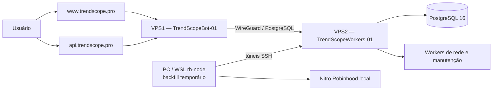

# TrendScope — Referência Técnica Atual

> Estado revisado em `2026-08-01`.
>
> Esta referência descreve o que foi confirmado no código, no banco e na
> infraestrutura durante a migração para os servidores Netcup. Planos futuros
> aparecem separados do que já está em produção.

## 1. Objetivo e regra de confiança

Este documento é o mapa técnico do TrendScope. Ele deve responder:

- onde cada parte do produto roda;
- qual processo é responsável por cada trabalho;
- quais dados são persistidos;
- como Solana e Robinhood entram no sistema;
- quais integrações externas estão envolvidas;
- o que já existe e o que ainda é roadmap;
- como validar, implantar e recuperar o serviço.

Quando houver conflito, use esta ordem de confiança:

1. código e schema da branch implantada;
2. configuração efetiva dos serviços e do `.env` do host;
3. estado observado no PostgreSQL e nos endpoints de health;
4. este documento;
5. planos históricos.

Nunca coloque neste arquivo:

- senhas;
- chaves privadas;
- API keys;
- bearer tokens;
- JWT secrets;
- conteúdo de arquivos WireGuard privados.

## 2. Estado resumido

O TrendScope é uma aplicação web multichain em evolução, com:

- frontend Vite + TypeScript;
- API Express;
- Socket.io para atualizações em tempo real;
- PostgreSQL como armazenamento central;
- workers separados por responsabilidade;
- Solana como chain original;
- Robinhood Chain em rollout/backfill;
- autenticação local, social e por carteira;
- acesso token-gated;
- billing implementado no código, mas não necessário para o lançamento
  token-gated atual;
- integração Telegram registrada em checkpoints locais, ainda não tratada como produção;
- wallet tracking multichain planejado, ainda não implementado como produto.

Baseline observado na migração:

- branch implantada nas duas VPS: `Robinhood-Implementation`;
- commit implantado: `350c45d`;
- a base local auditada antes das fatias wallet LIVE era `954ae548`, com o
  enrichment preparado para leituras de supply/quote no head, mas esse commit
  não deve ser
  presumido nas VPS sem conferir `git rev-parse --short HEAD`;
- o histórico local possui checkpoints posteriores, além de mudanças ainda não commitadas;
- os checkpoints locais, incluindo Telegram, não devem ser presumidos nas VPS até
  push, deploy e schema check correspondentes.

## 3. Topologia de produção atual



### 3.1 VPS1 — produto público

Hostname operacional:

```text
TrendScopeBot-01
```

Responsabilidades:

- servir o frontend estático;
- expor a API pública;
- manter o Socket.io;
- terminar TLS no Nginx;
- consumir o PostgreSQL pela rede privada WireGuard;
- não executar background workers.

Caminhos atuais:

```text
/opt/trendscope/app                 repositório
/var/www/trendscope                 build estático do frontend
/etc/nginx/sites-available/trendscope
/etc/nginx/sites-available/api.trendscope.pro
/etc/systemd/system/trendscope-web.service
```

Serviço web:

```text
trendscope-web.service
```

Contrato do runtime:

```env
NODE_ENV=production
PORT=3000
RUN_SOCKET_HUB=true
RUN_BACKGROUND_JOBS=false
DB_HOST=10.77.0.2
DB_PORT=5432
DB_NAME=volume_alert
```

`BACKGROUND_WORKER_GROUPS` não deve existir no `.env` da VPS1.

### 3.2 VPS2 — dados e processamento

Hostname operacional:

```text
TrendScopeWorkers-01
```

Responsabilidades:

- hospedar PostgreSQL 16;
- executar workers permanentes;
- executar partes pesadas do backfill Robinhood;
- receber conexões da VPS1 apenas pela rede privada;
- concentrar armazenamento de buckets, catálogos e dados de wallet tracking
  quando essa feature for implantada.

Características confirmadas:

- disco de aproximadamente 2 TB;
- PostgreSQL local na própria VPS2;
- database principal `volume_alert`;
- aplicação conectando com o usuário PostgreSQL `volumebot`;
- acesso entre VPS1 e VPS2 via WireGuard;
- PostgreSQL não deve ser publicado diretamente na internet.

Contrato geral de processos worker:

```env
NODE_ENV=production
RUN_SOCKET_HUB=false
RUN_BACKGROUND_JOBS=true
DB_HOST=127.0.0.1
DB_PORT=5432
DB_NAME=volume_alert
```

Cada unidade deve escolher apenas o grupo que realmente executa.

### 3.3 PC/WSL — papel temporário no backfill Robinhood

O ambiente `rh-node` no WSL mantém o Nitro Robinhood e foi usado para acelerar o
backfill.

Estado observado durante a migração:

- Nitro exposto localmente na porta `8547`;
- chain id retornado: `0x1237`;
- RPC reverso entregue à VPS2 em `127.0.0.1:18545`;
- acesso ao PostgreSQL da VPS2 feito por túnel;
- dois processos/shards de enrichment foram usados no WSL;
- discovery/shadow e enrichment foram distribuídos no PC;
- finalização/agregação pesada foi executada na VPS2.

Essa divisão é temporária. Antes de reiniciar o backfill, sempre confira as
unidades efetivas; não presuma que o `.env` sozinho representa o processo:

```bash
systemctl show <unidade> -p Environment -p ExecStart -p ActiveState
```

## 4. DNS, HTTPS e tráfego público

Registros públicos atuais:

```text
trendscope.pro      A      VPS1
www.trendscope.pro  A      VPS1
api.trendscope.pro  A      VPS1
```

A Vercel não está mais no caminho do frontend.

Nginx possui dois papéis:

- `trendscope.pro` e `www.trendscope.pro` servem `/var/www/trendscope`;
- `api.trendscope.pro` faz proxy para `127.0.0.1:3000`;
- `/socket.io/` suporta upgrade WebSocket;
- o fallback do frontend usa `index.html`, necessário para rotas SPA.

TLS:

- certificados emitidos pelo Let's Encrypt;
- Certbot integrado ao Nginx;
- `certbot.timer` habilitado e ativo;
- HTTP redirecionado para HTTPS.

Checagens:

```bash
curl -I https://www.trendscope.pro
curl -i https://api.trendscope.pro/api/health
curl -s https://api.trendscope.pro/nginx-health
systemctl is-active certbot.timer
```

`/nginx-health` prova apenas que o Nginx está vivo. `/api/health` prova que o
Node também está respondendo.

## 5. Repositório e componentes

### 5.1 Frontend

Diretório:

```text
frontend/
```

Tecnologias:

- Vite;
- TypeScript;
- Lightweight Charts;
- Socket.io Client;
- Solana Wallet Standard.

Arquivos centrais:

- `frontend/src/main.ts`;
- `frontend/src/state/app-controller.ts`;
- `frontend/src/state/app-state.ts`;
- `frontend/src/ui/app-shell.ts`;
- `frontend/src/ui/sections/`;
- `frontend/src/services/api/`;
- `frontend/src/services/socket/`.

Em produção, `frontend/src/services/api/base.ts` usa:

```text
https://api.trendscope.pro
```

como API padrão, salvo override permitido pelo próprio código.

### 5.2 Backend

Diretório:

```text
src/
```

Responsabilidades:

- API HTTP;
- cookies e sessões;
- OAuth;
- token gate;
- billing;
- catálogo;
- dashboard;
- alertas;
- Socket.io;
- composição e inicialização dos workers.

`src/server.js` é um arquivo de composição. Lógica nova de domínio deve ser
extraída para `src/services/` ou `src/models/`, não acumulada no servidor.

### 5.3 Banco e schema

Principais áreas:

- `src/models/`: acesso e contratos de persistência;
- `src/utils/db-init*.js`: criação/migração incremental;
- `src/utils/runtime-schema.js`: contrato do schema esperado;
- `src/utils/check-runtime-schema.js`: verificação operacional.

Validação obrigatória:

```bash
npm run db:schema-check
```

## 6. Runtime roles e workers

Controles principais:

```env
RUN_SOCKET_HUB=
RUN_BACKGROUND_JOBS=
BACKGROUND_WORKER_GROUPS=
```

Papéis derivados:

| Papel | Socket/API | Background jobs |
|---|---:|---:|
| `web` | sim | não |
| `background` | não | sim |
| `combined` | sim | sim |
| `idle` | não | não |

Produção deve usar processos separados. `combined` é forma de desenvolvimento
ou rollback emergencial, não topologia normal.

Grupos existentes:

| Grupo | Responsabilidades principais |
|---|---|
| `core` | catálogo, descoberta DEX, risco/enrichment e review sync |
| `market` | Meteora, bid zone, GMGN discovery e claim signals |
| `maintenance` | limpeza, retenção Robinhood e mock-trading take-profit |
| `robinhood` | ingestão live, projeção, staging e agregação Robinhood |
| `robinhood-backfill` | discovery, scan, enrichment, finalizer e aggregation do replay |

`robinhood` e `robinhood-backfill` são grupos isolados. O config rejeita
combinar um grupo isolado com grupos compartilhados.

A projeção Robinhood mantém um reparo persistente de metadata separado da página
de mercado ativa. Identidades `robinhood-onchain` com imagem ou launchpad pendente
são priorizadas, e a atividade recente desempata dentro da mesma classe;
assim o enriquecimento não depende de o token continuar no recorte de mercado de
15 minutos. Para preencher apenas imagens ausentes, a ordem é `logo()` pons
on-chain, `logoUrl` de `/rhj/assets` para Stock Tokens, `tokenURI()` IPFS para
metadata de contratos, `icon_url` do Blockscout e `info.imageUrl` do DexScreener. Esse
fallback de imagem fica sempre ativo. `ROBINHOOD_SOCIAL_METADATA_ENABLED=true`
controla somente o reparo adicional de website, X e comunidade via DexScreener;
`symbol/name` continuam vindo do ERC-20 on-chain e do Blockscout.

O worker processa por padrão até 50 identidades por minuto, com concorrência 8.
Os limites podem ser ajustados por `ROBINHOOD_CATALOG_PROJECTION_MAX_TOKENS`,
`ROBINHOOD_CATALOG_PROJECTION_CONCURRENCY` e
`ROBINHOOD_BLOCKSCOUT_METADATA_BATCH_SIZE` (máximo 50).

O catálogo também possui atribuição persistente de launchpad. O vocabulário
Robinhood diferencia pons, Bankr/Doppler, LaunchHood, RobinPad, Stock Tokens e o
fallback explícito `robinhood` para contratos diretos ou ainda desconhecidos.
Factories conhecidas vêm do creator retornado pelo Blockscout. Bankr/Doppler só
é atribuído quando o registro público da Bankr confirma o contrato; `tokenURI()`
genérico não é evidência suficiente. Factories prevalecem sobre metadata genérica.
As respostas do workspace e do feed de alertas expõem `launchpadId` e o protocolo
do mercado; no avatar, o frontend mostra o logo local da launchpad atribuída.
Contratos diretos, desconhecidos ou respostas antigas sem atribuição usam o
unicórnio da Uniswap. O tooltip do badge identifica a pool como Uniswap V2, V3
ou V4 quando `pairDexId` está disponível.

Worker leases no PostgreSQL evitam dois donos ativos para loops protegidos. Eles
não autorizam iniciar processos arbitrários: sempre verifique as leases e os
logs antes de escalar.

## 7. Superfícies do produto

Rotas web principais:

| Rota | Função |
|---|---|
| `/` | landing pública |
| `/login` | autenticação e criação de conta |
| `/access` | acesso/token gate e billing quando habilitado |
| `/account-security` | segurança e identidades vinculadas |
| `/alerts` | monitorados, manuais e feed de alertas |
| `/monitor` | RADAR, tokens recentes, antigos e bid zone |

Chains visíveis:

- Solana é a chain base;
- Robinhood só entra em `availableChains` quando
  `ROBINHOOD_USER_VISIBILITY_ENABLED=true`;
- readiness de Robinhood considera flags locais da API e a lease/telemetria
  compartilhada do worker.

Por isso a VPS1 mantém flags de rollout/readiness Robinhood mesmo com
`RUN_BACKGROUND_JOBS=false`.

As sparklines do workspace preservam a última série renderizável quando um
refresh do mesmo range/resolução falha ou retorna temporariamente vazio. A
entrada preservada recebe apenas o novo instante de refresh, evitando apagar o
gráfico ou iniciar retries agressivos; mudanças reais de range/resolução não
reutilizam a série anterior. Eventos `market:bucket` atualizam métricas e candles
em realtime; se um snapshot HTTP iniciado antes terminar depois, os candles
realtime posteriores ao corte do snapshot são mesclados novamente para impedir
rollback visual.

## 8. API pública

Mount points confirmados em `src/server.js`:

| Prefixo | Área |
|---|---|
| `/api/health` | health |
| `/api/auth` | autenticação local |
| `/api/auth/social` | Google/Discord |
| `/api/wallet-auth` | autenticação por carteira |
| `/api/invites` | convites |
| `/api/admin` | administração |
| `/api/account` | conta |
| `/api/account-security` | segurança |
| `/api/billing` | billing/MoonPay |
| `/api/token-gate` | token gate e webhook Helius |
| `/api/pre-access` | sessão pré-acesso |
| `/api/config` | configuração do usuário |
| `/api/bootstrap` | bootstrap de sessão/workspace |
| `/api/catalog` | catálogo |
| `/api/dashboard` | painéis, históricos e charts |
| `/api/x-profile` | perfil X |
| `/api/telegram` | integração Telegram presente apenas nos checkpoints locais em desenvolvimento |

Rotas sensíveis usam autenticação, rate limit e/ou checagem de origem. Não
publique o Node diretamente; o tráfego deve entrar pelo Nginx.

## 9. Autenticação, sessão e acesso

O sistema possui:

- login local;
- verificação de e-mail;
- recuperação de senha;
- OTP de login por e-mail;
- sessões persistidas;
- logout individual e global;
- vinculação/login com Google;
- vinculação/login com Discord;
- autenticação por carteira;
- pre-access;
- token gate.

URLs de produção esperadas:

```env
APP_BASE_URL=https://www.trendscope.pro
SOCIAL_AUTH_CALLBACK_BASE_URL=https://api.trendscope.pro
CORS_ORIGINS=https://www.trendscope.pro,https://trendscope.pro
PRE_ACCESS_RETURN_URL=https://www.trendscope.pro/access
```

Callbacks OAuth:

```text
https://api.trendscope.pro/api/auth/social/google/callback
https://api.trendscope.pro/api/auth/social/google/login/callback
https://api.trendscope.pro/api/auth/social/discord/callback
https://api.trendscope.pro/api/auth/social/discord/login/callback
```

Esses endereços precisam coincidir exatamente com os cadastrados nos consoles
Google e Discord.

## 10. Token gate

O lançamento atual não depende de assinatura. O acesso será token-gated.

Configuração conceitual:

```env
TOKEN_GATE_ENABLED=true
TOKEN_GATE_CHAIN=solana
TOKEN_GATE_RPC_PROVIDER=helius
```

Decisão de lançamento:

- tier unlimited habilitado;
- desconto desabilitado;
- promoção temporária desabilitada, salvo nova decisão explícita.

Valores usados para essa forma:

```env
TOKEN_GATE_UNLIMITED_THRESHOLD=10000
TOKEN_GATE_DISCOUNT_THRESHOLD=0
TOKEN_GATE_DISCOUNT_PERCENT=0
TOKEN_GATE_LAUNCH_PROMO_ENABLED=false
```

Webhook Helius esperado:

```text
https://api.trendscope.pro/api/token-gate/webhooks/helius
```

O webhook exige bearer token. A sincronização automática também precisa de ID,
URL e token configurados. Não registre esses segredos neste documento.

## 11. Integrações externas

### 11.1 Resend

Responsável por e-mails transacionais:

- verificação de e-mail;
- reset de senha;
- OTP.

Contrato:

```env
EMAIL_ENABLED=true
EMAIL_PROVIDER=resend
APP_BASE_URL=https://www.trendscope.pro
```

`EMAIL_FROM` deve usar domínio verificado no Resend. A migração da Vercel para a
VPS não altera Resend desde que os registros de e-mail e o domínio do remetente
continuem válidos.

### 11.2 Google e Discord

O backend inicia e conclui o OAuth em `api.trendscope.pro`; o retorno visual vai
para `www.trendscope.pro`.

Rotacionar um client secret não altera client ID nem callbacks, mas exige
atualizar o `.env` antes de remover o secret antigo.

### 11.3 MoonPay Commerce

Código de billing e webhook existe, mas billing não é requisito do lançamento
token-gated.

Webhook implementado:

```text
POST /api/billing/webhooks/moonpay
```

URL pública correspondente:

```text
https://api.trendscope.pro/api/billing/webhooks/moonpay
```

Não habilite billing parcialmente. `BILLING_ENABLED=true` só deve entrar quando
planos, credenciais, bearer token, webhook token e fluxo de retorno estiverem
validados juntos.

### 11.4 Telegram

Há uma implementação ampla registrada em checkpoints locais:

- vínculo por token;
- webhook;
- menus e alertas localizados automaticamente pelo `language_code` do Telegram,
  com português para tags `pt-*`, inglês como fallback e estados binários
  padronizados em `✅` ativo e `❌` inativo;
- perfis e regras;
- state independente;
- outbox de entrega;
- coordenação de destino Solana.
- cutoff interno no último bucket completo anterior ao alerta, sem parâmetro público.
- `sharp` 0.35.3 selecionado para rasterização; requer Node >= 20.9 nas VPS.
- renderer Telegram gera PNG 960x420 e sinaliza fallback quando faltam pontos.
- sender Telegram compõe histórico e imagem, com fallback textual pré-envio.
- formatter Telegram produz HTML seguro e links validados por rede.
- worker Telegram possui claim, access gate, heartbeat e settlement isolados.
- contexto de entrega revalida lease e identidade antes de montar o sender.
- access gate de entrega suspende a conexao e cancela backlog ainda nao claimed.
- acesso recuperado grava pedido de reativacao, mas nao libera envio sem baseline.
- epoch de reativacao possui transicao atomica pronta, ainda sem wiring runtime.
- planner converte observacoes de reativacao em baseline sem criar delivery.
- destino Solana ativa a conexao apenas depois do commit seguro do baseline.
- reconciliador pode reativar sem baseline quando Solana esta desabilitado,
  revalidando essa condicao no mesmo `UPDATE` que libera a conexao.
- runtime Telegram drena a outbox antes de reconciliar reativacoes e executa
  ciclos serializados com backoff.
- quando habilitado, o grupo `core` inicia esse runtime sob lease distribuido e
  o encerra antes de liberar os leases no shutdown.
- telemetria Telegram agrega fila, latencia, erros, perfis, conexoes, updates e
  fallbacks sem expor secrets, chats ou payloads; o admin recebe o diagnostico
  completo sanitizado e `/api/health` recebe apenas o resumo publico.
- registro e remocao do webhook ainda sao operacoes manuais documentadas em
  `docs/telegram-alert-operations-runbook.md`; nao existe shadow Telegram
  separado, portanto a primeira ativacao deve ficar isolada no admin de staging.
- smoke Playwright protege a transicao visivel entre integracao desabilitada e
  criacao controlada do deep link, sem chamar a Bot API real.

Stages locais relacionados:

```text
84 a 89, 93, 94 e 95
```

Até push, deploy, migrations e validação em produção, Telegram deve ser
tratado como **em desenvolvimento**, não como capacidade ativa do bot.

### 11.5 Fontes de mercado Solana

O código contém integrações e workers relacionados a:

- GMGN;
- DexScreener;
- Meteora;
- PumpFun;
- Helius;
- QuickNode e Jupiter em scripts/probes.

Scripts de probe não são automaticamente infraestrutura de produção.

SHYFT/Yellowstone gRPC continua planejado. Não confundir o plano de firehose com
uma integração já implantada.

## 12. Solana

Solana continua sendo a chain funcional original.

Responsabilidades atuais incluem:

- descoberta e atualização de catálogo;
- snapshots e buckets de mercado;
- monitorados e tokens manuais;
- RADAR;
- alertas;
- snapshots Meteora;
- PumpFun;
- token gate via Helius;
- Socket.io para atualização do frontend.

Durante migrações, interromper workers Solana cria lacunas nos buckets. O banco
central reduz a fragmentação, mas não recompõe automaticamente períodos que
nenhum worker coletou. Backfill de lacunas deve ser uma ação explícita e
validada por fonte.

### 12.1 Recovery recente de candles via CoinGecko

`npm run market-buckets:recover-coingecko` audita as últimas 12 horas completas
de candles de 1 minuto dos tokens Solana elegíveis e ativos, excluindo
prioridade `dormant` e tokens bloqueados. O relatório segue market cap
decrescente e mostra exatamente os intervalos ausentes por token.

O comando é dry-run por padrão. `--confirm-fill` imprime primeiro o relatório
completo e depois insere somente timestamps ausentes, com backup transacional e
reconstrução dos agregados dependentes. Buckets de 1 minuto já existentes nunca
são substituídos. A conversão de preço para market cap usa o par
`last_mcap / last_price` do mesmo snapshot de catálogo.

Esse recovery deve rodar na VPS2, onde está o PostgreSQL de produção, com a
chave CoinGecko disponível apenas no backend:

```bash
npm run market-buckets:recover-coingecko
npm run market-buckets:recover-coingecko -- --confirm-fill
```

## 13. Robinhood Chain

### 13.1 Objetivo

O pipeline Robinhood deve:

- acompanhar a chain;
- descobrir pools/markets;
- normalizar logs de mercado;
- produzir observações;
- gerar buckets de 1 minuto, 1 hora e agregados;
- alimentar catálogo, charts e alertas;
- permitir wallet tracking EVM futuramente.

### 13.2 Componentes persistidos

Stages confirmados:

| Stage | Função |
|---:|---|
| 63 | registry de pools, cursores e processed logs |
| 64 | observações exatas de mercado |
| 65 | buckets de 1 minuto |
| 66 | buckets de 1 hora |
| 67–68 | liquidez em observações/buckets |
| 72–75 | metadata e proveniência de cobertura |
| 78 | buckets agregados por token |
| 79 | proveniência de supply |
| 82 | captura durável do backfill |
| 83 | outbox de agregação do backfill |
| 90 | swaps Robinhood atribuídos à wallet (`tx.from`) |
| 91 | cursores independentes `seed`/`live` de wallet-swaps |
| 92 | índice de leitura das observações para atribuição |
| 96 | proveniência `latest_call` usada pelo enrichment LIVE no node podado |
| 98 | TVL Uniswap V3 pelos saldos ERC-20 da pool e constraints correspondentes |
| 99 | ledger idempotente dos deltas `ModifyLiquidity` V4 por pool/faixa de ticks |
| 100 | cursor independente do replay histórico de liquidez V4 pelo RPC local |
| 101 | faixas V4 materializadas e mantidas incrementalmente após o replay |
| 102 | TVL V4 point-in-time pelas faixas de ticks e constraints correspondentes |

A liquidez V3 usa os saldos reais de token e quote mantidos pelo contrato da
pool, valorados ao preço spot do mesmo snapshot. V4 captura os deltas assinados
de liquidez de forma atômica com o processed log, mas continua fail-closed até o
backfill histórico e a materialização das posições/ticks do `PoolManager`.
O replay V4 usa `eth_getLogs` em `127.0.0.1:8547`, não altera os watermarks do
backfill geral e pode ser retomado com `npm run robinhood:v4-liquidity-replay`.
Depois de `completed`, `npm run robinhood:v4-liquidity-materialize` valida saldos
não negativos, cria as faixas e ativa sua manutenção atômica pelo worker live.
Com a Stage 102, swaps V4 valoram o principal das faixas no preço corrente; o
backfill consulta o ledger no bloco/log do swap, sem usar posições futuras.

### 13.3 Pipeline de backfill

Ordem lógica:

```text
discovery/scan
    -> staging durável
    -> enrichment
    -> finalizer
    -> aggregation outbox
    -> buckets permanentes
```

As tabelas de staging, ranges, watermarks e outbox existem para o trabalho
continuar após restart sem escolher manualmente o último bloco.

Reiniciar um worker corretamente configurado deve retomar claims pendentes,
leases expiradas e watermarks persistidos. Não resete cursores ou ranges para
"começar de novo" sem auditoria.

Snapshot informado em `2026-08-01`:

```text
discovery_scan.next_block  = 25346067
market_scan.next_block     = 25345966
market_enriched.next_block = 25345966
```

Nesse instante, market scan e enrichment estavam alinhados; discovery estava
101 blocos à frente. Esses valores são móveis e servem como evidência de saúde,
não como bloco fixo para um cutover posterior.

### 13.4 Live depois do backfill

O backfill histórico e o acompanhamento do head são responsabilidades
diferentes.

Depois do catch-up:

- um node pruned pode acompanhar o head;
- workers transformam eventos novos em observações/buckets;
- histórico consolidado permanece no PostgreSQL;
- os listeners PostgreSQL de buckets e alertas reconectam automaticamente após
  queda de rede, reinício do banco ou encerramento administrativo da conexão;
  como `LISTEN/NOTIFY` não retém mensagens, a reconexão recupera o transporte,
  mas não reemite sozinha a janela perdida; gráficos podem recarregar pela API
  e alertas de usuário permanecem persistidos para replay quando o cliente
  reconecta;
- o backend expõe histórico expandido completo em 5m, 15m e 30m diretamente de
  `robinhood_market_buckets_agg`, limitado a 10.000 candles e com `truncated`
  explícito quando o token ultrapassa esse teto; o frontend solicita esse modo
  somente nesses três períodos e mantém 1m/1h/4h/24h nos limites usuais;
- archive completo do node não é necessário apenas para processar blocos novos;
- qualquer consulta histórica fora da janela do node precisa do PostgreSQL,
  de um provedor archive ou de um snapshot próprio.

O node atual no WSL foi iniciado com archive durante o backfill. A troca para
uma configuração pruned/live deve ser feita somente depois de confirmar head,
cursores e cobertura.

Na base local auditada `954ae548`, o enrichment LIVE normal de swaps já usa WETH/USD e
metadata/supply em `latest`, com `token_supply_status='latest_call'`. Esse caminho
depende da stage 96 antes de ser ligado. A validação de lançamentos NOXA ainda faz
`eth_call`/`eth_getCode` no bloco do evento; portanto steady state perto do head
é compatível com o node podado, mas catch-up após uma parada maior que a janela
de estado ainda precisa de política própria ou recuperação operacional.

O cutover aprovado é por sobreposição: manter o backfill ativo, ligar o LIVE na
VPS2 a partir de um `market_enriched.next_block` fresco, comprovar cursores e
buckets avançando, parar scanners, drenar os consumidores do backfill e só então
desabilitar as units antigas. O archive do PC é o último componente a ser desligado.

## 14. Buckets, swaps e retenção

Princípio:

- buckets consolidados são históricos de longo prazo;
- swaps/eventos normalizados sustentam wallet tracking e evidência detalhada;
- dados brutos não devem crescer indefinidamente.

Decisão de produto:

- preservar aproximadamente 30 dias de swaps normalizados;
- remover dados expirados em batches;
- manter buckets e agregados além dessa janela;
- usar o timestamp do swap para posicionar markers históricos no chart.

Estado atual:

- Robinhood já possui tabelas duráveis de observações, buckets e backfill;
- Solana já possui buckets de mercado;
- a retenção normalizada multichain de swaps por 30 dias é um plano aprovado,
  mas não deve ser tratada como totalmente implantada sem schema, jobs e
  métricas correspondentes em produção.

## 15. Wallet tracking multichain

Wallet tracking de produto ainda é roadmap, mas a fundação de captura Robinhood
já existe localmente: tabela particionada, persistência, adapter `tx.from`,
attributor, cursores `seed`/`live` e seed standalone. A captura contínua do stream
`live` também está implementada no checkout local, mas permanece desabilitada e
sem cursor até executar o bootstrap explícito; não confundir código pronto com
cobertura LIVE já ativa de `robinhood_wallet_swaps`.

Os contratos locais de atribuição já são fail-closed: o bloco cheio fornece hash,
número e timestamp para checkpoint; qualquer transação ausente impede escrita
parcial e avanço do seed. O repository também possui avanço monotônico específico
para o futuro cursor `live`, preservando checkpoint em atualizações de frontier.

O runner e o worker de wallet-swaps LIVE existem localmente. Eles limitam o trabalho
ao menor valor entre `nodeHead - 12` e o último bloco commitado pelo cursor market,
revalidam checkpoint, avançam ranges comprovadamente vazios e ficam em
`awaiting-bootstrap` enquanto o cursor `live` não foi criado. O worker reutiliza o
RPC Robinhood com preflight de chain ID `4663`, lease própria, telemetria, backoff e
wiring no grupo `robinhood`; execução do bootstrap, deploy e canary continuam pendentes.

O bootstrap também existe localmente como
`npm run robinhood:wallet-live-bootstrap`: dry-run por padrão, audita observações
aceitas sem wallet até `seed.safe_head`, valida o RPC/chain e prova o bloco cheio
mais antigo com observação aceita no gap. A confirmação longa cria o cursor uma
única vez; sua existência no código não significa que o comando já foi executado
na VPS2.

Ele deve nascer multichain:

- identidade inclui `chain` + endereço normalizado;
- EVM e Solana usam adaptadores diferentes;
- fee payer, signer, router, beneficiário e trader não são sempre a mesma coisa;
- compras/vendas precisam de direção, token, quote, valor, market e timestamp;
- dedupe deve usar identidade própria da chain;
- markers do chart devem apontar para eventos persistidos.

Não confundir:

- wallets vinculadas para login/token gate, que já existem;
- wallets acompanhadas como smart money/trader, que são uma feature futura.

Sequência aprovada:

1. concluir e estabilizar o backfill Robinhood;
2. estabilizar o node/live Robinhood;
3. criar fundação de wallet tracking multichain;
4. lançar wallet tracking Robinhood;
5. integrar SHYFT/Yellowstone para Solana;
6. adicionar wallets Solana;
7. avaliar Base, BSC e outras EVM por adaptador.

## 16. Persistência

Áreas de dados importantes:

- usuários, sessões e tokens de auth;
- identidades sociais;
- wallets vinculadas;
- acesso/token gate;
- billing orders e events;
- configs e preferências;
- tokens manuais, starred, blocklist e folders;
- catálogo;
- snapshots e buckets;
- alert events e states;
- mock trading;
- Robinhood registry, cursores, observações e buckets;
- worker leases;
- staging/outbox de backfill;
- Telegram, quando as stages 84–89 forem oficialmente implantadas.

O PostgreSQL deve continuar sendo o ponto compartilhado entre web e workers.
Não coloque um segundo banco independente na VPS1.

## 17. Backup e recuperação

A migração física com `pg_basebackup` não é uma política de backup contínuo.

Política mínima ainda necessária:

- backup lógico ou físico automatizado;
- destino fora da VPS2;
- retenção diária/semanal;
- criptografia;
- teste periódico de restore;
- monitoramento de tamanho e falha;
- cópia dos arquivos operacionais que não estão no Git.

Um `pg_dump` pode ser muito menor que o diretório do PostgreSQL porque:

- não copia espaço livre/bloat da mesma maneira;
- recria índices durante restore em vez de armazenar todas as páginas do índice;
- comprime dados repetitivos.

Isso não significa que o restore usará apenas o tamanho do dump. O banco
restaurado volta a ocupar dados + índices + WAL + espaço operacional.

Arquivos que precisam de cópia segura separada:

- `.env` de produção;
- chaves WireGuard;
- unidades systemd;
- configs Nginx;
- inventário de DNS/OAuth/webhooks;
- procedimento de recuperação.

## 18. Deploy do frontend

Fluxo atual na VPS1:

```bash
cd /opt/trendscope/app
runuser -u trendscope -- npm --prefix frontend ci
runuser -u trendscope -- npm --prefix frontend run build
rsync -a --delete frontend/dist/ /var/www/trendscope/
chown -R www-data:www-data /var/www/trendscope
nginx -t
systemctl reload nginx
```

Validação:

```bash
curl -I -H 'Host: www.trendscope.pro' http://127.0.0.1
curl -I https://www.trendscope.pro
```

Risco atual:

- `rsync --delete` atualiza o diretório ativo;
- ainda não há release directory versionado/symlink atômico documentado;
- rollback do frontend depende de Git + rebuild.

## 19. Deploy do backend

Antes:

```bash
cd /opt/trendscope/app
git status --short
git branch --show-current
git log -1 --oneline
```

Nunca execute pull sobre alterações desconhecidas.

Depois de atualizar dependências/configuração:

```bash
runuser -u trendscope -- npm run db:schema-check
systemctl restart trendscope-web.service
systemctl status trendscope-web.service --no-pager -l
curl -i https://api.trendscope.pro/api/health
```

Se falhar:

```bash
journalctl -u trendscope-web.service -n 100 --no-pager
```

O deploy de workers deve reiniciar somente as unidades afetadas. Não reinicie
todos os workers por conveniência durante backfill ou ingestão live.

## 20. Segurança operacional

Controles atuais:

- SSH por chave;
- firewall permitindo apenas portas necessárias;
- Nginx na frente do Node;
- HTTPS;
- banco em rede privada;
- API e workers separados;
- cookies seguros em produção;
- CORS explícito;
- Helmet/CSP;
- rate limiting;
- schema check antes de restart.

Regras:

- não publicar PostgreSQL em `0.0.0.0/0`;
- não expor RPC do node diretamente à internet;
- não reutilizar private keys entre hosts;
- não commitar `.env`;
- rotacionar segredo vazado, não apenas apagá-lo de uma mensagem;
- manter VPS1 sem background jobs;
- manter VPS2 sem socket hub público;
- auditar unidades systemd e processos depois de reboot.

## 21. Testes e segurança do banco

Testes unitários:

```bash
npm run test:unit
```

Integração:

```bash
npm run test:integration
```

Integração é destrutiva contra o database selecionado. Nunca use:

- banco de produção;
- snapshot de produção;
- VPS2;
- `.env` normal.

Use `.env.test` e database local claramente nomeado como teste.

Validação por mudança:

- frontend: lint + build;
- backend: lint + testes afetados;
- schema: schema check;
- auth/billing/persistência: validação de integração proporcional;
- fluxo visível: smoke quando aplicável.

## 22. Observabilidade e checagens rápidas

Web:

```bash
systemctl status trendscope-web.service --no-pager -l
curl -i https://api.trendscope.pro/api/health
curl -I https://www.trendscope.pro
```

Banco:

```bash
sudo -u postgres psql -Atc "SELECT current_database(), current_user;"
sudo -u postgres psql -Atc "SELECT pg_size_pretty(pg_database_size('volume_alert'));"
```

WireGuard:

```bash
wg show
ping -c 3 10.77.0.2
```

Schema:

```bash
npm run db:schema-check
```

Workers:

```bash
systemctl list-units --type=service --all | grep -Ei 'trendscope|volume|robinhood'
```

Backfill:

- conferir ranges por status;
- conferir leases expiradas;
- conferir staging pendente;
- conferir watermarks;
- conferir outbox de agregação;
- conferir cobertura/buckets, não apenas CPU do processo.

## 23. Pendências e riscos atuais

### Infraestrutura

- backup externo automatizado ainda precisa ser formalizado;
- rollback atômico do frontend ainda não está montado;
- inventário permanente das unidades worker da VPS2 precisa ser mantido;
- monitoração de disco, WAL, conexões e leases deve ganhar alertas.
- no diagnóstico de `2026-08-01`, o runtime schema check da VPS2 ainda reportava
  stages Telegram 84-89 e 93-95 ausentes; o servidor do HEAD local valida o profile
  runtime antes de iniciar workers, portanto essa divergência precisa ser resolvida
  antes do canary LIVE. A stage 96 deve ser confirmada e aplicada somente se o
  schema check completo ainda a reportar como pendente.

### Documentação

O `README.md` ainda contém premissas antigas:

- frontend na Vercel;
- PostgreSQL na mesma VPS do backend;
- nomes antigos sugeridos para unidades systemd;
- referência a um ops runbook removido.

Ele deve ser corrigido em uma mudança separada para não continuar contradizendo
esta referência.

### Produto

- o backfill Robinhood foi reportado como alcançado no snapshot de `2026-08-01`,
  mas ainda precisa da auditoria final de staging/outbox antes de ser desligado;
- o LIVE Robinhood preparado no código precisa de migrations, deploy, canary com
  overlap e estabilização no head da VPS2;
- o worker LIVE de wallet-swaps, seu runner fail-closed, configuração, lease e
  bootstrap auditável já existem no checkout local, desabilitados por padrão.
  Ainda faltam executar o bootstrap na VPS2, deploy e canary antes de considerar
  o desligamento do seed/archive como handoff completo de wallet tracking;
- retenção de swaps por 30 dias precisa virar implementação verificável;
- wallet tracking multichain ainda é roadmap;
- SHYFT/Yellowstone ainda é roadmap;
- Telegram está em desenvolvimento local;
- billing existe, mas lançamento atual é token-gated.

## 24. Relação com outros documentos

Referências úteis:

- `README.md`: entrada do projeto, parcialmente desatualizada na topologia;
- `docs/robinhood-vps-history-rollout-plan.md`: desenho do replay Robinhood;

Os planos locais de retenção, wallet tracking, SHYFT/Yellowstone, Telegram,
configuração por chain e alertas derivados do X ainda precisam de commits
documentais separados antes de serem referenciados aqui como arquivos
versionados.

Planos descrevem direção e decisões; não provam deploy.

## 25. Checklist de estado saudável

- [ ] `www.trendscope.pro` responde HTTPS com o frontend atual.
- [ ] `api.trendscope.pro/api/health` responde sem `502`.
- [ ] `trendscope-web.service` está `active`.
- [ ] VPS1 reporta `RUN_BACKGROUND_JOBS=false`.
- [ ] VPS2 alcança PostgreSQL local.
- [ ] VPS1 alcança PostgreSQL apenas pelo WireGuard.
- [ ] Schema check passa no perfil runtime.
- [ ] Cada worker possui no máximo uma lease ativa.
- [ ] Solana continua produzindo dados recentes.
- [ ] Robinhood backfill avança sem ranges presos.
- [ ] Buckets Robinhood são auditados por cobertura.
- [ ] Disco e WAL possuem folga.
- [ ] Certbot timer está ativo.
- [ ] OAuth usa callbacks em `api.trendscope.pro`.
- [ ] Resend usa remetente verificado.
- [ ] Helius token gate aponta para o webhook de produção.
- [ ] Nenhum segredo está versionado.
- [ ] Existe backup externo recente e um restore já foi testado.
