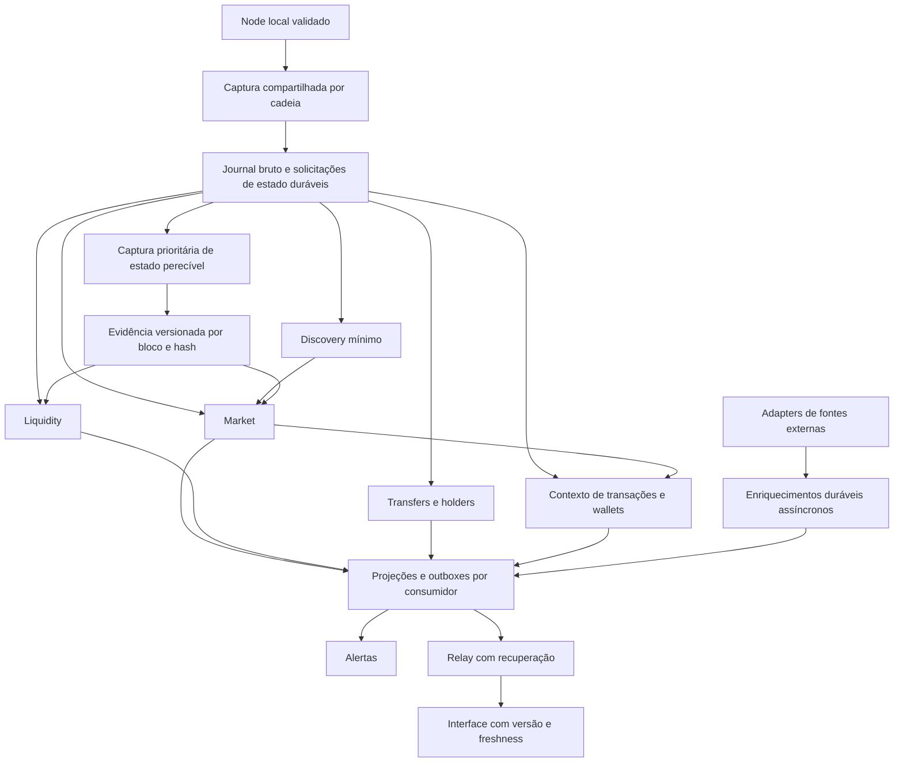

# Arquitetura realtime Robinhood — execução, comprovação e backfill posterior

Status: plano proposto; nenhuma migração ou troca de produtor é autorizada por este documento.
Base: revisão estática do repositório em 2026-09-04, sem acesso ao banco, node ou VPS.
Prioridade: colocar a arquitetura nova em funcionamento, testá-la e comprovar o resultado antes da recuperação histórica ampla.

## 1. Objetivo e regra de conclusão

Compartilhar a captura da blockchain, processar cada domínio por eventos duráveis e entregar as mudanças até alertas e interface com latência baixa, mensurável e recuperação segura.

**Ponto importante:** arquitetura funcionando e histórico recuperado são entregas distintas. A primeira pode terminar com pendências históricas explícitas, mas não com perda de eventos novos, ausência silenciosa de evidência ou dados incompletos apresentados como atuais.

Não será necessário drenar todo o atraso de holders e liquidity pelo caminho legado antes de migrar. Será necessário preservar sua cobertura, seus checkpoints e os dados usados para reconstrução. Entidades sem base inicial confiável continuam capturadas, mas não são publicadas como completas.

O marco “arquitetura comprovada” exige todos os gates da seção 8. Rodar em shadow, passar testes unitários ou alcançar o head em um único momento não basta. O backfill amplo começa depois desse marco; bootstrap mínimo e captura de estado perecível pertencem à arquitetura e acontecem antes.

## 2. Escopo e relação com os outros planos

O caminho de implementação deste plano é Robinhood: captura, discovery, market, liquidity, holders/transfers, creators/deployment, wallets/classificações, derived, alertas, relay e interface. Preservar os contratos públicos e regras de negócio existentes, exceto mudanças explicitamente aprovadas em cada fatia.

“Todos os dados do bot” exige também inventariar Solana, X/callouts, metadata, imagens e demais fontes externas. Cada fonte precisa de adapter e contrato próprios; não deve passar pelo journal EVM. Essa cobertura entra na matriz da etapa 0. Implementação de outros adapters exige escopo e aprovação próprios; não declarar o bot inteiro migrado enquanto houver fonte fora do inventário ou do aceite.

Este documento orienta a próxima execução e refina o [plano original](robinhood-zero-delay-realtime-architecture-plan.md), em especial estado perecível, finality, migração dos consumidores e critérios de comprovação. A [auditoria de cobertura](robinhood-chain-capture-coverage-audit.md) é ponto de partida a revalidar, não prova suficiente de completude.

O [bot-reference](bot-reference.md) continua descrevendo a operação existente. Atualizá-lo apenas quando cada alteração efetivamente mudar o contrato operacional. Não registrar este alvo como se já estivesse implantado. Preservar os mecanismos úteis do [backfill de holders](robinhood-holder-global-backfill-plan.md).

## 3. Estado observado no código

| Componente | Base existente | Lacuna para o alvo |
|---|---|---|
| Captura | `robinhood-chain-capture-worker` lê bloco/receipts; journal transacional e validações | Espera snapshots V3 antes do commit; fetch entre blocos serial; estado fora da janela pode faltar |
| Journal | Hash, contexto de transações, tópicos selecionados, versão e digest; sidecar V3 | Retenção segura e contrato completo de reorg; blocos lidos não significam todos os dados preservados |
| Outbox canônica | Somente discovery/market, claims e retries | Outros domínios e posições independentes para consumidores/canário |
| Canonical head | Sink separado de candidatos, guard RPC e gate de canário | Não publica no processing de produção; bloqueio global do prefixo; paridade inversa ausente |
| Processing | Evidência congelada e persistência sem RPC | Timer de 1s/5s por default; falta wake-up durável até esse consumidor |
| Derived | Outbox e `LISTEN/NOTIFY` | Fan-out também entrega tarefas em memória; confirmar durabilidade por consumidor |
| Holders | Journal, ledger, hot queue, apply por token, handoff e correções de reorg | Substituir leitura própria pela captura comum, preservando esses contratos |
| Liquidity | Atividade por logs, valoração em lotes, cursor e snapshots | Leitor próprio e dependência do frontier legado; separar evidência e falhas por pool |
| Wallets/deployment | Cursores, projeções e evidências especializadas | Releituras de blocos/receipts/code e alguns caminhos de trace a classificar |
| Publicação | Socket, sequências e recuperação em algumas superfícies | Freshness consistente, recuperação de lacunas e invalidações de todos os domínios |
| Saúde | Leases e telemetria | Health de alertas exige head legado; heartbeat não prova progresso nem SLO |

Esses itens descrevem código, não processos ativos na VPS. O atraso de holders e liquidity foi informado pelo operador; sua causa e tamanho ainda precisam ser medidos. Não presumir que trocar a fonte resolve um eventual gargalo do apply ou do PostgreSQL.

## 4. Arquitetura alvo

### 4.1 Captura e evidência

- Uma autoridade lógica de captura por cadeia, com possibilidade de standby e proteção de escrita por geração/lease. “Uma vez” significa leitura compartilhada no caminho normal; retry e recuperação podem reler dados.
- `newHeads` acorda a captura; continuidade verifica lacunas e perda de transporte. Validar número, hash, parent, chain ID, receipts, transações e ordem antes de persistir.
- Persistir envelope bruto, trabalhos obrigatórios e cursor bruto atomicamente. Fetch pode ter concorrência limitada; commit mantém ordem e não salta blocos.
- Capturar todos os contextos de transação exigidos e a união versionada dos tópicos necessários, sem depender apenas do catálogo atual. Mudança de escopo/tópicos tem fronteira explícita de cobertura.
- Separar `rawThroughBlock` de `evidenceThroughBlock` por domínio/entidade. Esses nomes são conceitos do contrato alvo, não colunas existentes.
- Estados necessários devem ser capturados uma vez por chave equivalente `(chain, blockHash, contrato, chamada)` e compartilhados; usar cache/single-flight e batches limitados.
- Estado perecível recebe recursos reservados e deadline anterior à retenção real do node. Solicitação pendente, falha, indisponibilidade definitiva e evidência completa são situações diferentes e persistidas.
- Bloco bruto pode avançar sem a evidência de uma pool; a projeção dependente não publica valor inventado. Nenhuma exceção permite abandonar silenciosamente uma solicitação necessária.
- Consultas por hash quando suportadas; caso contrário, conferir identidade antes/depois e rejeitar divergência. Registrar se a evidência representa fim de bloco, estado por evento ou leitura atual.
- Separar estado por evento de saldo final do bloco: o snapshot V3 atual reutiliza o saldo final para todos os swaps da pool no bloco. Preservar ou alterar esse contrato conscientemente.
- Não separar o snapshot atual do capturador antes de existir a fila prioritária, a retenção suficiente e o teste de recuperação que o substituem. Apenas mover o `await` criaria risco de perda de estado.

### 4.2 Consumidores, dependências e publicação

- PostgreSQL é a primeira opção de journal/outbox; introduzir outro broker somente diante de gargalo medido e decisão arquitetural própria.
- Notificação é wake-up. Cada consumidor possui posição durável, retries, lease e isolamento de falhas. Canário não pode consumir o trabalho que o produtor real ainda precisa.
- Avanço de cobertura inclui blocos sem eventos relevantes, distinguindo “nenhuma mudança” de “não processado”.
- Ordenar por `(blockNumber, transactionIndex, logIndex)` dentro da entidade e preservar dependências entre entidades. Shards determinísticos impedem dois aplicadores simultâneos do mesmo estado.
- Discovery mínimo libera a identidade da pool antes de seus swaps; imagens/sociais não fazem parte dessa barreira. Metadata essencial ao cálculo pode bloquear apenas seu dependente.
- Commit da projeção, idempotência e outbox downstream pertencem à mesma transação, ou a protocolo equivalente testado contra crash. Enqueue em memória não é confirmação durável.
- Drenar imediatamente trabalho elegível, com limites por rodada para preservar responsividade. Polling normal de entidades não pode substituir um evento já disponível.
- Interface usa versão/geração e fronteiras por dado. Snapshot inicial e eventos seguintes precisam de handoff sem lacuna; reconnect recupera deltas ou novo snapshot com limite explícito de replay.
- Alertas externos mantêm intenção durável e deduplicação. Se o canal não oferecer idempotência, documentar a janela de entrega ambígua; não prometer exactly-once externo.

### 4.3 Reorg, segurança e recursos

- Centralizar a decisão canônica; consumidores mantêm sua lógica de reversão/reconstrução. Reorg na mesma altura também precisa ser detectado.
- Encontrar ancestral comum, persistir nova geração/invalidação, barrar writes de geração antiga, reverter derivados e reaplicar a nova ramificação. Correções públicas incluem a nova geração.
- Além da janela suportada: `recovery_required`, preservação de evidência e dados públicos invalidados. Recuperação não pode avançar cursor por skip.
- Distinguir observado, confirmação por profundidade e finalização demonstrada pela fonte. Não chamar `head - N` de finalização da rede.
- Reservar conexões, CPU, memória e I/O para captura, estado perecível e live; limites locais por processo não substituem orçamento total do node/banco/disco.
- RPC local de leitura, chain ID validado, métodos permitidos por papel e credenciais separadas por necessidade. Não reduzir durabilidade do banco para ganhar latência.
- Leases precisam de proteção na escrita contra proprietário antigo, não apenas encerramento futuro pelo heartbeat. Testar failover e perda de conectividade.
- Reter dados até consumidores, replay, lookbacks e janela de reorg estarem protegidos. Arquivamento só libera poda após verificação de integridade e restauração.
- Monitorar disco, WAL, filas e notificações; espaço finito exige degradação explícita. Consumidor lento não bloqueia logicamente a captura, mas ainda pode esgotar recursos sem esses limites.

## 5. Sequência de execução

As etapas abaixo não são uma autorização para executá-las em lote. Cada etapa pode exigir várias fatias menores que 500 linhas; cada fatia requer escopo, implementação, validação, diff e commit próprios.

### Etapa 0 — fechar contratos e baseline sem iniciar recuperação ampla

- [ ] Inventariar cada dado consumido: fonte, gatilho, decoder, domínio, estado inicial, leitura complementar, retenção, precisão, consumidor público e comportamento quando ausente.
- [ ] Distinguir dados atuais, histórico, cobertura de eventos e finality. Cobrir supply, cotação USD, saldo nativo, criação interna, classificações e dependências temporais.
- [ ] Registrar endpoints/capacidades sem segredos, schemas instalados, units/flags, checkpoints, hashes, floors de retenção e pendências. Solicitar ao operador queries somente de leitura, derivadas dos schemas verificados, se necessárias.
- [ ] Medir separadamente captura, apply de holders, valoração de liquidity, filas de conexões e disco. Não atribuir todo atraso ao RPC.
- [ ] Preencher orçamento de recursos, retenção de estado e SLO por domínio; valores medidos e metas devem ficar separados.

Saída: matriz sem fontes desconhecidas e mapa de dependências. Gate: nenhum dado obrigatório com fonte ou política de ausência indefinida.

### Etapa 1 — preservar o futuro durante a construção

- [ ] Verificar cobertura contínua do journal e versão adequada. Escolher `C = primeiro bloco integralmente coberto pela nova captura`, com hash e contratos ativos; não inventar esse número localmente.
- [ ] Preservar cursores/floors legados e registrar intervalos históricos faltantes por domínio/entidade. Criar controle separado para cobertura nova; não deslocar cursor antigo para esconder atraso.
- [ ] Dimensionar retenção até a recuperação e salvar evidência perecível desde já. Preservar também lookbacks anteriores a C necessários a FRESH/BUNDLED e outras regras; se faltarem, sinalizar incompletude.
- [ ] Validar capacidade antes de prolongar retenção; pausar apenas manutenção concorrente que o operador autorizar. Não parar grupos inteiros sem mapear suas outras responsabilidades.

Saída: eventos novos e estados necessários protegidos. Gate: nenhuma poda destrói a faixa prometida e não há dependência cotidiana do archive do PC para completar o live.

### Etapa 2 — endurecer captura, canonicalidade e fila de estado

- [ ] Implementar as duas fronteiras, trabalhos de estado atômicos, captura prioritária e evidência com proveniência imutável.
- [ ] Aplicar limites de bytes/eventos por batch, concorrência e deadline; um bloco grande não pode gerar Multicall ou transação sem limite operacional conhecido.
- [ ] Implementar detecção de reorg, gerações, finality correta e proteção dos writers. Reusar reversões existentes por domínio por uma interface explícita.
- [ ] Implementar continuidade, reconnect, backoff e standby; fetch limitado pode sobrepor blocos, mantendo commit ordenado.
- [ ] Medir tempos por bloco com relógio monotônico para durações; timestamps UTC e correlação entre processos para a cadeia completa.

Saída: captura/evidência confiáveis em shadow. Gate: testes de falha e cobertura da seção 7; desligar snapshot síncrono somente quando o substituto estiver comprovado.

### Etapa 3 — firmar contrato comum dos consumidores

- [ ] Adicionar roteamento e posições de consumo independentes para os domínios restantes; preferir trabalho por bloco/shard quando isso reduzir amplificação sem perder isolamento.
- [ ] Garantir cobertura de blocos vazios, replay, deduplicação, lease expirada e settlement protegido por geração.
- [ ] Usar `LISTEN/NOTIFY` com reconciliação da fila no startup/reconnect e fallback limitado. Não reutilizar a mesma posição entre shadow e produção.
- [ ] Para cada fallback, documentar cursor, limite de batch/concorrência, cadência ociosa, readiness retry, backoff, idempotência e freshness. Falta de dependência deve acordar por evento de conclusão; o timer apenas recupera sinais perdidos. Calibrar retries da captura de estado ao seu deadline, sem herdar backoff histórico que permita sua expiração.
- [ ] Isolar dependências/falhas por entidade; remover barreiras globais apenas depois de substituir a garantia causal que elas ofereciam.

Saída: interfaces reutilizáveis e testadas. Gate: pausar/falhar um consumidor não impede captura nem domínio independente.

### Etapa 4 — discovery e market até o processing

- [ ] Reusar o pipeline de evidência/processing existente, trocando a fonte por journal e evidência congelada; leitura atual não pode alterar replay já aceito.
- [ ] Manter discovery mínimo antes de market e introduzir wake-up no processing; continuidade por polling fica apenas para recuperação.
- [ ] Comparar canário e legado nos dois sentidos, em faixa fechada comum, incluindo rejeições, ordens e protocolos. Auditar também cobertura do bruto; equivalência entre dois pipelines não prova ausência de omissão compartilhada.
- [ ] Migrar readiness/health para a autoridade configurada, eliminando dependência obrigatória da lease legada no novo modo.

Saída: novo caminho produz projeções candidatas equivalentes sem esperas artificiais de segundos. Gate: paridade explicada, replay determinístico e testes de comportamento downstream.

### Etapa 5 — migrar liquidity para a nova fonte

- [ ] Consumir eventos já journalizados e resolver dependência do registry por frontier explícito; não iniciar novo scan live de logs.
- [ ] Reusar valoração e persistência existentes primeiro, ancoradas em evidência capturada pelo serviço comum. Falha de uma pool conserva último valor marcado stale e trabalho retomável.
- [ ] Definir seed por pool em `B_pool`: snapshot suficiente e validado, com hash. Pools sem base completa continuam pendentes; V4 pode precisar de ranges/ticks e replay específico, não apenas saldo atual.
- [ ] Aplicar depois de B_pool em ordem; preservar a lacuna histórica anterior separadamente. Não exigir recuperar cada snapshot antigo para publicar um estado atual comprovado.
- [ ] Projetar V2 por Sync onde o contrato permitir; introduzir projeções incrementais V3/V4 somente com especificação e paridade por protocolo. Não tornar essa reescrita matemática pré-requisito para trocar a fonte.
- [ ] Testar cotação/supply, pool criada e usada no mesmo bloco, atividade tardia, reorg e snapshot ausente; publicar snapshot e atualização durável juntos.

Saída: liquidity live independente do leitor legado, para todas as pools elegíveis com base validada. Gate: cobertura recente completa, precisão por protocolo e indisponibilidades explicitamente contabilizadas.

### Etapa 6 — migrar holders preservando ledger e apply

- [ ] Adaptar journal comum ao journal holder e à hot queue existentes. Reusar apply por token, fences, deduplicação, publicações e tratamento de drift.
- [ ] Mapear fronteiras compartilhadas com wallet-transfer, bootstrap, handoff, reconciliação e poda antes de desligar qualquer writer. Preservar contratos de descoberta tardia de tokens.
- [ ] Separar `capturado até` de `ledger aplicado até`. Novos transfers podem estar protegidos mesmo quando um token antigo continua backfilling.
- [ ] Reusar base existente somente com hash e cobertura contínua. Alternativamente construir seed completo em `B_token`; snapshot paginado mutável ou saldo apenas das wallets conhecidas não prova total de holders.
- [ ] Sem seed confiável, manter eventos posteriores pendentes e count incompleto; não aplicar deltas do head sobre saldo antigo nem zerar ledger para declarar live.
- [ ] Promover por token usando handoff atômico e cobertura contígua, preservando transições existentes shadow/live e invalidações.

Saída: captures e apply consomem a arquitetura nova; tokens sem base histórica estão identificados. Gate: nenhuma duplicação, déficit mascarado ou publicação prematura; tokens aptos não ficam atrás do backlog antigo de outros tokens.

### Etapa 7 — wallets, creators e classificações

- [ ] Alimentar wallet-swap e posição de transação com observação aceita e contexto durável, removendo releituras redundantes de bloco.
- [ ] Alimentar signed-origin, first-buy, launch-anchor, funding e classificações por seus eventos de dependência, com cobertura mínima/versão exigida.
- [ ] Separar transação externa de transferências/criações internas. Se o contrato exigir traces ou code histórico, criar solicitação específica com orçamento/deadline; receipt não prova tudo.
- [ ] Representar dependências incompletas como desconhecidas. Não transformar falta de lookback em “não fresh”, “não bundled” ou ausência de vínculo.

Saída: todos os consumidores Robinhood inventariados têm fonte e recuperação definidas. Gate: nenhum caminho live relê dados já disponíveis por conveniência; exceções documentadas e limitadas.

### Etapa 8 — derived, alertas e interface

- [ ] Tornar entregas importantes independentes e duráveis; publicação no relay não liquida trabalho não concluído de outro consumidor.
- [ ] Garantir snapshot + atualizações sem lacuna, deduplicação, proteção contra HTTP atrasado e recuperação após queda do relay/browser.
- [ ] Expor fronteira, hash, versão/geração, qualidade e timestamps por campo/domínio. Separar idade da última mudança da cobertura processada; token sem atividade pode estar atualizado.
- [ ] Derivar freshness da fonte e dependências reais. Estado live de market não torna holders incompletos live; dado ausente não aparece como zero.
- [ ] Testar regras de alertas com dados incompletos, reorg e entrega ambígua; manter autorização e isolamento de assinaturas por usuário.

Saída: caminho do evento até o produto validado. Gate: smoke controlado, correções de reorg e reconexão reproduzíveis.

### Etapa 9 — canário sustentado, corte e comprovação

- [ ] Executar testes de carga/falha controlados, depois canário na VPS. Registrar hardware, configurações, faixa, protocolos, volume, SLOs e falhas; não usar somente prints de lag zero.
- [ ] Definir `H_domínio = último bloco assumido pelo produtor antigo` e autoridade da geração nova a partir de H+1, com hashes e trabalho em voo resolvido. H pode diferir entre domínios e do bloco C.
- [ ] Para domínio legado atrasado, iniciar cobertura nova em C com lacuna anterior registrada e seed validado por entidade; preservar cursor antigo. Isso é troca explícita de cobertura, não skip disfarçado de processamento completo.
- [ ] Desativar o writer antigo no corte autorizado e impedir suas escritas residuais. Ativar novo writer sem resetar dados, com rollback da seção 10 disponível.
- [ ] Medir novamente após desligar a duplicação de captura do canário. Atualizar bot-reference apenas com operação confirmada.
- [ ] Auditar que nenhum domínio migrou apenas o wake-up e manteve um scan oculto no live. Aplicar guard por papel; reparos continuam explicitamente fora desse caminho.

Saída: arquitetura nova em produção, comprovada no escopo Robinhood. Gate: seção 8 integralmente aprovada e pendências históricas exportadas para a fase seguinte.

## 6. Fronteiras e backfill futuro

Notação: C inicia captura nova comprovada; H é handoff de autoridade por domínio; B é base confiável por entidade; P é fronteira já aplicada. Cada fronteira carrega hash e geração. Número maior sozinho não vence uma correção de reorg.

Primeiro recuperar bases mínimas das entidades ainda incompletas; depois histórico de produto. Não existe obrigação de refazer dados já comprovados. A lista exata de lacunas será produzida pelos registros da etapa 1 e pelos gates, sem adivinhar intervalos agora.

| Pendência | Recuperação posterior | Condição de publicação |
|---|---|---|
| Holders sem base | Reconstruir ledger até B em staging; conferir checkpoint e consumir deltas posteriores preservados | Snapshot completo + cobertura contígua + handoff validado |
| Histórico de holder count | Reconstituir apenas buckets com evidência suficiente | Gaps permanecem indisponíveis, nunca zeros artificiais |
| Liquidity histórica/V3 ausente | Archive ou evidência equivalente validada por protocolo; armazenar proveniência | Snapshot histórico não substitui ponta atual da geração vigente |
| Estado V4 incompleto | Recuperar seed/ranges/eventos necessários e verificar replay | Nova base suficiente para todos os cálculos publicados |
| Market rejeitado por evidência ausente | Completar evidência em versão de reparo, reprocessar idempotentemente e corrigir derivados | Sem duplicar volume, trades ou alertas live |
| Wallets/first-buy/funding | Preencher contexto/lookbacks e projetar em staging | Classificações respeitam cobertura; correções têm versão |
| Eventos anteriores a C | Ler journal legado ou fonte histórica verificável por intervalos fechados | Merge com identidade canônica e relatório de cobertura |

O backfill usa as mesmas regras de domínio, mas execução isolada. Emite correções/invalidações próprias; não reproduz automaticamente alertas live antigos. Para holders, uma base histórica nunca é somada por cima de um ledger atual: usar staging, checkpoint e handoff transacional.

Contrato inicial proposto para manutenção, a calibrar antes de habilitar: concorrência 1, uma faixa fechada por claim e limites explícitos de eventos/bytes/tempo; cursor e chave idempotente por campanha/domínio/entidade/faixa/versão. Verificar readiness antes de cada claim; se indisponível, aguardar 5s; erro transitório usa backoff exponencial de 1s a 60s com jitter. Com trabalho elegível, próxima faixa somente após o budget liberar. Intervalos são política proposta, não flags implementadas.

Prioridade: estado perecível e captura, live dos consumidores, bootstrap mínimo, reconciliação, histórico amplo. Pausar novos claims históricos se lag/pressão ultrapassar limites calibrados; usar histerese para retomar, sem exigir lag instantâneo exatamente zero. Trabalho em voo é limitado e termina em checkpoint ou cancelamento seguro.

Métricas obrigatórias: frontier, idade do backlog, faixas completas/faltantes, erros definitivos, carga RPC/banco/disco, impacto no SLO live e progresso da campanha. Archive do PC é fonte de reparo; falhar ou desligá-lo não interrompe o live novo.

## 7. Validação por camada

| Camada | Risco/contrato a verificar |
|---|---|
| Unit | Normalização, roteamento, ordem, idempotência, precisão numérica, regras por protocolo, readiness, backoff e fronteiras |
| Integração PostgreSQL isolada | Commit atômico, trabalho/cursores, leases e geração, crash entre etapas, notificações perdidas, reorg e não sobrescrita pelo backfill |
| Integração dos consumidores | Discovery+swap no mesmo bloco, blocos sem eventos, token/pool defeituoso, falta de seed/estado, consumidor pausado e live independente |
| Smoke montado com fonte controlada | Evento até projeção, alerta de teste e navegador; snapshot concorrente, reconnect, duplicata, fora de ordem e invalidação |
| Carga/falha controlada | Burst, bloco grande, RPC lento/indisponível, queda de DB, restart, lease vencida, backfill concorrente, disco próximo do limite e drenagem |
| Canário VPS operado com autorização | Cobertura nos dois sentidos, p50/p95/p99, lag sustentado, recursos, recuperação e comportamento após cutover |

Incluir reorg raso, mesma altura, reorg além da janela e reorg durante snapshot/handoff/backfill; queda após commit antes do notify/ack; falha de subchamada de snapshot; retomada próxima do prazo de poda de estado; pool/token descoberto tardiamente; writer antigo retomando depois de perder autoridade.

Por fatia de código: `npm run lint` e menor teste afetado. Frontend: também build e teste afetado. Schema: schema-check e integração em banco isolado. Usar smoke apenas onde o contrato exige sistema montado. Nunca executar testes destrutivos ou de falha no banco da VPS. Documentação isolada requer revisão de texto e diff, sem testes runtime.

## 8. Gates de aceite da arquitetura

- [ ] G0 — Matriz de dados e dependências completa para Robinhood; escopo externo explicitamente separado.
- [ ] G1 — Captura contínua, versão/cobertura verificáveis e estados perecíveis recuperáveis dentro da retenção contratada.
- [ ] G2 — Cada consumidor possui recuperação durável; perda de NOTIFY, duplicata e restart não perdem nem duplicam efeitos.
- [ ] G3 — Ordem causal, reorg e exclusão de writer antigo comprovados em todas as projeções afetadas.
- [ ] G4 — Holders/liquidity usam a nova fonte; entidades sem base estão identificadas e dados atuais completos têm precisão validada.
- [ ] G5 — Discovery/market/wallets/classificações e derived não dependem de releituras redundantes ou do head legado após seus cortes.
- [ ] G6 — Interface e alertas respeitam freshness, autoridade e correções; reconexão recupera lacunas.
- [ ] G7 — Pausar/falhar um domínio e executar manutenção limitada não quebra o SLO dos domínios independentes nem esgota recursos reservados.
- [ ] G8 — Catch-up tem capacidade sustentada superior à entrada observada, enquanto a chain avança; nenhum atraso crescente fica escondido por heartbeat.
- [ ] G9 — Canário e pós-corte têm evidência registrada, rollback praticável e zero divergência inexplicada.

Meta inicial proposta: p95 <= 500ms e p99 <= 1s do receipt observado disponível até a projeção publicada, em regime saudável para entidades com base válida. Medir separadamente chegada ao navegador e atraso do próprio node. Fixar metas de UI, carga suportada e prazo de recuperação na etapa 0; não alterar limites depois apenas para aprovar um canário ruim.

Não somar percentis das etapas para declarar percentil ponta a ponta. Medir cada etapa e o trajeto correlacionado; separar bootstrapping, catch-up, regime saudável e falhas. Reportar também percentual de entidades/eventos completos, inclusive rejeitados, missed e skipped; latência baixa dos poucos eventos aceitos não prova cobertura.

Janela proposta de comprovação: pelo menos 24h de canário cobrindo períodos de atividade, mais observação pós-corte de 24h, com amostras por protocolo/domínio. Ajustar duração antes da execução conforme volume real; cadeia ociosa exige fixtures/carga controlada complementar e não comprova capacidade sozinha.

Critério de encerramento: G0–G9 aprovados e evidência anexada. Incompletude histórica pode permanecer com dono, intervalo e estratégia de reparo. Ausência de estado necessário aos eventos novos recorrente, domínio sem teste ou frontend mostrando dado stale como live impede encerrar a arquitetura.

## 9. Fatias, limites e checkpoints de arquitetura

Esta mudança atravessa captura, persistência, workers e produto: é um checkpoint arquitetural, não uma fatia única. Estimativa preliminar da implementação restante: 25–40 arquivos de produção e 5.000–9.000 linhas incluindo testes/schema/documentação, distribuídas inicialmente em 18–30 fatias de 250–450 linhas. Os intervalos não são cotas nem autorização; a etapa 0 refina arquivos e fronteiras antes de editar produção.

| Grupo de fatias | Fronteiras/arquivos de partida | Dependências |
|---|---|---|
| Contratos e proteção de cobertura | Documentos, journal, retenção, runtime-schema | Etapas 0–1 |
| Captura/estado/reorg | chain-capture-worker, chain-capture-journal, v3-balance-snapshotter, novos adapters/repositórios | Proteção de cobertura |
| Consumo durável e wake-up | chain-domain-outbox/router, processing-worker, runners e leases | Captura/estado/reorg |
| Discovery/market e health | canonical-head-runtime/runner, head-capture-builder, pipeline-health, canary-audit | Contrato de consumo |
| Liquidity | pool-liquidity-worker/events/onchain, snapshots e cursor | Consumo, evidência e registry |
| Holders | holder-live-capture/runner, ledger, handoff e hot queue | Consumo, reorg e cobertura |
| Wallets e dependentes | wallet-swap/signed-origin, deployment e classificações | Contexto e projeções causais |
| Entrega e produto | derived, outboxes, relays, socket-hub, API/frontend | Projeções versionadas |
| Operação e comprovação | Config, deploy, auditorias, fixtures e bot-reference | Gates técnicos |

Hub files recebem apenas wiring; regras novas pertencem a interfaces testadas. Cada fatia apresenta arquivos, linhas estimadas e testes antes de começar; crescimento >20%, subsistema inesperado ou migração não prevista exige nova direção. Schema aditivo antes dos consumidores, flags inicialmente desligadas e cutovers por domínio, sem dual-write de produção.

O documento atual não altera runtime. As etapas de implementação e os comandos exatos de deploy devem ser aprovados por fatia; não executar uma lista de migrations presumida ou reutilizar números de stages sem conferir o repositório.

## 10. Rollback e registro de evidência

Em divergência canônica, perda de evidência, duplicação de efeitos ou regressão de latência sustentada: suspender o writer/publicador afetado, manter captura se segura, preservar filas e sinalizar stale/unavailable. Falha localizada não exige desligar todos os consumidores.

Para voltar ao legado: revogar a geração nova, aguardar/deter trabalho em voo, conferir schema/contratos compatíveis e cobertura do writer antigo e reassumir uma fronteira validada sob exclusão. Se o legado não possuir dados/estado suficientes, manter indisponibilidade explícita e reparar; não retroceder cursores arbitrariamente nem religar ambos.

Antes de podar a janela de rollback, executar restauração controlada do arquivo e confirmar que nenhum consumidor/handoff/campanha depende dela. Não apagar filas para acelerar catch-up.

Preencher em cada gate: data, operador, commit/config, ambiente, faixa e hashes, volume por protocolo, resultado dos testes, cobertura, latências, recursos, falhas injetadas, recuperação, divergências e decisão. Identificar separadamente “implementado”, “testado localmente”, “validado na VPS” e “ativo em produção”.

Próxima ação: executar somente a etapa 0 como preparação da primeira fatia da arquitetura. O backfill amplo continua adiado até o aceite G0–G9.

Referências de contrato: [NOTIFY e commit no PostgreSQL](https://www.postgresql.org/docs/current/sql-notify.htm), [estado por blockHash — EIP-1898](https://eips.ethereum.org/EIPS/eip-1898) e [tags safe/finalized na API de execução](https://ethereum.github.io/execution-apis/api/methods/eth_call/). Suporte e semântica efetivos no node Robinhood devem ser verificados na etapa 0.
